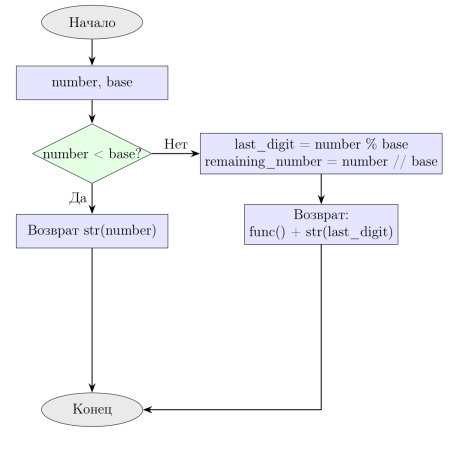

---
jupytext:
  formats: ipynb,md:myst
  text_representation:
    extension: .md
    format_name: myst
    format_version: 0.13
    jupytext_version: 1.17.3
kernelspec:
  display_name: Python 3 (ipykernel)
  language: python
  name: python3
---

# Итеративные и рекурсивные алгоритмы


## Цель работы

Изучить рекурсивные алгоритмы и рекурсивные структуры данных; научиться проводить анализ итеративных и рекурсивных процедур; исследовать эффективность итеративных и  рекурсивных процедур при реализации на ПЭВМ.

+++

## Задания

### Задание 1
Рекурсивный алгоритм перевода натурального числа из десятичной системы счисления в систему счисления с основанием $N$, $N \leq 10$.

```{code-cell} ipython3
def decimal_to_base_n(number, base):
    if not isinstance(number, int) or number < 0:
        raise ValueError("Число должно быть натуральным (неотрицательным целым)")
    
    if not (2 <= base <= 10):
        raise ValueError("Основание системы счисления должно быть от 2 до 10")
    
    if number < base:
        return str(number)
    
    last_digit = number % base
    remaining_number = number // base
    
    return decimal_to_base_n(remaining_number, base) + str(last_digit)
```

```{code-cell} ipython3
print("Введите натуральное число:")
number = int(input())
print("Введите основание системы счисления от 1 до 9:")
base = int(input())
print("Число " + str(number) + " в системе счисления с основанием " + str(base) + ":")
print(decimal_to_base_n(number, base))
```

### Задание 2

Алгоритм из задания 1 без рекурсии.

```{code-cell} ipython3
def decimal_to_base_n_iter(number, base):
    if not isinstance(number, int) or number < 0:
        raise ValueError("Число должно быть натуральным (неотрицательным целым)")
    
    if not (2 <= base <= 10):
        raise ValueError("Основание системы счисления должно быть от 2 до 10")
    
    if number == 0:
        return "0"
    
    digits = []
    n = number
    
    while n > 0:
        remainder = n % base
        digits.append(str(remainder))
        n = n // base
    
    return ''.join(reversed(digits))
```

```{code-cell} ipython3
print("Введите натуральное число:")
number = int(input())
print("Введите основание системы счисления от 1 до 9:")
base = int(input())
print("Число " + str(number) + " в системе счисления с основанием " + str(base) + ":")
print(decimal_to_base_n_iter(number, base))
```

### Задание 3

+++

Код для блок-схемы в LaTeX:
``` LaTeX
\documentclass[a4paper,12pt]{article}

% Поддержка русского языка
\usepackage[T2A]{fontenc}
\usepackage[utf8]{inputenc}
\usepackage[russian]{babel}

\usepackage{tikz}
\usetikzlibrary{shapes.geometric, arrows.meta, positioning}

% Определение стилей блоков
\tikzstyle{startstop} = [ellipse, draw, fill=gray!20, minimum width=3cm, minimum height=1cm, text centered]
\tikzstyle{process} = [rectangle, draw, fill=blue!10, minimum width=4.5cm, minimum height=1cm, text centered, align=center]
\tikzstyle{decision} = [diamond, draw, fill=green!10, aspect=2, text centered, align=center, inner sep=0pt]
\tikzstyle{arrow} = [thick, -{Stealth[scale=1.2]}]

\begin{document}

\begin{center}
\begin{tikzpicture}[node distance=1.8cm]

% Узлы
\node (start) [startstop] {Начало};
\node (input) [process, below of=start] {number, base};
\node (check1) [decision, below of=input, yshift=-0.3cm] {number < base?};
\node (return1) [process, below of=check1, yshift=-0.5cm] {Возврат str(number)};
\node (calc1) [process, right of=check1, xshift=5cm] {last\_digit = number \% base\\remaining\_number = number // base};
\node (recursion) [process, below of=calc1, yshift=-0.3cm] {Возврат:\\func() + str(last\_digit)};
\node (stop) [startstop, below of=return1, yshift=-3.5cm] {Конец};

% Стрелки
\draw [arrow] (start) -- (input);
\draw [arrow] (input) -- (check1);
\draw [arrow] (check1) -- node[anchor=east]{Да} (return1);
\draw [arrow] (check1) -- node[anchor=south]{Нет} (calc1);
\draw [arrow] (calc1) -- (recursion);
\draw [arrow] (return1) -- (stop);
\draw [arrow] (recursion) |- (stop);

\end{tikzpicture}
\end{center}

\end{document}
```


+++

Класс для сбора статистики выполнения алгоритмов

```{code-cell} ipython3
import sys
import time
from functools import wraps
from typing import List, Dict, Any

class ConversionStats:
    def __init__(self):
        self.iterations = 0
        self.max_stack_depth = 0
        self.execution_time = 0
        self.intermediate_results = []
    
    def reset(self):
        self.iterations = 0
        self.max_stack_depth = 0
        self.execution_time = 0
        self.intermediate_results = []

stats = ConversionStats()
```

Декоратор для сохранения промежуточных результатов рекурсии

```{code-cell} ipython3
def save_intermediate_results(func):
    @wraps(func)
    def wrapper(number, base, depth=0):
        stats.iterations += 1
        stats.max_stack_depth = max(stats.max_stack_depth, depth)
        
        intermediate = {
            'depth': depth,
            'number': number,
            'base': base,
            'timestamp': time.time()
        }
        
        result = func(number, base, depth)
        
        intermediate['result'] = result
        stats.intermediate_results.append(intermediate)
        
        return result
    return wrapper
```

Рекурсивная реализация с ручным сохранением промежуточных результатов

```{code-cell} ipython3
def manual_recursion_with_storage(number, base):
    intermediate_results = []
    stack_depth = 0
    
    def recursive_helper(n, b, depth):
        nonlocal stack_depth
        stack_depth = max(stack_depth, depth)
        stats.iterations += 1
        
        intermediate_results.append({
            'depth': depth,
            'number': n,
            'base': b,
            'action': 'before_call'
        })
        
        if n < b:
            result = str(n)
            intermediate_results.append({
                'depth': depth,
                'result': result,
                'action': 'base_case'
            })
            return result
        
        last_digit = n % b
        remaining = n // b
        
        recursive_result = recursive_helper(remaining, b, depth + 1)
        final_result = recursive_result + str(last_digit)
        
        intermediate_results.append({
            'depth': depth,
            'last_digit': last_digit,
            'remaining': remaining,
            'recursive_result': recursive_result,
            'final_result': final_result,
            'action': 'after_call'
        })
        
        return final_result
    
    result = recursive_helper(number, base, 0)
    stats.max_stack_depth = stack_depth
    stats.intermediate_results = intermediate_results
    return result
```

Рекурсивный алгоритм с декоратором для сохранения промежуточных результатов

```{code-cell} ipython3
@save_intermediate_results
def recursive_decimal_to_base_n(number, base, depth=0):
    if number < base:
        return str(number)
    
    last_digit = number % base
    remaining_number = number // base
    
    return recursive_decimal_to_base_n(remaining_number, base, depth + 1) + str(last_digit)
```

Итеративный алгоритм со сбором статистики

```{code-cell} ipython3
def iterative_decimal_to_base_n(number, base):
    stats.reset()
    start_time = time.time()
    
    if number == 0:
        stats.execution_time = time.time() - start_time
        return "0"
    
    digits = []
    n = number
    
    while n > 0:
        stats.iterations += 1
        remainder = n % base
        digits.append(str(remainder))
        
        stats.intermediate_results.append({
            'iteration': stats.iterations,
            'current_number': n,
            'remainder': remainder,
            'digits_so_far': digits.copy()
        })
        
        n = n // base
    
    result = ''.join(reversed(digits))
    stats.execution_time = time.time() - start_time
    return result
```

Анализ максимальной глубины рекурсии

```{code-cell} ipython3
def analyze_stack_limit():
    original_limit = sys.getrecursionlimit()
    print(f"Текущий лимит рекурсии: {original_limit}")
    
    test_base = 2
    max_safe_number = 0
    
    for i in range(original_limit - 100):
        try:
            test_number = (1 << i) - 1  # 2^i - 1
            recursive_decimal_to_base_n(test_number, test_base)
            max_safe_number = test_number
        except RecursionError:
            break
    
    return max_safe_number, original_limit
```

Сравнение производительности алгоритмов

```{code-cell} ipython3
def performance_comparison(test_cases):
    results = []
    
    for number, base in test_cases:
        print(f"\nТестирование числа {number} в систему с основанием {base}:")
        
        stats.reset()
        start_time = time.time()
        result1 = recursive_decimal_to_base_n(number, base)
        recursive_time = time.time() - start_time
        
        print(f"Рекурсивный (с декоратором): {result1}")
        print(f"  Время: {recursive_time:.6f}с, Итерации: {stats.iterations}, Глубина стека: {stats.max_stack_depth}")
        
        stats.reset()
        start_time = time.time()
        result2 = manual_recursion_with_storage(number, base)
        manual_recursive_time = time.time() - start_time
        
        print(f"Рекурсивный (ручное сохранение): {result2}")
        print(f"  Время: {manual_recursive_time:.6f}с, Итерации: {stats.iterations}, Глубина стека: {stats.max_stack_depth}")
        
        stats.reset()
        result3 = iterative_decimal_to_base_n(number, base)
        iterative_time = stats.execution_time
        
        print(f"Итеративный: {result3}")
        print(f"  Время: {iterative_time:.6f}с, Итерации: {stats.iterations}")
        
        if result1 == result2 == result3:
            print("Все алгоритмы дали одинаковый результат")
        else:
            print("Ошибка: результаты различаются")
        
        results.append({
            'number': number,
            'base': base,
            'recursive_time': recursive_time,
            'manual_recursive_time': manual_recursive_time,
            'iterative_time': iterative_time,
            'recursive_iterations': stats.iterations,
            'stack_depth': stats.max_stack_depth
        })
    
    return results
```

Вывод сохраненных промежуточных результатов

```{code-cell} ipython3
def print_intermediate_results():
    print("\nПромежуточные результаты (последний вызов):")
    for i, result in enumerate(stats.intermediate_results[-10:]):
        print(f"  {i+1}: {result}")
```

Итог:

```{code-cell} ipython3
print("=" * 60)
print("АНАЛИЗ АЛГОРИТМОВ ПЕРЕВОДА СИСТЕМ СЧИСЛЕНИЯ")
print("=" * 60)

print("\n1. АНАЛИЗ ОГРАНИЧЕНИЙ РЕКУРСИИ")
max_safe_number, recursion_limit = analyze_stack_limit()
print(f"Максимальное безопасное число: {max_safe_number}")
    
test_cases = [
    (10, 2),
    (100, 2),  
    (1000, 2),
    (255, 8),
    (1024, 2),
    (12345, 2),
]
    
print("\n2. СРАВНЕНИЕ ПРОИЗВОДИТЕЛЬНОСТИ")
results = performance_comparison(test_cases)
    
print("\n3. СВОДНАЯ СТАТИСТИКА")
print("Алгоритм           | Среднее время | Макс. итераций")
print("-" * 50)
    
recursive_times = [r['recursive_time'] for r in results]
manual_times = [r['manual_recursive_time'] for r in results]
iterative_times = [r['iterative_time'] for r in results]
    
print(f"Рекурсивный        | {sum(recursive_times)/len(recursive_times):.6f}с    | {max(r['recursive_iterations'] for r in results)}")
print(f"Ручной рекурсивный | {sum(manual_times)/len(manual_times):.6f}с    | {max(r['recursive_iterations'] for r in results)}")
print(f"Итеративный        | {sum(iterative_times)/len(iterative_times):.6f}с    | {max(r['recursive_iterations'] for r in results)}")
    
print("\n4. ДЕМОНСТРАЦИЯ ПРОМЕЖУТОЧНЫХ РЕЗУЛЬТАТОВ")
stats.reset()
recursive_decimal_to_base_n(10, 2)
print_intermediate_results()
```

```{code-cell} ipython3

```
