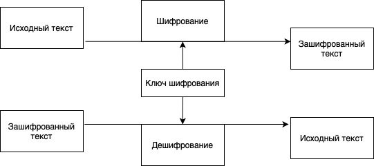
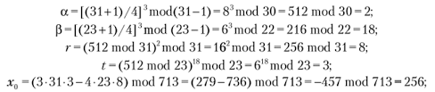
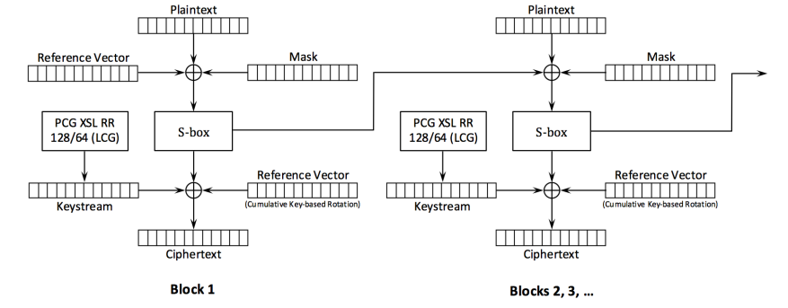
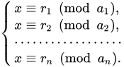
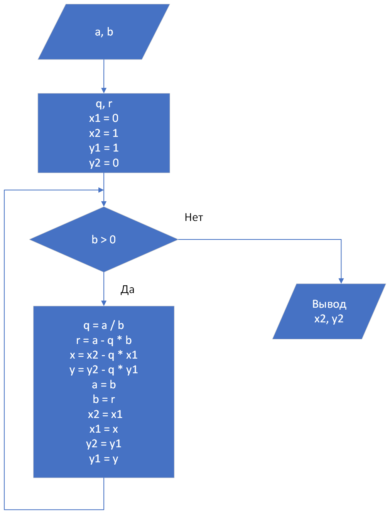

# Л.Р. 9 - "Криптоалгоритмы"

**Цао М.М.**
**ИУ10-36**

### Задания
### Задание №1 - Реализовать программу, выполняющую шифрование и расшифровку текста двумя разными методами:
**1) Симметричный цикл: Шифр Цезаря.**
```python
### Создается только в симметричных алгоритмах
def __init__(self):
        self.alphabet = 'абвгдеёжзийклмнопрстуфхцчшщъыьэюяabcdefghijklmnopqrstuvwxyz'
        self.alphabet += 'АБВГДЕЁЖЗИЙКЛМНОПРСТУФХЦЧШЩЪЫЬЭЮЯABCDEFGHIJKLMNOPQRSTUVWXYZ'
        self.alphabet += ' 0123456789!@#$%^&*()_+-=[]{}|;:,.<>?'

### Алгоритм шифрования ключа
key_hash = 0
for char in user_key:
    key_hash = (key_hash * 31 + ord(char)) % len(self.alphabet)

### Шифрование исходных данных 
    key = self.generate_key(user_key)
    encrypted_text = []
        
    for char in text:
        if char in self.alphabet:
            idx = self.alphabet.index(char)
            new_idx = (idx + key) % len(self.alphabet)
            encrypted_text.append(self.alphabet[new_idx])
        else:
            encrypted_text.append(char)

### Расшифровка шифротекста
for char in encrypted_text:
        if char in self.alphabet:
            idx = self.alphabet.index(char)
            new_idx = (idx - key) % len(self.alphabet)
            decrypted_text.append(self.alphabet[new_idx])
        else:
            decrypted_text.append(char)
        
    return ''.join(decrypted_text)
```



**2) Ассиметричный цикл: Криптосистема Блюма — Гольдвассер.**
```python
### Генерация ключей
def generate_key_pair(self):
    
    # (p;q) - приватный ключ
    p = self.generate_blum_prime(100, 1000)
    q = self.generate_blum_prime(100, 1000)
    n = p * q 
    
    public_key = turple(n)  
    g, a, b = self.extended_gcd(p, q) 
    private_key = (p, q, a, b)  
    
    return public_key, private_key
    
### Шифрование данные

n = public_key[0]

bytes_list = self.text_to_bytes(text)
bits = self.bytes_to_bits(bytes_list)
t = len(bits)

# Генерим псведослучайную последовательность и шифруем XOR
x0 = random.randint(2, n - 1)
while math.gcd(x0, n) != 1:
    x0 = random.randint(2, n - 1)
        
encrypted_bits = []
x = x0
        
for i in range(t):
    x = (x * x) % n
    encrypted_bit = bits[i] ^ (x % 2)
    encrypted_bits.append(encrypted_bit)
        
x_t_plus_1 = (x * x) % n # последнее состояние

### Дешифрование 

    d1 = self.mod_exp((p + 1) // 4, t + 1, p - 1)
    d2 = self.mod_exp((q + 1) // 4, t + 1, q - 1)
    
    u = self.mod_exp(x_t_plus_1 % p, d1, p)
    v = self.mod_exp(x_t_plus_1 % q, d2, q)
    
    # Восстанавливаем x₀ через Китайскую теорему об остатках
    x0 = (v * a * p + u * b * q) % n
    
    # Воспроизводим ту же последовательность и дешифруем XOR
    decrypted_bits = []
    x = x0
    for i in range(t):
        x = (x * x) % n
        decrypted_bit = encrypted_bits[i] ^ (x % 2)  # обратный XOR
        decrypted_bits.append(decrypted_bit)

    decrypted_bytes = self.bits_to_bytes(decrypted_bits)
    return self.bytes_to_text(decrypted_bytes)
```




### Особенности реализации:
**Формула Дэниеля Джулиуса Бернштейна**
```python
key_hash = (key_hash * 31 + ord(char)) % len(self.alphabet)
```



**Китайская теорема об остатках(КТО)**
```python
x0 = (v * a * p + u * b * q) % n
```



**Алгоритм Евклида**
```python
g, a, b = self.extended_gcd(p, q)
```



**Выводы:**
1) Симметричные алгоритмы (шифр Цезаря) и асимметричные системы (Блюма-Гольдвассера) представляют принципиально различные подходы к защите информации. Первые характеризуются использованием единого ключа и высокой производительностью, вторые - разделением ключевой пары и решением проблемы безопасной дистрибуции ключей.
2) Эффективность современных криптографических систем базируется на фундаментальных математических теориях. Алгоритм Евклида и китайская теорема об остатках, являясь классическими разделами теории чисел, образуют математический фундамент для построения стойких асимметричных криптосистем.
3) Существует обратная зависимость между вычислительной эффективностью криптографических алгоритмов и обеспечиваемым уровнем безопасности. Симметричные алгоритмы демонстрируют линейную сложность O(n), тогда как асимметричные системы требуют выполнения операций с полиномиальной сложностью O(n^2) и выше.
4) Стойкость криптографических систем напрямую зависит от размера ключевого пространства. Алгоритмы с ограниченным ключевым пространством (шифр Цезаря - 26 ключей) уязвимы к полному перебору, тогда как современные стандарты (AES-256 - 2^256 ключей) обеспечивают теоретическую стойкость против атак грубой силы.
5) Криптографическая стойкость алгоритма определяется не только его математическими основами, но и корректностью программной реализации. Детали реализации, включая генерацию случайных чисел, управление памятью и временем выполнения, оказывают существенное влияние на общую безопасность системы.
6) Простая операция XOR, используемая в сочетании с криптографически стойкими генераторами псевдослучайных последовательностей, демонстрирует возможность построения эффективных систем шифрования на основе элементарных битовых операций при условии обеспечения надлежащих свойств случайности.
7) Обеспечение информационной безопасности требует комплексного подхода, включающего корректный выбор алгоритмов, защиту ключевой информации, учет вычислительных аспектов и адаптацию к развивающимся угрозам. Криптография представляет собой динамическую область, требующую постоянного мониторинга актуальных уязвимостей и своевременного перехода на более совершенные алгоритмы.