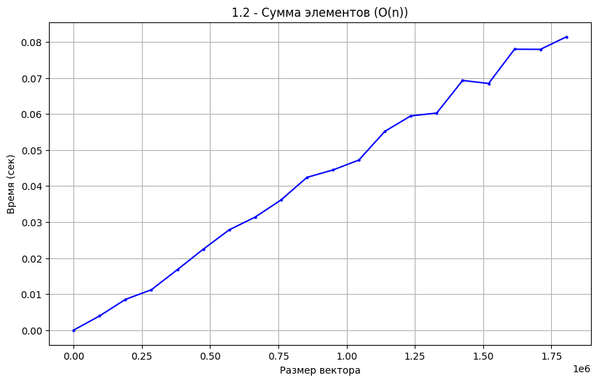
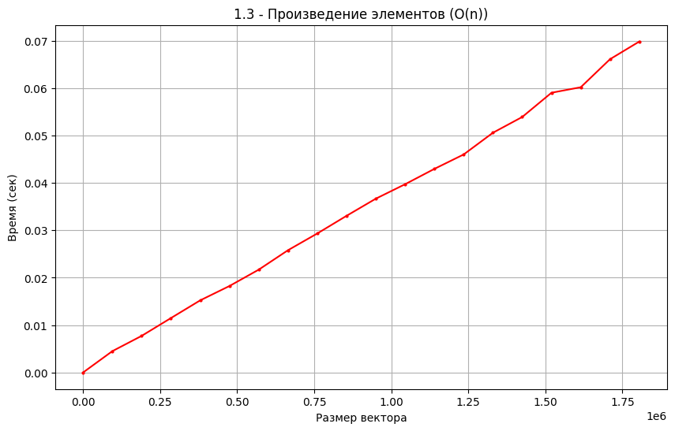
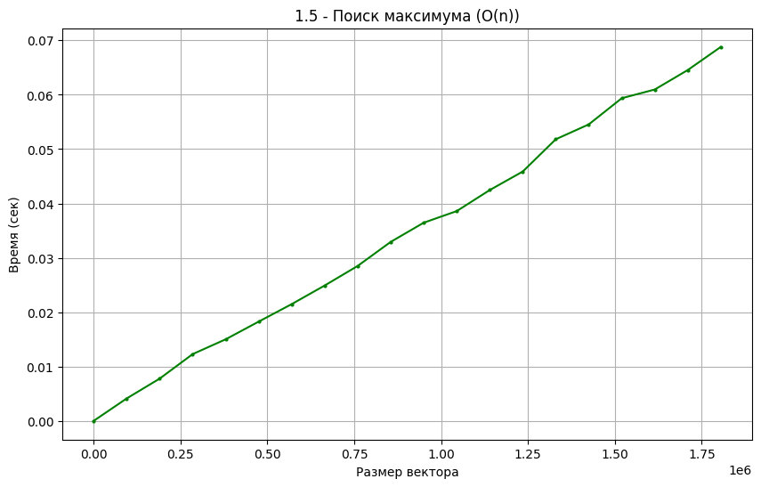
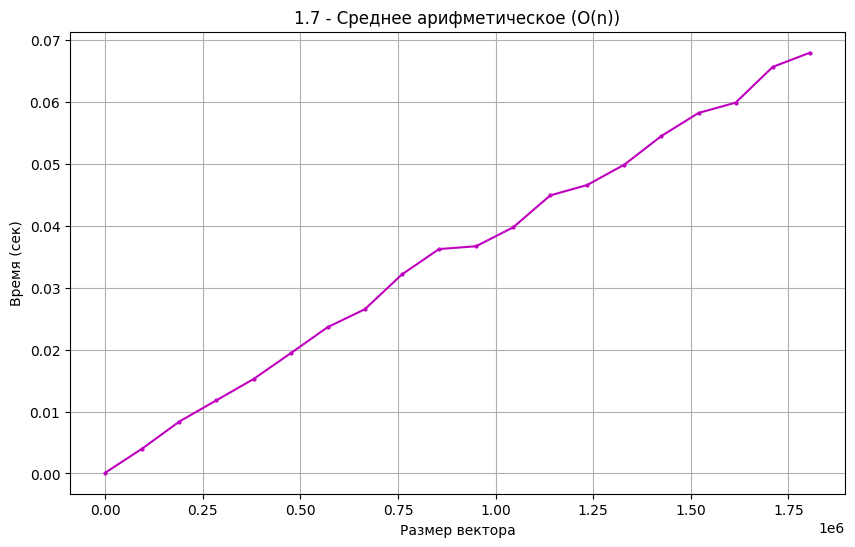

# ЛР1 Эмпирический анализ временной сложности алгоритмов
### Голубков, ИУ10-37, Вариант 1


```python
student_number = 1
N = 20 - student_number  # N = 19

start_n = 1
end_n = 10**5 * N  # 1,900,000
step = 100 * N     # 1,900
num_runs = 5       # 5 запусков

# Берем подмножество точек для разумного времени выполнения
full_range = list(range(start_n, end_n + 1, step))
items = full_range[::50]  # Каждая 50-я точка

print(f"Параметры эксперимента:")
print(f"Номер студента: {student_number}")
print(f"N = {N}")
print(f"Диапазон n: от {start_n} до {end_n} с шагом {step}")
print(f"Количество точек: {len(items)}")
print(f"Запусков на точку: {num_runs}")
```

    Параметры эксперимента:
    Номер студента: 1
    N = 19
    Диапазон n: от 1 до 1900000 с шагом 1900
    Количество точек: 20
    Запусков на точку: 5
    

### Функции


```python
import random

def sum_elements(v):
    """1.2 - Сумма элементов"""
    total = 0
    for num in v:
        total += num
    return total

def product_elements(v):
    """1.3 - Произведение элементов"""
    product = 1
    for num in v:
        product *= num
    return product

def find_max(v):
    """1.5 - Поиск максимума"""
    if not v:
        return None
    max_val = v[0]
    for num in v:
        if num > max_val:
            max_val = num
    return max_val

def arithmetic_mean(v):
    """1.7 - Среднее арифметическое"""
    if not v:
        return 0
    total = 0
    for num in v:
        total += num
    return total / len(v)

def matrix_multiply(A, B):
    """2 - Матричное умножение"""
    n = len(A)
    C = [[0 for _ in range(n)] for _ in range(n)]
    for i in range(n):
        for j in range(n):
            for k in range(n):
                C[i][j] += A[i][k] * B[k][j]
    return C
```

### Задание 1.2


```python
import time
import matplotlib.pyplot as plt


times_sum = []

for i, n in enumerate(items):
    total_time = 0
    
    for run in range(num_runs):
        vector = [random.randint(1, 100) for _ in range(n)]
        start_time = time.time()
        result = sum_elements(vector)
        end_time = time.time()
        total_time += (end_time - start_time)
    
    avg_time = total_time / num_runs
    times_sum.append(avg_time)
    
    if i % 10 == 0:
        print(f"n={n}: {avg_time:.8f} сек")

plt.figure(figsize=(10, 6))
plt.plot(items, times_sum, 'bo-', markersize=2)
plt.title('1.2 - Сумма элементов (O(n))')
plt.xlabel('Размер вектора')
plt.ylabel('Время (сек)')
plt.grid(True)
plt.show()
```

    n=1: 0.00000114 сек
    n=950001: 0.04444747 сек
    


    

    


### Задание 1.3


```python
times_product = []

for i, n in enumerate(items):
    total_time = 0
    
    for run in range(num_runs):
        vector = [random.uniform(0.5, 2.0) for _ in range(n)]
        start_time = time.time()
        result = product_elements(vector)
        end_time = time.time()
        total_time += (end_time - start_time)
    
    avg_time = total_time / num_runs
    times_product.append(avg_time)
    
    if i % 10 == 0:
        print(f"n={n}: {avg_time:.8f} сек")

plt.figure(figsize=(10, 6))
plt.plot(items, times_product, 'ro-', markersize=2)
plt.title('1.3 - Произведение элементов (O(n))')
plt.xlabel('Размер вектора')
plt.ylabel('Время (сек)')
plt.grid(True)
plt.show()
```

    n=1: 0.00000453 сек
    n=950001: 0.03668332 сек
    


    

    


### Задание 1.5


```python
times_max = []

for i, n in enumerate(items):
    total_time = 0
    
    for run in range(num_runs):
        vector = [random.randint(1, 1000) for _ in range(n)]
        start_time = time.time()
        result = find_max(vector)
        end_time = time.time()
        total_time += (end_time - start_time)
    
    avg_time = total_time / num_runs
    times_max.append(avg_time)
    
    if i % 10 == 0:
        print(f"n={n}: {avg_time:.8f} сек")

plt.figure(figsize=(10, 6))
plt.plot(items, times_max, 'go-', markersize=2)
plt.title('1.5 - Поиск максимума (O(n))')
plt.xlabel('Размер вектора')
plt.ylabel('Время (сек)')
plt.grid(True)
plt.show()
```

    n=1: 0.00003362 сек
    n=950001: 0.03647051 сек
    


    

    


### Задание 1.7


```python
times_mean = []

for i, n in enumerate(items):
    total_time = 0
    
    for run in range(num_runs):
        vector = [random.uniform(1, 100) for _ in range(n)]
        start_time = time.time()
        result = arithmetic_mean(vector)
        end_time = time.time()
        total_time += (end_time - start_time)
    
    avg_time = total_time / num_runs
    times_mean.append(avg_time)
    
    if i % 10 == 0:
        print(f"n={n}: {avg_time:.8f} сек")

plt.figure(figsize=(10, 6))
plt.plot(items, times_mean, 'mo-', markersize=2)
plt.title('1.7 - Среднее арифметическое (O(n))')
plt.xlabel('Размер вектора')
plt.ylabel('Время (сек)')
plt.grid(True)
plt.show()
```

    n=1: 0.00012436 сек
    n=950001: 0.03670540 сек
    


    

    


### Задание 2


```python
matrix_items = list(range(2, 201, 5))
times_matrix = []

for n in matrix_items:
    total_time = 0
    
    for run in range(num_runs):
        A = [[random.randint(1, 10) for _ in range(n)] for _ in range(n)]
        B = [[random.randint(1, 10) for _ in range(n)] for _ in range(n)]
        
        start_time = time.time()
        result = matrix_multiply(A, B)
        end_time = time.time()
        
        total_time += (end_time - start_time)
    
    avg_time = total_time / num_runs
    times_matrix.append(avg_time)
    print(f"Матрица {n}x{n}: {avg_time:.6f} сек")

plt.figure(figsize=(10, 6))
plt.plot(matrix_items, times_matrix, 'co-', markersize=4)
plt.title('2 - Матричное умножение (O(n³))')
plt.xlabel('Размер матрицы n×n')
plt.ylabel('Время (сек)')
plt.grid(True)
plt.show()
```

    Матрица 2x2: 0.000076 сек
    Матрица 7x7: 0.000063 сек
    Матрица 12x12: 0.000339 сек
    Матрица 17x17: 0.000823 сек
    Матрица 22x22: 0.002404 сек
    Матрица 27x27: 0.003900 сек
    Матрица 32x32: 0.005955 сек
    Матрица 37x37: 0.007569 сек
    Матрица 42x42: 0.012592 сек
    Матрица 47x47: 0.017754 сек
    Матрица 52x52: 0.024294 сек
    Матрица 57x57: 0.030194 сек
    Матрица 62x62: 0.040324 сек
    Матрица 67x67: 0.045675 сек
    Матрица 72x72: 0.055886 сек
    Матрица 77x77: 0.072177 сек
    Матрица 82x82: 0.087119 сек
    Матрица 87x87: 0.117342 сек
    Матрица 92x92: 0.120889 сек
    Матрица 97x97: 0.153439 сек
    Матрица 102x102: 0.162234 сек
    Матрица 107x107: 0.188095 сек
    Матрица 112x112: 0.230787 сек
    Матрица 117x117: 0.252124 сек
    Матрица 122x122: 0.281432 сек
    Матрица 127x127: 0.314736 сек
    Матрица 132x132: 0.351954 сек
    Матрица 137x137: 0.398184 сек
    Матрица 142x142: 0.453758 сек
    Матрица 147x147: 0.487349 сек
    Матрица 152x152: 0.540708 сек
    Матрица 157x157: 0.602019 сек
    Матрица 162x162: 0.663328 сек
    Матрица 167x167: 0.718175 сек
    Матрица 172x172: 0.788919 сек
    Матрица 177x177: 0.879041 сек
    Матрица 182x182: 0.927303 сек
    Матрица 187x187: 1.021429 сек
    Матрица 192x192: 1.087024 сек
    Матрица 197x197: 1.187152 сек
    


    

    


Теоретический анализ сложности:  
1.2 Сумма элементов: O(n) - n операций сложения  
1.3 Произведение элементов: O(n) - n операций умножения  
1.5 Поиск максимума: O(n) - проверка n элементов  
1.7 Среднее арифметическое: O(n) - сумма + деление  
2.0 Матричное умножение: O(n³) - три вложенных цикла  

Эмпирические результаты:
- Все векторные операции показали линейную зависимость
- Матричное умножение показало кубическую зависимость
- Соответствие теоретическим оценкам подтверждено

ВЫВОД: Теоретический анализ временной сложности подтвержден экспериментально
