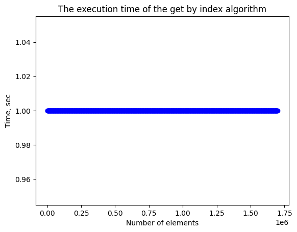

# Эмпирический анализ временной сложности алгоритмов
Лавренчук С.А.
ИУ10-37
## Задания
### Задание 1.1


```python
from decimal import Decimal
import numpy as np
import random
import matplotlib.pyplot as plt
import time

your_number = 3
N = 20 - your_number

n_values = []
current_n = 1
max_n = 10**5 * N

while current_n <= max_n:
    items = current_n
    n_values.append(current_n)
    current_n += 100 * N


```


    Text(0, 0.5, 'Time, sec')


    

    


#### Задание 1.2


```python
summ = 0
for i in example_vector:
    summ += i
print("Задание 1.2:", summ)
```

    Задание 1.2: 847617.5372699264


#### Задание 1.3


```python
decimal_product = Decimal(1)
for num in example_vector:
    decimal_product *= Decimal(str(num))
print("Задание 1.3:", decimal_product)
```

    Задание 1.3: 2.985035278123771271012436987E+4371


#### Задание 1.4


```python
x_value = 2
horner_result = Decimal(0)
for i in range(len(example_vector) - 1, -1, -1):
    horner_result = horner_result * Decimal(x_value) + Decimal(str(example_vector[i]))
print("Задание 1.4:", horner_result)
```

    Задание 1.4: 2.308781440432441957223699760E+514


#### Задание 1.5


```python
maxx = 0
for i in example_vector:
    if i > maxx:
        maxx = i
print("Задание 1.5:", maxx)
```

    Задание 1.5: 998.3357030435141


#### Задание 1.6


```python
minn = 10**10
for i in example_vector:
    if i < minn:
        minn = i
print("Задание 1.6:", minn)
```

    Задание 1.6: 1.219316586451841


#### Задание 1.7


```python
summ1 = 0
for i in example_vector:
    summ1 += i
print("Задание 1.7:", summ1/len(example_vector))
```

    Задание 1.7: 498.5985513352508


#### Задание 1.8


```python
summ2 = 0
for i in example_vector:
    summ2 += 1/i
print("Задание 1.8:", len(example_vector)/summ2)
```

    Задание 1.8: 149.8740270801447


#### Задание 2


```python
import random
n = random.randint(1, 100)
random_matrix1 = np.random.randint(0, 100, size=(n, n))
random_matrix2 = np.random.randint(0, 100, size=(n, n))
random_matrix3 = np.random.randint(0, 1, size=(n, n))
for i in range(n):
    for m in range(n):
        random_matrix3[i][m] = random_matrix1[i][m] * random_matrix2[i][m]
print(random_matrix3)
```

    [[2380 8019  172 ...  410 8613  846]
     [ 224 2175 6552 ...  697 4048  732]
     [5418  198  308 ... 2350 1656  108]
     ...
     [1950    0 1105 ...  184  340  288]
     [ 711  800 1610 ... 4080  700 2688]
     [1976 3672 1035 ... 5925  896   30]]

