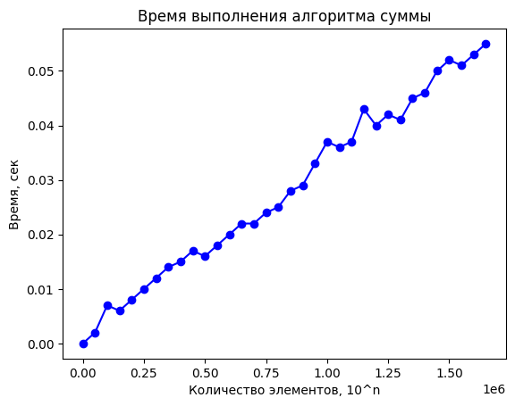
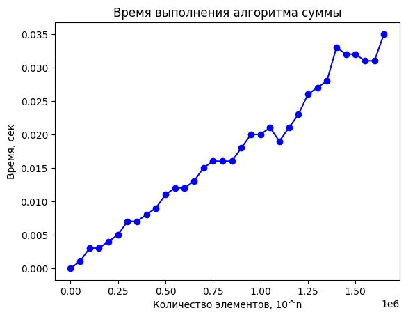
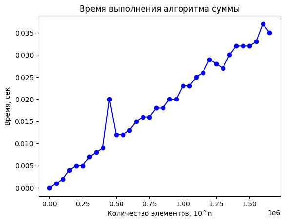
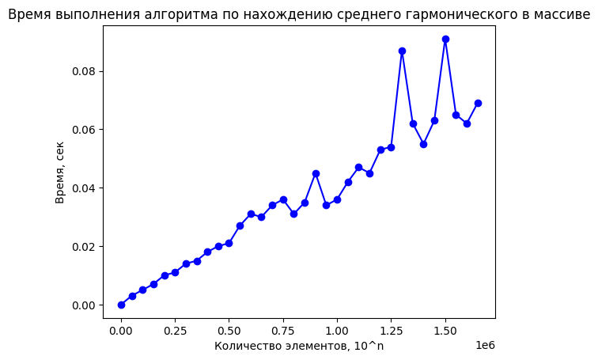
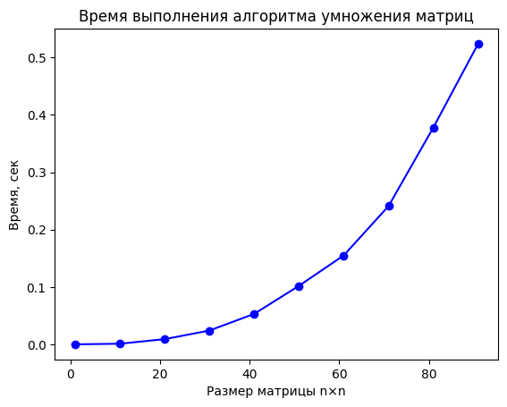

# Эмпирический анализ временной сложности алгоритмов
Лавренчук С.А.
ИУ10-37
## Задания


#### Задание 1.2


```python
from decimal import Decimal
import numpy as np
import random
import matplotlib.pyplot as plt
import time
import usage_time

your_number = 3
N = 20 - your_number

n_values = []
current_n = 1
max_n = 10**5 * N

while current_n <= max_n:
    items = current_n
    n_values.append(current_n)
    current_n += 100 * N

def sum_elements(v: list):
    summ = 0
    for i in v:
        summ += i
    return summ


items = range(1, 10**5 * 17, 50000)
func = usage_time.get_usage_time()(sum_elements)
times = []
for n in items:
    random_list = []
    for _ in range(n):
        random_list.append(random.randint(1, 3))

    result = func(random_list)
    times.append(result)

fig = plt.plot(items, times, 'bo-')
ax = plt.gca()
plt.title('Время выполнения алгоритма суммы')
ax.set_xlabel('Количество элементов, 10^n')
ax.set_ylabel('Время, сек')

```


    Text(0, 0.5, 'Время, сек')


    

    


#### Задание 1.5


```python
from decimal import Decimal
import numpy as np
import random
import matplotlib.pyplot as plt
import time
import usage_time

your_number = 3
N = 20 - your_number

n_values = []
current_n = 1
max_n = 10**5 * N

while current_n <= max_n:
    items = current_n
    n_values.append(current_n)
    current_n += 100 * N

def maxxx(v: list):
    maxx = 0
    for i in v:
        if i > maxx:
            maxx = i
    return maxx


items = range(1, 10**5 * 17, 50000)
func = usage_time.get_usage_time()(maxxx)
times = []
for n in items:
    random_list = []
    for _ in range(n):
        random_list.append(random.randint(1, 3))

    result = func(random_list)
    times.append(result)

fig = plt.plot(items, times, 'bo-')
ax = plt.gca()
plt.title('Время выполнения алгоритма по нахождению максимального значения в массиве')
ax.set_xlabel('Количество элементов, 10^n')
ax.set_ylabel('Время, сек')
print(maxxx(example_vector))

```

    998.3357030435141


    

    


#### Задание 1.6


```python
from decimal import Decimal
import numpy as np
import random
import matplotlib.pyplot as plt
import time
import usage_time

your_number = 3
N = 20 - your_number

n_values = []
current_n = 1
max_n = 10**5 * N

while current_n <= max_n:
    items = current_n
    n_values.append(current_n)
    current_n += 100 * N

def minnn(v: list):
    minn = 10**10
    for i in v:
        if i < minn:
            minn = i
    return minn


items = range(1, 10**5 * 17, 50000)
func = usage_time.get_usage_time()(minnn)
times = []
for n in items:
    random_list = []
    for _ in range(n):
        random_list.append(random.randint(1, 3))

    result = func(random_list)
    times.append(result)

fig = plt.plot(items, times, 'bo-')
ax = plt.gca()
plt.title('Время выполнения алгоритма по нахождению минимального значения в массиве')
ax.set_xlabel('Количество элементов, 10^n')
ax.set_ylabel('Время, сек')
print(minnn(example_vector))


```

    1.219316586451841


    

    


#### Задание 1.8


```python
from decimal import Decimal
import numpy as np
import random
import matplotlib.pyplot as plt
import time
import usage_time

your_number = 3
N = 20 - your_number

n_values = []
current_n = 1
max_n = 10**5 * N

while current_n <= max_n:
    items = current_n
    n_values.append(current_n)
    current_n += 100 * N

def garmoniya(v: list):
    summ2 = 0
    for i in v:
        summ2 += 1/i
    return summ2


items = range(1, 10**5 * 17, 50000)
func = usage_time.get_usage_time()(garmoniya)
times = []
for n in items:
    random_list = []
    for _ in range(n):
        random_list.append(random.randint(1, 3))
        

    result = func(random_list)
    times.append(result)

fig = plt.plot(items, times, 'bo-')
ax = plt.gca()
plt.title('Время выполнения алгоритма по нахождению среднего гармонического в массиве')
ax.set_xlabel('Количество элементов, 10^n')
ax.set_ylabel('Время, сек')
print(garmoniya(example_vector))


```

    11.342859287359575


    

    


#### Задание 2


```python
import numpy as np
import matplotlib.pyplot as plt
import usage_time

def matrix(n):  
    random_matrix1 = np.random.randint(0, 100, size=(n, n))
    random_matrix2 = np.random.randint(0, 100, size=(n, n))
    random_matrix3 = np.zeros((n, n), dtype=int) 
    
    for i in range(n):
        for j in range(n):
            product_in_matrix = 0
            for m in range(n):
                product_in_matrix += random_matrix1[i][m] * random_matrix2[m][j]
            random_matrix3[i][j] = product_in_matrix
    
    return random_matrix3

items = range(1, 100, 10) 
func = usage_time.get_usage_time()(matrix)
times = []

for n in items:
    result = func(n)  
    times.append(result)

fig = plt.plot(items, times, 'bo-')
ax = plt.gca()
plt.title('Время выполнения алгоритма умножения матриц')
ax.set_xlabel('Размер матрицы n×n')
ax.set_ylabel('Время, сек')
plt.show()


```


    

    

