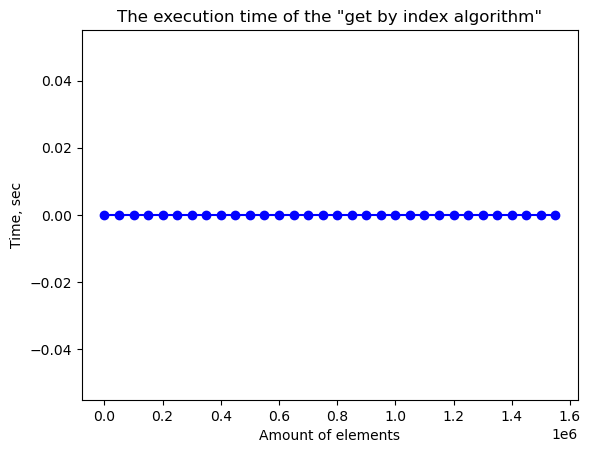
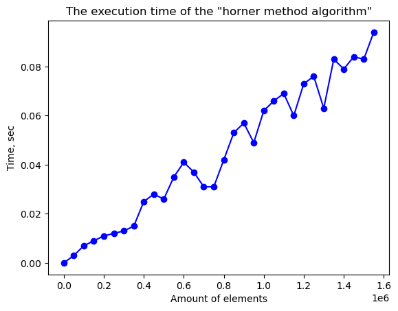
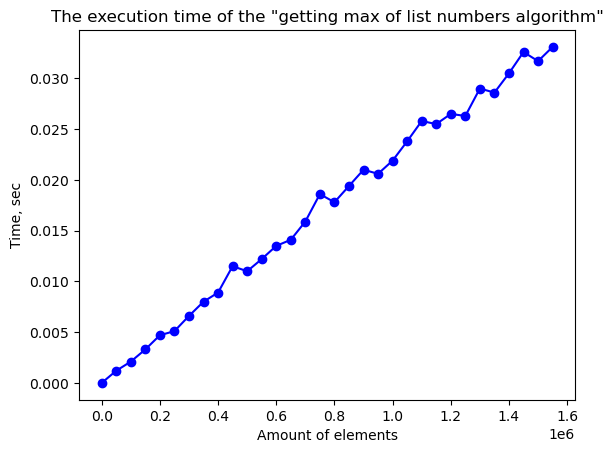
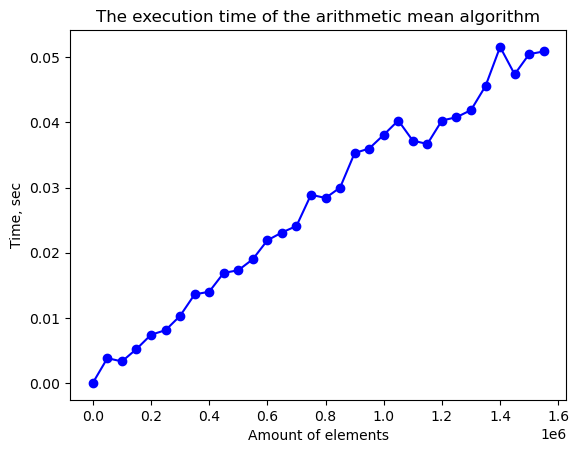
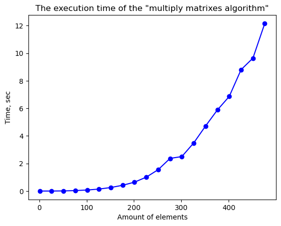

# Эмпирический анализ временной сложности алгоритмов
Ломовский Егор ИУ10-37

# Задания

## Задание 1.1


```python
import matplotlib.pyplot as plt
import random, usage_time

def by_index(a: list):
    return a[random.randint(0, len(a)) - 1]

elements = range(1, 10**5 * 16, 50000)
function = usage_time.get_usage_time()(by_index)
times = [
    function([random.randint(1, 3)
        for _ in range(n)])
        for n in elements
]

fig = plt.plot(elements, times, 'bo-')
ax = plt.gca()

ax.set_title('The execution time of the "get by index algorithm"')
ax.set_xlabel('Amount of elements')
ax.set_ylabel('Time, sec')
plt.show()
```


    

    


# Задание 1.4


```python
import matplotlib.pyplot as plt
import random, usage_time

def hor_met(a: list, x):
    res = 0
    for c in a:
        res = res * x + c
    return res

elements = range(1, 10**5 * 16, 50000)
function = usage_time.get_usage_time()(hor_met)
times = [
    function(
        [1 for _ in range(n)],0.000001)
    for n in elements
]

fig = plt.plot(elements, times, 'bo-')
ax = plt.gca()

ax.set_title('The execution time of the "horner method algorithm"')
ax.set_xlabel('Amount of elements')
ax.set_ylabel('Time, sec')
plt.show()
```


    

    


## Задание 1.5


```python
import matplotlib.pyplot as plt
import random, usage_time

def get_max(a: list):
    max_num = 0
    for num in a:
        if num > max_num:
            max_num = num
    return max_num


elements = range(1, 10**5 * 16, 50000)
function = usage_time.get_usage_time()(get_max)
times = [
    sum([
        function([random.randint(1, 10)
            for _ in range(n)])
        for _ in range(10)]) / 10
    for n in elements
]

fig = plt.plot(elements, times, 'bo-')
ax = plt.gca()

ax.set_title('The execution time of the "getting max of list numbers algorithm"')
ax.set_xlabel('Amount of elements')
ax.set_ylabel('Time, sec')
plt.show()
```


    

    


## Задание 1.7


```python
import matplotlib.pyplot as plt
import random, usage_time

def arithmetic_mean(a: list):
    summ = 0
    for num in a:
        summ += num
    mean = summ / len(v)
    return mean

elements = range(1, 10**5 * 16, 50000)
function = usage_time.get_usage_time()(arithmetic_mean)
times = [
    sum([function([random.randint(1, 10)
            for _ in range(n)])
        for _ in range(10)]) / 10
    for n in elements
]

fig = plt.plot(elements, times, 'bo-')
ax = plt.gca()

ax.set_title('The execution time of the "arithmetic mean algorithm"')
ax.set_xlabel('Amount of elements')
ax.set_ylabel('Time, sec')
plt.show()
```


    

    


## Задание 2


```python
import matplotlib.pyplot as plt
import random, usage_time

def matrix_product_calculation(mat_A: list, mat_B: list, size: int):
    mat_res = [[0 for _ in range(size)] for _ in range(size)]

    for row in range(size):
        for col in range(size):
            total = 0
            for inner in range(size):
                total += mat_A[row][inner] * mat_B[inner][col]
            mat_res[row][col] = total

    return mat_res

elements = range(1, 500, 25)
function = usage_time.get_usage_time()(matrix_product_calculation)

times = []
for n in elements:
    A = [[random.randint(1, 5) for _ in range(n)] for _ in range(n)]
    B = [[random.randint(1, 5) for _ in range(n)] for _ in range(n)]
    time_taken = function(A, B, n)
    times.append(time_taken)

fig = plt.plot(elements, times, 'bo-')
ax = plt.gca()

ax.set_title('The execution time of the "multiply matrixes algorithm"')
ax.set_xlabel('Amount of elements')
ax.set_ylabel('Time, sec')
plt.show()
```


    

    

