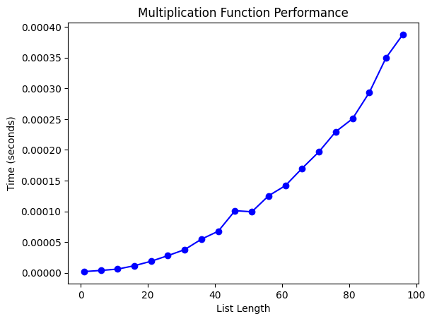

Эмпирический анализ временной сложности алгоритмов
Самуйлов С.С
ИУ10-37
### Задание 1.1


```python
import time
import timeit
import random
import functools
import typing
import matplotlib.pyplot as plt
import usage_time


def index(v):
    j = v[5]
    return(j)

N = 20 - 5

n = 10**5 * N

step = 100 * N

#for i in range(1, n, step):
   # v= list(range(1,n))
for k in range(1):
    v= list(range(1,n,step))
    fulltime=[i for i in range(5)]
    for t in range(1,6):
        usage_index=usage_time.get_usage_time()(index)
    
        parametr=usage_index(v)
        f= index(v)
        fulltime[t-1]=parametr
    #avg_time = sum(fulltime) / 5
x=[i for i in range(1,6)]
print(fulltime)
plt.plot(x, fulltime, "bo-")
plt.title('Multiplication Function Performance')
plt.xlabel('List Length')
plt.ylabel('Time (seconds)')
plt.show()


```

    [0.0, 0.0, 0.0, 0.0, 0.0]


    

    


### Задание 1.3


```python
import time
import timeit
import random
import functools
import typing
import matplotlib.pyplot as plt
import usage_time
def mult(u):
    o = 1
    for i in u:
        o = o * i
    return o

N = 15
n = 10**5 * N
step = 100 * N

list_lengths = [10**5 * 15, 10**5 * 18, 10**5 * 20, 10**5 * 22, 10**5 * 24]
times = []

usage_mult = usage_time.get_usage_time(ndigits=7)(mult)

for length in list_lengths:
    test_list = list(range(1, length + 1, step ))
    time_taken = usage_mult(test_list)
    times.append(time_taken)

plt.plot(list_lengths, times, 'bo-')
plt.title('Multiplication Function Performance')
plt.xlabel('List Length')
plt.ylabel('Time (seconds)')
plt.show()
```


    

    


### Задание 1.6


```python
import time
import timeit
import random
import functools
import typing
import matplotlib.pyplot as plt
import usage_time
def mult(u):
    o = u[0]
    for i in u:
        if i<o:
            o=i
    return (o)

N = 15
n = 10**5 * N
step = 100 * N

list_lengths = [10**5 * 15, 10**5 * 16, 10**5 * 17, 10**5 * 18, 10**5 * 19, 10**5 * 20, 10**5 * 21, 10**5 * 22, 10**5 * 23]
times = []

usage_mult = usage_time.get_usage_time(ndigits=7)(mult)

for length in list_lengths:
    test_list = list(range(1, length + 1, step ))
    time_taken = usage_mult(test_list)
    times.append(time_taken)

plt.plot(list_lengths, times, 'bo-')
plt.title('Multiplication Function Performance')
plt.xlabel('List Length')
plt.ylabel('Time (seconds)')
plt.show()
```


    

    


### Задание 1.8


```python
import time
import timeit
import random
import functools
import typing
import matplotlib.pyplot as plt
import usage_time
def mult(u):
    o = 1/u[0]
    for i in u:
            o=o+1/i
    j=len(u)/o
    return (j)

N = 15
n = 10**5 * N
step = 100 * N

list_lengths = [10**5 * 15, 10**5 * 16, 10**5 * 17, 10**5 * 18, 10**5 * 19, 10**5 * 20, 10**5 * 21, 10**5 * 22, 10**5 * 23]
times = []

usage_mult = usage_time.get_usage_time(ndigits=7)(mult)

for length in list_lengths:
    test_list = list(range(1, length + 1, step ))
    time_taken = usage_mult(test_list)
    times.append(time_taken)

plt.plot(list_lengths, times, 'bo-')
plt.title('Multiplication Function Performance')
plt.xlabel('List Length')
plt.ylabel('Time (seconds)')
plt.show()
```


    

    


### Задание 2


```python
import time
import timeit
import random
import functools
import typing
import matplotlib.pyplot as plt
import usage_time
def mult(X, Y, Z):
    
    for i in range(len(X)):
        for j in range(len(Y)):
            Z[i][j]=X[i][j]*Y[i][j]
    return(Z)
usage_mult=usage_time.get_usage_time(ndigits=7)(mult)
times=[]
o=[i for i in range(1,100,5)]
for s in o:
    A=[[random.randint(1,1000) for i in range (s)] for i in range (s)]
    B=[[random.randint(1,1000) for i in range (s)] for i in range (s)]
    C=[[0 for i in range (s)] for i in range (s)]
    parametr=usage_mult(A, B, C)
    times.append(parametr)
plt.plot(o, times, 'bo-')
plt.title('Multiplication Function Performance')
plt.xlabel('List Length')
plt.ylabel('Time (seconds)')
plt.show()
```


    

    


```python

```


```python

```
