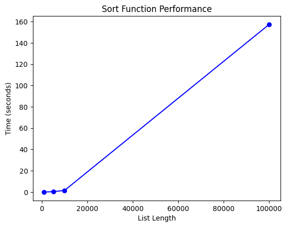
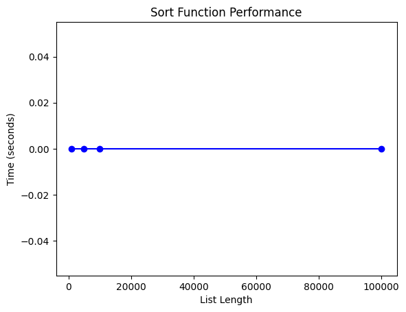
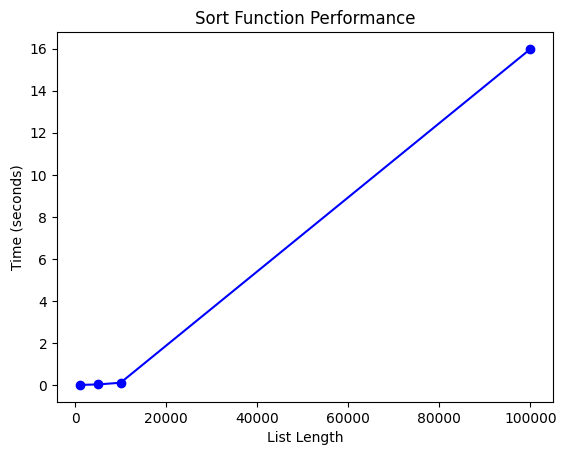
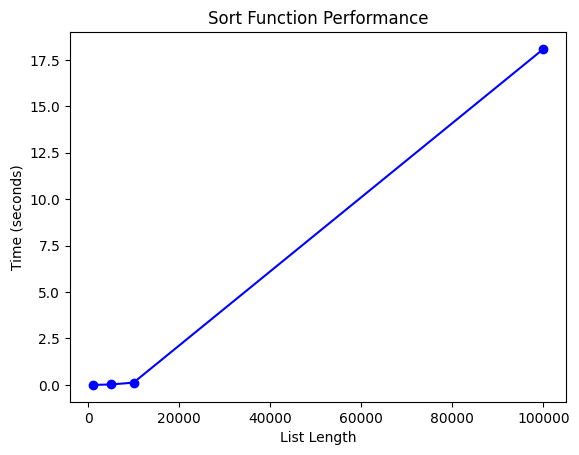

```python
#Самуйлов С.С Лабораторная работа№2
#Алгоритмы сортировки
#Цель работы
#изучение основных алгоритмов на сортировки.
Критерий	Классификация
Устойчивость	Устойчивая (равные элементы сохраняют порядок)
Место хранения	Внутренняя (данные хранятся в оперативной памяти)
Доп. память	    Сортировка на месте (требует O(1) дополнительной памяти)
Адаптивность    Неадаптивная (не учитывает частичную упорядоченность)
Сложность (время)	
- Худший случай: O(n²)
- Средний случай: O(n²)
- Лучший случай: O(n)
Тип алгоритма	Сравнительная, обменная
Сортировка деревом (Tree Sort)
Критерий	Классификация
Устойчивость	❌ Неустойчивая (зависит от реализации, обычно не сохраняет порядок равных)
Место хранения	Внутренняя (данные хранятся в оперативной памяти)
Доп. память	❌ Не на месте (требует O(n) дополнительной памяти для дерева)
Адаптивность	❌ Неадаптивная
Сложность (время)	- Худший случай: O(n²)
- Средний случай: O(n log n)
- Лучший случай: O(n log n)
Тип алгоритма	Сравнительная, основанная на бинарном дереве поиска
Краткое пояснение:

    Шейкерная сортировка — это улучшенная версия пузырьковой сортировки, которая проходит массив в двух направлениях. Она устойчива, не требует дополнительной памяти, но медленная на больших данных.

    Сортировка деревом использует бинарное дерево поиска для вставки элементов и обход inorder для получения отсортированного массива. Эффективна в среднем, но может деградировать до O(n²) в худшем случае (например, если дерево вырождается в список).
```


```python
import random
import usage_time
import matplotlib.pyplot as plt
times=[]
def shaker_sort(v):
    left = 0
    right = len(v) - 1
    
    while left <= right:
        for i in range(left, right):
            if v[i] > v[i + 1]:
                v[i], v[i + 1] = v[i + 1], v[i]
        right -= 1
        
        for i in range(right, left, -1):
            if v[i - 1] > v[i]:
                v[i - 1], v[i] = v[i], v[i - 1]
        left += 1
    return v
massive_length=[1000, 5000, 10000, 100000,]
for t in massive_length:
    g = [random.randint(-100, 100) for h in range(t)]
    usage_shaker=usage_time.get_usage_time()(shaker_sort)
    get_usage_shaker=usage_shaker(g)
    times.append(get_usage_shaker)
    sorted_g = shaker_sort(g.copy()) 
print(times)
plt.plot(massive_length, times, 'bo-')
plt.title('Sort Function Performance')
plt.xlabel('List Length')
plt.ylabel('Time (seconds)')
plt.show()
```

    [-26, 97, 53, 40, -60, -25, -4, 25, 63, -35]
    [-100, -100, -100, -99, -99, -99, -98, -98, -98, -98]
    [-52, -92, 69, 8, -65, -76, -39, -94, 83, 12]
    [-100, -100, -100, -100, -100, -100, -100, -100, -100, -100]
    [-43, -52, -22, 38, 97, 36, 72, 75, -50, 56]
    [-100, -100, -100, -100, -100, -100, -100, -100, -100, -100]
    [-64, -16, 86, 39, -16, -58, 98, -85, -28, 90]
    [-100, -100, -100, -100, -100, -100, -100, -100, -100, -100]
    [0.025, 0.687, 2.693, 282.379]


    

    


```python
import random
import usage_time
import matplotlib.pyplot as plt
times=[]
def shaker_sort(v):
    left = 0
    right = len(v) - 1
    
    while left <= right:
        for i in range(left, right):
            if v[i] > v[i + 1]:
                v[i], v[i + 1] = v[i + 1], v[i]
        right -= 1
        
        for i in range(right, left, -1):
            if v[i - 1] > v[i]:
                v[i - 1], v[i] = v[i], v[i - 1]
        left += 1
    return v
massive_length=[1000, 5000, 10000, 100000,]
for t in massive_length:
    g = [ h for h in range(int(-(t/2)),int(t/2))]
    usage_shaker=usage_time.get_usage_time()(shaker_sort)
    get_usage_shaker=usage_shaker(g)
    times.append(get_usage_shaker)
    sorted_g = shaker_sort(g.copy()) 
print(times)
plt.plot(massive_length, times, 'bo-')
plt.title('Sort Function Performance')
plt.xlabel('List Length')
plt.ylabel('Time (seconds)')
plt.show()
```

    [0.015, 0.392, 1.53, 157.279]


    

    


```python
import random
import usage_time
import matplotlib.pyplot as plt
times=[]
def shaker_sort(v):
    left = 0
    right = len(v) - 1
    
    while left <= right:
        for i in range(left, right):
            if v[i] > v[i + 1]:
                v[i], v[i + 1] = v[i + 1], v[i]
        right -= 1
        
        for i in range(right, left, -1):
            if v[i - 1] > v[i]:
                v[i - 1], v[i] = v[i], v[i - 1]
        left += 1
    return v
massive_length=[1000, 5000, 10000, 100000,]
for t in massive_length:
    g = [ h for h in range(int((t/2)),int(-(t/2)))]
    usage_shaker=usage_time.get_usage_time()(shaker_sort)
    get_usage_shaker=usage_shaker(g)
    times.append(get_usage_shaker)
    sorted_g = shaker_sort(g.copy()) 
print(times)
plt.plot(massive_length, times, 'bo-')
plt.title('Sort Function Performance')
plt.xlabel('List Length')
plt.ylabel('Time (seconds)')
plt.show()
```

    [0.0, 0.0, 0.0, 0.0]


    

    


```python
import random
import matplotlib.pyplot as plt
from usage_time import get_usage_time
import sys

class Node:
    def __init__(self, data):
        self.data = data
        self.left = self.right = None

class Tree:
    def __init__(self):
        self.root = None
    
    def __find(self, node, parent, value):
        if node is None:
            return None, parent, False
        if value == node.data:
            return node, parent, True
        if value < node.data:
            if node.left:
                return self.__find(node.left, node, value)
        if value > node.data:
            if node.right:
                return self.__find(node.right, node, value)
        return node, parent, False
    
    def append(self, obj):
        if self.root is None:
            self.root = obj
            return obj
        s, p, fl_find = self.__find(self.root, None, obj.data)
        if not fl_find and s:
            if obj.data < s.data:
                s.left = obj
            else:
                s.right = obj
        elif fl_find:
            temp = s.right
            s.right = obj
            obj.right = temp
        return obj
    
    def show_tree(self, node):
        if node is None:
            return
        self.show_tree(node.left)
        #print(node.data)
        self.show_tree(node.right)

sys.setrecursionlimit(1000000)

def test_tree_operations(list_length):
    v = [random.randint(-100, 100) for i in range(list_length)]
    t = Tree()
    for x in v:
        t.append(Node(x))
    t.show_tree(t.root)

list_lengths = [1000, 5000, 10000, 100000]
times=[]
for length in list_lengths:
    timed_function = get_usage_time(number=1)(test_tree_operations)
    execution_time = timed_function(length)
    times.append(execution_time)
    print(length, execution_time)
plt.plot(list_length, times, 'bo-')
plt.title('Sort Function Performance')
plt.xlabel('List Length')
plt.ylabel('Time (seconds)')
plt.show()
```

    1000 0.003
    5000 0.037
    10000 0.115
    100000 17.392


    

    


```python
import random
import matplotlib.pyplot as plt
from usage_time import get_usage_time
import sys

class Node:
    def __init__(self, data):
        self.data = data
        self.left = self.right = None

class Tree:
    def __init__(self):
        self.root = None
    
    def __find(self, node, parent, value):
        if node is None:
            return None, parent, False
        if value == node.data:
            return node, parent, True
        if value < node.data:
            if node.left:
                return self.__find(node.left, node, value)
        if value > node.data:
            if node.right:
                return self.__find(node.right, node, value)
        return node, parent, False
    
    def append(self, obj):
        if self.root is None:
            self.root = obj
            return obj
        s, p, fl_find = self.__find(self.root, None, obj.data)
        if not fl_find and s:
            if obj.data < s.data:
                s.left = obj
            else:
                s.right = obj
        elif fl_find:
            temp = s.right
            s.right = obj
            obj.right = temp
        return obj
    
    def show_tree(self, node):
        if node is None:
            return
        self.show_tree(node.left)
        #print(node.data)
        self.show_tree(node.right)

sys.setrecursionlimit(1000000)

for O in list_lengths:
    v = [i for i in range(int(O/2),int(-(O/2)))]
    t = Tree()
    for x in v:
        t.append(Node(x))
    t.show_tree(t.root)

list_lengths = [1000, 5000, 10000, 100000]
times=[]
for length in list_lengths:
    timed_function = get_usage_time(number=1)(test_tree_operations)
    execution_time = timed_function(length)
    times.append(execution_time)
    print(length, execution_time)
plt.plot(list_length, times, 'bo-')
plt.title('Sort Function Performance')
plt.xlabel('List Length')
plt.ylabel('Time (seconds)')
plt.show()
```

    1000 0.002
    5000 0.025
    10000 0.106
    100000 15.989


    

    


```python
import random
import matplotlib.pyplot as plt
from usage_time import get_usage_time
import sys

class Node:
    def __init__(self, data):
        self.data = data
        self.left = self.right = None

class Tree:
    def __init__(self):
        self.root = None
    
    def __find(self, node, parent, value):
        if node is None:
            return None, parent, False
        if value == node.data:
            return node, parent, True
        if value < node.data:
            if node.left:
                return self.__find(node.left, node, value)
        if value > node.data:
            if node.right:
                return self.__find(node.right, node, value)
        return node, parent, False
    
    def append(self, obj):
        if self.root is None:
            self.root = obj
            return obj
        s, p, fl_find = self.__find(self.root, None, obj.data)
        if not fl_find and s:
            if obj.data < s.data:
                s.left = obj
            else:
                s.right = obj
        elif fl_find:
            temp = s.right
            s.right = obj
            obj.right = temp
        return obj
    
    def show_tree(self, node):
        if node is None:
            return
        self.show_tree(node.left)
        #print(node.data)
        self.show_tree(node.right)

sys.setrecursionlimit(1000000)

for O in list_lengths:
    v = [i for i in range(int(-(O/2)),int(O/2))]
    t = Tree()
    for x in v:
        t.append(Node(x))
    t.show_tree(t.root)

list_lengths = [1000, 5000, 10000, 100000]
times=[]
for length in list_lengths:
    timed_function = get_usage_time(number=1)(test_tree_operations)
    execution_time = timed_function(length)
    times.append(execution_time)
    print(length, execution_time)
plt.plot(list_length, times, 'bo-')
plt.title('Sort Function Performance')
plt.xlabel('List Length')
plt.ylabel('Time (seconds)')
plt.show()
```

    1000 0.001
    5000 0.025
    10000 0.125
    100000 18.085


    

    


```python

```
