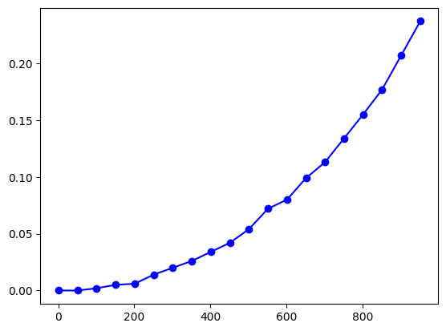
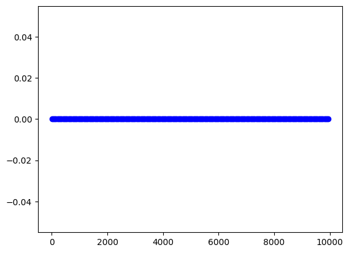

Итеративные и рекурсивные алгоритмы
Цель работы
Изучить рекурсивные алгоритмы и рекурсивные структуры данных; научиться проводить анализ итеративных и рекурсивных процедур; исследовать эффективность итеративных и рекурсивных процедур при реализации на ПЭВМ.


```python
import matplotlib.pyplot as plt
import usage_time
def factorial(a):
    if a==0:
        return 1
    else:
        return a*factorial(a-1)
def line(x,N):
    if N == 1:
        return 1
    else:
        return (x**(N-1))/(factorial(N-1))+line(x,N-1) 
def basic(a):
    return a+1
def A(a):
    return a+basic(a)
print(line(2,3))
times=[]
usage=usage_time.get_usage_time()(line)
ranges=list(range(1,1000,50))
for i in ranges:
    usage_line=usage(2,i)
    times.append(usage_line)
plt.plot(ranges,times,'bo-')
```

    5.0


    [<matplotlib.lines.Line2D at 0x7e6b1425f250>]


    

    


в итоге верхняя граница = 1000


```python

```


```python
def taylor_series(x, n):
    total = 0
    factorial = 1
    
    for i in range(n):
        if i > 0:
            factorial *= i
        term = (x ** i) / factorial
        total += term
    
    return total
print(taylor_series(2,3))
times2 = []
ranges2=list(range(1,10000,50))
usage1=usage_time.get_usage_time()(taylor_series)
for i in ranges2:
    usage_func=usage1(i,2)
    times2.append(usage_func)
plt.plot(ranges2,times2,'bo-')
```

    5.0


    [<matplotlib.lines.Line2D at 0x7e6b1433f890>]


    

    


```python
import matplotlib.pyplot as plt
import usage_time
from functools import wraps

class ManualCache:
    def __init__(self):
        self.cache = {}
    
    def get(self, key):
        return self.cache.get(key)
    
    def set(self, key, value):
        self.cache[key] = value
        return value

def manual_cache(func):
    cache = {}
    
    @wraps(func)
    def wrapper(*args):
        key = args
        if key in cache:
            return cache[key]
        result = func(*args)
        cache[key] = result
        return result
    return wrapper

def factorial(a):
    if a == 0:
        return 1
    else:
        return a * factorial(a - 1)

line_cache_manual = ManualCache()

def line_manual(x, N):
    if N == 1:
        return 1
    
    cached = line_cache_manual.get((x, N))
    if cached is not None:
        return cached
    
    result = (x ** (N - 1)) / (factorial(N - 1)) + line_manual(x, N - 1)
    return line_cache_manual.set((x, N), result)


@manual_cache
def line_decorator(x, N):
    if N == 1:
        return 1
    else:
        return (x ** (N - 1)) / (factorial(N - 1)) + line_decorator(x, N - 1)
def line_original(x, N):
    if N == 1:
        return 1
    else:
        return (x ** (N - 1)) / (factorial(N - 1)) + line_original(x, N - 1)

def basic(a):
    return a + 1

def A(a):
    return a + basic(a)
```
