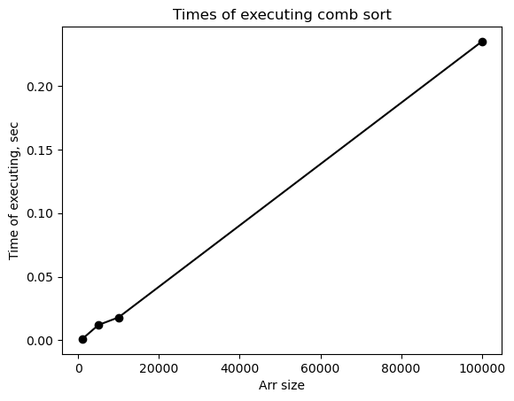

# Алгоритмы сортировки

***

Старшинов Владислав Эдуардович

ИУ10-37

Вариант 6.

## Задания 
***

### Классификация алгоритмов сортировки

- По вычислительной сложности
    - Алгоритмы со сложностью O($n^2$). Сюда относится comb sort в худшем случае.
    - Алгоритмы со сложностью O($nlogn$). Сюда относится comb sort в среднем случае.
    - Алгоритмы со сложностью O($n$). Сюда относится выпавший мне radix sort.
- По использованию дополнительной памяти
    - In-place сортировки. У них постоянный объем дополнительной памяти O($1$). Сюда относится comb sort.
    - Not-in-place сортировки. Алгоритм требует значительно большего количества дополнительной памяти. Radix sort относится и сюда.
- По устойчивости
    - Устойчивые сортировки. Если два элемента имеют одинаковый ключ, то их порядок в отсортированном массиве совпадает с порядком в исходном. Сюда относится radix sort.
    - Неустойчивые сортировки. Могут менять порядок элементов с одинаковыми ключами. Они не обязательно его поменяют, однако могут. Сюда относится comb sort.
- По методу сортировки
    - Сортировка сравнением. Алгоритмы, которые для сортировки используют только операции сравнения элементов. У них нижняя граница сложности Ω($nlogn$). Сюда относится comb sort.
    - Сортировки, не основанные на сравнении. Они используют внутреннюю структуру данных, могут работать за O($n$). Сюда относится radix sort.
- По параллельности.
    - Последовательные. Выполняются в одном потоке (т.е. в одном процессоре). Сюда относятся comb sort и radix sort
    - Параллельные. Предназначены для эффективного выполнения в многопроцессорных системах.

### Сортировка расческой

У нее есть два параметра - gap и shrink factor. Gap - это расстояние между элементами. Сначала она сравнивает элементы, у которых большой gap. Постепенно, с проведением сортировки, он уменьшается до 1. По мере уменьшения gap'a  массив становится все более отсортированным, поэтому при приближении окончания сортировки расческой она начинает работать как обычная пузырьковая сортировка. Shrink factor - число, которое используется для определения gap'a. Изначально gap равен длине массива, а shrink factor выбирается 1.247 как эмпирически наиболее оптимальное число. Начальный gap равен длине массива, деленой на shrink factor. На каждой следующей итерации gap снова делится на shrink factor, после чего округляется в меньшую сторону.

==Картинка блок-схемы comb sort==


```python
comb_sort(arr) {
    n = len(arr)
    gap = n
    swapped = true
    shrink_factor = 1.247

    while (gap > 1 or swapped = true) {
        gap = max(1, floor(gap / shrink_factor))
        swapped = false
        i = 0

        while (i + gap < n) {
            if (arr[i] > arr[i + gap]) {
                swap(arr[i], arr[i + gap])
                swapped = true
            }
            i = i + 1
        }
    }
}
```

**Достоинства сортировки расческой:**
- На практике работает значительно быстрее пузырьковой сортировки, в среднем случае время выполнения будет O($nlogn$)
- Его просто понять и написать
- Не требует дополнительной памяти, т.к. является сортировкой на месте, для своей работы использует исходный массив и несколько переменных
- Эффективно работает на частично отсортированных данных, особенно, когда gap - маленький

**Недостатки сортировки расческой:**
- Он может изменить относительный порядок элементов с одинаковыми ключами
- Время работы в худшем случае - O($n^2$), но на практике такое встречается редко
- Shrink factor влияет на время работы алгоритма.
- Существуют более быстрые и стабильные алгоритмы сортировки, так что почти не используется в промышленной разработке


```python
import usage_time
import matplotlib.pyplot as plot
import math

def comb_sort(arr, n):
    gap = n
    swapped = True
    shrink_factor = 1.247

    while gap > 1 or swapped == True:
        gap = max(1, math.floor(gap / shrink_factor))
        swapped = False
        i = 0

        while i + gap < n:
            if arr[i] > arr[i+gap]:
                c = arr[i]
                arr[i] = arr[i+gap]
                arr[i+gap] = c
                swapped = True
            i = i + 1

sizes = [1000, 5000, 10000, 100000]
times = [0, 0, 0, 0]
times_inc = 0
func = usage_time.get_usage_time()(comb_sort)
for n in sizes:
    arr = [0] * n
    for i in range(n):
        arr[i] = i
    
    times[times_inc] = func(arr, n)
    times_inc = times_inc + 1

plot.plot(sizes, times, "ko-")
plot.title("Times of executing comb sort")
plot.xlabel("Arr size")
plot.ylabel("Time of executing, sec")
```


    Text(0, 0.5, 'Time of executing, sec')


    

    


```python
import usage_time
import matplotlib.pyplot as plot
import math
import numpy as np

def comb_sort(arr, n):
    gap = n
    swapped = True
    shrink_factor = 1.247

    while gap > 1 or swapped == True:
        gap = max(1, math.floor(gap / shrink_factor))
        swapped = False
        i = 0

        while i + gap < n:
            if arr[i] > arr[i+gap]:
                c = arr[i]
                arr[i] = arr[i+gap]
                arr[i+gap] = c
                swapped = True
            i = i + 1

sizes = [1000, 5000, 10000, 100000]
times = [0, 0, 0, 0]
times_inc = 0
func = usage_time.get_usage_time()(comb_sort)
for n in sizes:
    arr = [0] * n
    for i in range(n):
        arr[i] = n-i
    
    times[times_inc] = func(arr, n)
    times_inc = times_inc + 1

plot.plot(sizes, times, "ko-")
plot.title("Times of executing comb sort")
plot.xlabel("Arr size")
plot.ylabel("Time of executing, sec")
```


    Text(0, 0.5, 'Time of executing, sec')


    

    


```python
import usage_time
import matplotlib.pyplot as plot
import math
import numpy as np
import random

def comb_sort(arr, n):
    gap = n
    swapped = True
    shrink_factor = 1.247

    while gap > 1 or swapped == True:
        gap = max(1, math.floor(gap / shrink_factor))
        swapped = False
        i = 0

        while i + gap < n:
            if arr[i] > arr[i+gap]:
                c = arr[i]
                arr[i] = arr[i+gap]
                arr[i+gap] = c
                swapped = True
            i = i + 1

sizes = [1000, 5000, 10000, 100000]
times = [0, 0, 0, 0]
times_inc = 0
func = usage_time.get_usage_time()(comb_sort)
for n in sizes:
    arr = [0] * n
    for i in range(n):
        arr[i] = random.randint(1, n)
    
    times[times_inc] = func(arr, n)
    times_inc = times_inc + 1

plot.plot(sizes, times, "ko-")
plot.title("Times of executing comb sort")
plot.xlabel("Arr size")
plot.ylabel("Time of executing, sec")
```


    Text(0, 0.5, 'Time of executing, sec')


    

    


***
### Поразрядная сортировка

Данный алгоритм разбивает данные на элементарные разряды. Скажем, число он будет разбивать на цифры, на строки - на символы. Он не сравнивает элементы между собой напрямую, он распределяет элементы по корзинам на основе каждого отдельного разряда, начиная с младшего. Число с наибольшим старшим разрядом всегда будет больше числа с меньшим старшим разрядом, каковы бы они ни были. Данный алгоритм применяется там, где входные данные можно разбивать на последовательность разрядов.

==Картинка блок-схемы Radix sort==


```python
radix_sort(arr) {
    max_ = max(arr)
    exp = 1

    while (max / exp > 0) {
        counting_sort_by_lsd(arr, exp)
        exp = exp * 10
    }
}

counting_sort_by_lsd(arr, exp) {
    n = len(arr)
    output = new_output_arr[n]
    count = new_arr[0, 0, 0, 0, 0, 0, 0, 0, 0, 0]

    for (i in range 0..n-1) {
        digit = (arr[i] / exp) % 10
        count[digit]++
    }

    for (i in range 1..9) {
        count[i] = count[i] + count[i-1]
    }

    for (i in range n-1..0) {
        digit = (arr[i] / exp) % 10
        output[count[digit] - 1] = arr[i]
        count[digit]--
    }

    for (i in range 0..n-1) {
        arr[i] = output[i]
    }
}
```

**Достоинства поразрядной сортировки:**
- В лучшем и среднем случае время алгоритма составит O($d*n$), где d - среднее число разрядов, n - количество элементов. Он может быть значительно быстрее алгоритмов с асимптотической сложностью O($nlogn$), особенно, когда $d<<n$. 
- Относительно количества элементов имеет линейную сложность.
- Является стабильным алгоритмом, т.е. сохраняет относительный порядок элементов с одинаковыми ключами.
- Его время работы легко предсказать, т.к. оно зависит не от степени отсортированности входного массива, а от количества разрядов и элементов.

**Недостатки поразрядной сортировки:**
- Неподходит для данных произвольной формы. Только для данных, которые можно представить в виде разрядов в некоторой системе счисления.
- Требует дополнительной памяти для временных массивов, т.е. его накладные расходы составляют O($n+k$), где n - количество элементов, k - размер алфавита разрядов (базис системы счисления). Это не in-place алгоритм.
- Если разрядов очень много, а элементов очень мало, то ее производительность будет уступать более простым алгоритмам из-за накладных расходов
- Для произвольных типов данных сложно реализовать, сначала надо их привести к разрядным типам данных


```python
import usage_time
import matplotlib.pyplot as plot
import math

def radix_sort(arr): 
    max_num = max(arr)
    exp = 1

    while max_num // exp > 0:
        counting_sort_by_lsd(arr, exp)
        exp = exp * 10

    return arr

def counting_sort_by_lsd(arr, exp):
    n = len(arr)
    output = [0] * n
    count = [0] * 10

    for i in range(n):
        digit = (arr[i] // exp) % 10
        count[digit] = count[digit] + 1

    for i in range(1, 10):
        count[i] = count[i] + count[i-1]

    for i in range(n-1, -1, -1):
        digit = (arr[i] // exp) % 10
        output[count[digit] - 1] = arr[i]
        count[digit] = count[digit] - 1

    for i in range(n):
        arr[i] = output[i]

sizes = [1000, 5000, 10000, 100000]
times = [0, 0, 0, 0]
times_inc = 0
func = usage_time.get_usage_time()(radix_sort)
for n in sizes:
    arr = [0] * n
    for i in range(n):
        arr[i] = i
    
    times[times_inc] = func(arr)
    times_inc = times_inc + 1

plot.plot(sizes, times, "ko-")
plot.title("Times of executing radix sort")
plot.xlabel("Arr size")
plot.ylabel("Time of executing, sec")
```


    Text(0, 0.5, 'Time of executing, sec')


    

    


```python
import usage_time
import matplotlib.pyplot as plot
import math

def radix_sort(arr): 
    max_num = max(arr)
    exp = 1

    while max_num // exp > 0:
        counting_sort_by_lsd(arr, exp)
        exp = exp * 10

    return arr

def counting_sort_by_lsd(arr, exp):
    n = len(arr)
    output = [0] * n
    count = [0] * 10

    for i in range(n):
        digit = (arr[i] // exp) % 10
        count[digit] = count[digit] + 1

    for i in range(1, 10):
        count[i] = count[i] + count[i-1]

    for i in range(n-1, -1, -1):
        digit = (arr[i] // exp) % 10
        output[count[digit] - 1] = arr[i]
        count[digit] = count[digit] - 1

    for i in range(n):
        arr[i] = output[i]

sizes = [1000, 5000, 10000, 100000]
times = [0, 0, 0, 0]
times_inc = 0
func = usage_time.get_usage_time()(radix_sort)
for n in sizes:
    arr = [0] * n
    for i in range(n):
        arr[i] = n-i
    
    times[times_inc] = func(arr)
    times_inc = times_inc + 1

plot.plot(sizes, times, "ko-")
plot.title("Times of executing radix sort")
plot.xlabel("Arr size")
plot.ylabel("Time of executing, sec")
```


    Text(0, 0.5, 'Time of executing, sec')


    

    


```python
import usage_time
import matplotlib.pyplot as plot
import math
import random

def radix_sort(arr): 
    max_num = max(arr)
    exp = 1

    while max_num // exp > 0:
        counting_sort_by_lsd(arr, exp)
        exp = exp * 10

    return arr

def counting_sort_by_lsd(arr, exp):
    n = len(arr)
    output = [0] * n
    count = [0] * 10

    for i in range(n):
        digit = (arr[i] // exp) % 10
        count[digit] = count[digit] + 1

    for i in range(1, 10):
        count[i] = count[i] + count[i-1]

    for i in range(n-1, -1, -1):
        digit = (arr[i] // exp) % 10
        output[count[digit] - 1] = arr[i]
        count[digit] = count[digit] - 1

    for i in range(n):
        arr[i] = output[i]

sizes = [1000, 5000, 10000, 100000]
times = [0, 0, 0, 0]
times_inc = 0
func = usage_time.get_usage_time()(radix_sort)
for n in sizes:
    arr = [0] * n
    for i in range(n):
        arr[i] = random.randint(1, n)
    
    times[times_inc] = func(arr)
    times_inc = times_inc + 1

plot.plot(sizes, times, "ko-")
plot.title("Times of executing radix sort")
plot.xlabel("Arr size")
plot.ylabel("Time of executing, sec")
```


    Text(0, 0.5, 'Time of executing, sec')


    

    

