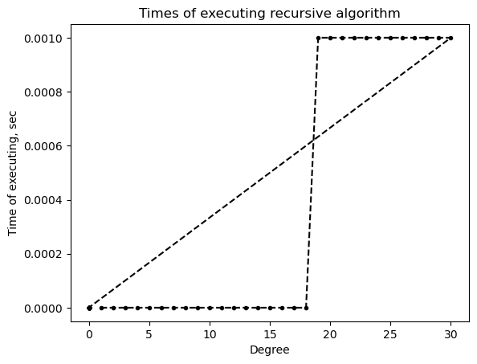
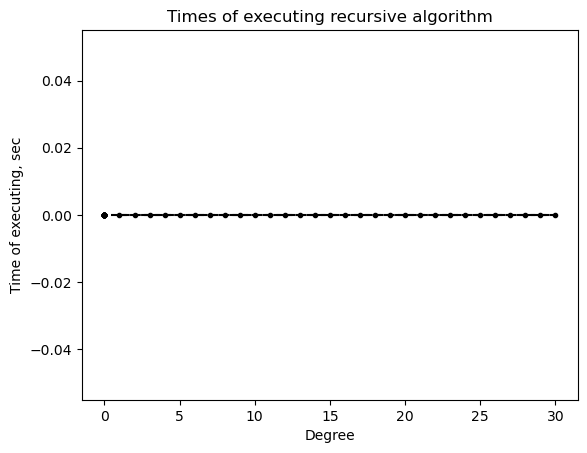

# Итеративные и рекурсивные алгоритмы

***

Старшинов Владислав Эдуардович

ИУ10-37

Вариант 6

## Задания

***

### Реализовать рекурсивный алгоритм для вычисления суммы $n$ первых членов ряда

Ряд: $x + (x^3)/2! + (x^5)/3! + (x^7)/4! + ... + (x^(2n-1))/n!$


```python
import usage_time
import matplotlib.pyplot as plot

def factorial(n):
    """Рекурсивное вычисление факториала"""
    if n == 0 or n == 1:
        return 1
    return n * factorial(n - 1)

def power(x, n):
    """Рекурсивное вычисление степени"""
    if n == 0:
        return 1
    return x * power(x, n - 1)

def series_term(x, n):
    """Рекурсивное вычисление n-го члена ряда"""
    numerator = power(x, 2*n - 1)      # x^(2n-1)
    denominator = factorial(n)         # n!
    return numerator / denominator

def series_sum(x, n):
    """Рекурсивное вычисление суммы n первых членов ряда"""
    if n == 0:
        return 0
    if n == 1:
        return x  # первый член: x^1/1! = x
    
    # Сумма = сумма предыдущих (n-1) членов + n-й член
    return series_sum(x, n - 1) + series_term(x, n)

func = usage_time.get_usage_time()(series_sum)
n = 50
degrees = [0] * n
for i in range(1, 31):
    degrees[i-1] = i
times = [0] * n
times_inc = 0
for i in degrees:
    times[times_inc] = func(2, i)
    times_inc += 1

plot.plot(degrees, times, "k.--")
plot.title("Times of executing recursive algorithm")
plot.xlabel("Degree")
plot.ylabel("Time of executing, sec")
```


    Text(0, 0.5, 'Time of executing, sec')


    

    


```python
\documentclass[border=5mm]{standalone}
\usepackage{tikz}
\usetikzlibrary{shapes, arrows, positioning}

\begin{document}

\begin{tikzpicture}[node distance=2cm, auto]
\tikzstyle{startstop} = [rectangle, rounded corners, minimum width=3cm, minimum height=1cm,text centered, draw=black, fill=red!30]
\tikzstyle{process} = [rectangle, minimum width=3cm, minimum height=1cm, text centered, draw=black, fill=orange!30]
\tikzstyle{decision} = [diamond, minimum width=3cm, minimum height=1cm, text centered, draw=black, fill=green!30]
\tikzstyle{arrow} = [thick,->,>=stealth]

\node (start) [startstop] {Begin: series\_sum(x, n)};
\node (dec1) [decision, below of=start] {n == 0?};
\node (ret0) [process, right of=dec1, xshift=3cm] {return 0};
\node (dec2) [decision, below of=dec1, yshift=-1cm] {n == 1?};
\node (retx) [process, right of=dec2, xshift=3cm] {return x};
\node (calc) [process, below of=dec2, yshift=-1cm] {term = $x^{2n-1}/n!$};
\node (recur) [process, below of=calc] {sum = series\_sum(x, n-1)};
\node (combine) [process, below of=recur] {return sum + term};
\node (end) [startstop, below of=combine] {End};

\draw [arrow] (start) -- (dec1);
\draw [arrow] (dec1) -- node {yes} (ret0);
\draw [arrow] (dec1) -- node {no} (dec2);
\draw [arrow] (dec2) -- node {yes} (retx);
\draw [arrow] (dec2) -- node {no} (calc);
\draw [arrow] (calc) -- (recur);
\draw [arrow] (recur) -- (combine);
\draw [arrow] (combine) -- (end);
\draw [arrow] (ret0) |- (end);
\draw [arrow] (retx) |- (end);
\end{tikzpicture}

\end{document}
```

### Реализация вычисления этого же ряда без использования рекурсии


```python
import math
import usage_time
import matplotlib.pyplot as plot

def series_sum_large_n(x, n):
    """
    Версия, устойчивая к большим значениям n
    (использует логарифмы для предотвращения переполнения)
    """
    if n == 0:
        return 0
    
    total_sum = 0
    log_factorial = 0  # ln(n!)
    
    for i in range(1, n + 1):
        # Вычисляем ln(числителя) и ln(знаменателя)
        log_numerator = (2*i - 1) * math.log(x) if x > 0 else float('-inf')
        log_factorial += math.log(i)
        
        # Вычисляем член ряда через экспоненту
        log_term = log_numerator - log_factorial
        term = math.exp(log_term) if log_term > float('-inf') else 0
        
        total_sum += term
    
    return total_sum

func = usage_time.get_usage_time()(series_sum_large_n)
n = 50
degrees = [0] * n
for i in range(1, 31):
    degrees[i-1] = i
times = [0] * n
times_inc = 0
for i in degrees:
    times[times_inc] = func(2, i)
    times_inc += 1

plot.plot(degrees, times, "k.--")
plot.title("Times of executing recursive algorithm")
plot.xlabel("Degree")
plot.ylabel("Time of executing, sec")
```


    Text(0, 0.5, 'Time of executing, sec')


    

    


```python
\documentclass[border=5mm]{article}
\usepackage{tikz}
\usetikzlibrary{shapes, arrows, positioning}

\begin{document}

\begin{tikzpicture}[node distance=2cm, auto]
\tikzstyle{startstop} = [rectangle, rounded corners, minimum width=3cm, minimum height=1cm,text centered, draw=black, fill=red!30]
\tikzstyle{process} = [rectangle, minimum width=3cm, minimum height=1cm, text centered, draw=black, fill=orange!30]
\tikzstyle{decision} = [diamond, minimum width=3cm, minimum height=1cm, text centered, draw=black, fill=green!30]
\tikzstyle{arrow} = [thick,->,>=stealth]

\node (start) [startstop] {Begin};
\node (init) [process, below of=start] {sum = 0, fact = 1, i = 1};
\node (dec1) [decision, below of=init] {i <= n?};
\node (calc) [process, right of=dec1, xshift=3cm] {term = $x^{2i-1}/i!$};
\node (update) [process, below of=calc] {sum += term, i++};
\node (result) [process, below of=dec1, yshift=-2cm] {return sum};
\node (end) [startstop, below of=result] {End};

\draw [arrow] (start) -- (init);
\draw [arrow] (init) -- (dec1);
\draw [arrow] (dec1) -- node {yes} (calc);
\draw [arrow] (calc) -- (update);
\draw [arrow] (update) |- (dec1);
\draw [arrow] (dec1) -- node {no} (result);
\draw [arrow] (result) -- (end);
\end{tikzpicture}

\end{document}
```

### Выкладки к заданию 3


```python
import sys

def get_recursion_limit():
    """Определение максимальной глубины рекурсии"""
    return sys.getrecursionlimit()

def estimate_max_n():
    """
    Оценка максимального n для рекурсивной реализации
    С учетом того, что каждый вызов требует ~1 фрейм в стеке
    """
    recursion_limit = get_recursion_limit()
    
    # Безопасная оценка: оставляем запас для системных вызовов
    safe_limit = recursion_limit - 100
    
    # Для нашей рекурсии: series_sum(x, n) вызывает series_sum(x, n-1)
    # Глубина рекурсии = n
    max_n = safe_limit
    
    print(f"Лимит рекурсии в системе: {recursion_limit}")
    print(f"Безопасное максимальное n: {max_n}")
    print(f"При n > {max_n} возможно переполнение стека")
    
    return max_n

# Практическая проверка
def test_recursion_depth():
    """Тестирование фактической глубины рекурсии"""
    def recursive_test(n, depth=0):
        if n <= 0:
            return depth
        return recursive_test(n-1, depth+1)
    
    try:
        # Поиск максимальной глубины
        for n in [100, 500, 1000, 2000, 3000]:
            try:
                result = recursive_test(n)
                print(f"n = {n}: успешно, глубина = {result}")
            except RecursionError:
                print(f"n = {n}: переполнение стека")
                break
    except RecursionError:
        print("Достигнут предел рекурсии")

# Запуск оценки
if __name__ == "__main__":
    estimate_max_n()
    print("\nПрактическая проверка:")
    test_recursion_depth()
```


```python
def series_sum_cached(x, n, cache=None):
    """Рекурсивная реализация с явным кэшированием"""
    if cache is None:
        cache = {}
    
    # Проверяем кэш
    if (x, n) in cache:
        return cache[(x, n)]
    
    # Базовые случаи
    if n == 0:
        result = 0
    elif n == 1:
        result = x
    else:
        # Вычисляем текущий член
        power_val = x ** (2*n - 1)
        fact_val = 1
        for i in range(1, n + 1):
            fact_val *= i
        term = power_val / fact_val
        
        # Рекурсивный вызов с кэшированием
        prev_sum = series_sum_cached(x, n - 1, cache)
        result = prev_sum + term
    
    # Сохраняем в кэш
    cache[(x, n)] = result
    return result
```


```python
from functools import wraps

def cache_decorator(func):
    """Декоратор для кэширования результатов"""
    cache = {}
    
    @wraps(func)
    def wrapper(x, n):
        key = (x, n)
        if key in cache:
            print(f"Использован кэш для n={n}")
            return cache[key]
        
        result = func(x, n)
        cache[key] = result
        print(f"Вычислен и сохранен результат для n={n}: {result:.6f}")
        return result
    
    return wrapper

@cache_decorator
def series_sum_decorated(x, n):
    """Рекурсивная функция с декоратором кэширования"""
    if n == 0:
        return 0
    if n == 1:
        return x
    
    # Вычисляем текущий член
    power_val = x ** (2*n - 1)
    fact_val = 1
    for i in range(1, n + 1):
        fact_val *= i
    term = power_val / fact_val
    
    # Рекурсивный вызов
    return series_sum_decorated(x, n - 1) + term
```
