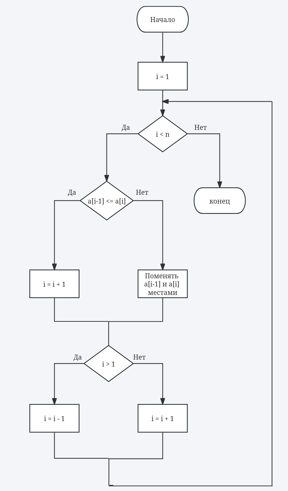
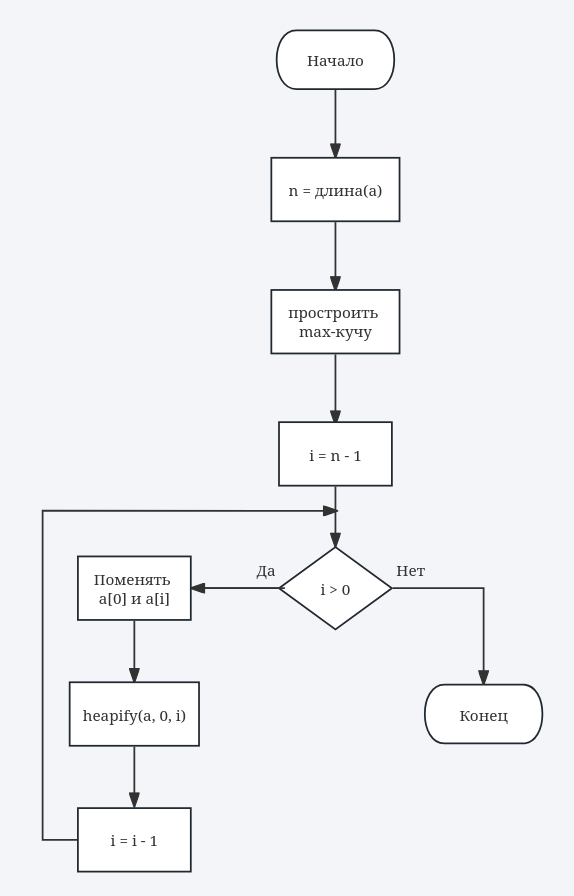
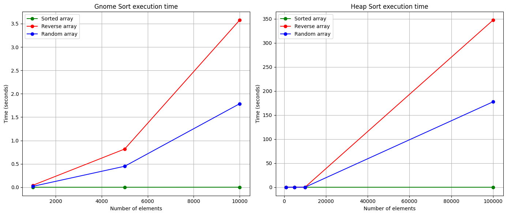

# Алгоритмы сортировки
Фомин И.Н.
ИУ10-37
## Задания
### Задание 1
| Алгоритм                                         | Устойчивость                                           | Место хранения       | На месте?   | Адаптивность        | Сложность (лучший / средний / худший)               |
| ------------------------------------------------ | ------------------------------------------------------ | -------------------- | ----------- | ------------------- | --------------------------------------------------- |
| **Bitonic sort (Битонная)**                      | Неустойчивая                                           | Внутренняя           | Частично    | Неадаптивная        | O(n log² n) / O(n log² n) / O(n log² n)             |
| **Bogosort**                                     | Устойчивая                                             | Внутренняя           | На месте    | Неадаптивная        | O(n) / O(n·n!) / O(∞)                               |
| **Stooge sort**                                  | Устойчивая                                             | Внутренняя           | На месте    | Неадаптивная        | O(n².709) / O(n².709) / O(n².709)                   |
| **Timsort**                                      | Устойчивая                                             | Внутренняя           | Не на месте | Адаптивная          | O(n) / O(n log n) / O(n log n)                      |
| **Introsort**                                    | Неустойчивая                                           | Внутренняя           | На месте    | Неадаптивная        | O(n log n) / O(n log n) / O(n log n)                |
| **Блинная сортировка (Pancake sort)**            | Неустойчивая                                           | Внутренняя           | На месте    | Неадаптивная        | O(n) / O(n²) / O(n²)                                |
| **Блочная сортировка (Block sort)**              | Устойчивая                                             | Внутренняя           | Не на месте | Частично            | O(n log n) / O(n log n) / O(n log n)                |
| **Быстрая (Хоара) сортировка (Quicksort)**       | Неустойчивая                                           | Внутренняя           | На месте    | Неадаптивная        | O(n log n) / O(n log n) / O(n²)                     |
| **Гномья сортировка (Gnome sort)**               | Устойчивая                                             | Внутренняя           | На месте    | Адаптивная          | O(n) / O(n²) / O(n²)                                |
| **Медленная сортировка (Slow sort)**             | Устойчивая                                             | Внутренняя           | На месте    | Неадаптивная        | O(n log n) / O(n log n) / O(2^n)                    |
| **Метод Шелла (Shell sort)**                     | Неустойчивая                                           | Внутренняя           | На месте    | Частично адаптивная | O(n) / O(n^(3/2)) / O(n²) (зависит от инкрементов)  |
| **Пирамидальная сортировка (Heap sort)**         | Неустойчивая                                           | Внутренняя           | На месте    | Неадаптивная        | O(n log n) / O(n log n) / O(n log n)                |
| **Плавная сортировка (Smoothsort)**              | Неустойчивая                                           | Внутренняя           | На месте    | Адаптивная          | O(n) / O(n log n) / O(n log n)                      |
| **Поразрядная сортировка (Radix sort)**          | Устойчивая                                             | Внутренняя           | Не на месте | Неадаптивная        | O(n·k) / O(n·k) / O(n·k), k — длина ключа           |
| **Пузырьковая сортировка (Bubble sort)**         | Устойчивая                                             | Внутренняя           | На месте    | Адаптивная          | O(n) / O(n²) / O(n²)                                |
| **Сортировка выбором (Selection sort)**          | Неустойчивая                                           | Внутренняя           | На месте    | Неадаптивная        | O(n²) / O(n²) / O(n²)                               |
| **Сортировка деревом (Tree sort)**               | Устойчивая (если использовать сбалансированное дерево) | Внутренняя           | Не на месте | Неадаптивная        | O(n log n) / O(n log n) / O(n²)                     |
| **Сортировка подсчетом (Counting sort)**         | Устойчивая                                             | Внутренняя           | Не на месте | Неадаптивная        | O(n + k) / O(n + k) / O(n + k), k — диапазон ключей |
| **Сортировка перемешиванием (Shuffle sort)**     | Устойчивая                                             | Внутренняя           | На месте    | Неадаптивная        | O(n log n) / O(n log n) / O(n log n)                |
| **Сортировка расческой (Comb sort)**             | Неустойчивая                                           | Внутренняя           | На месте    | Частично            | O(n) / O(n²/2^p) / O(n²)                            |
| **Сортировка слиянием (Merge sort)**             | Устойчивая                                             | Внутренняя / Внешняя | Не на месте | Неадаптивная        | O(n log n) / O(n log n) / O(n log n)                |
| **Сортировка чёт-нечет (Odd-even sort)**         | Устойчивая                                             | Внутренняя           | На месте    | Частично            | O(n) / O(n²) / O(n²)                                |
| **Топологическая сортировка (Topological sort)** | Неустойчивая                                           | Внутренняя           | На месте    | Неадаптивная        | O(V + E), V — вершины, E — ребра                    |
| **Шейкерная сортировка (Cocktail sort)**         | Устойчивая                                             | Внутренняя           | На месте    | Адаптивная          | O(n) / O(n²) / O(n²)                                |

### Задание 2
#### Гномья сортировка 
Это простой алгоритм обменного типа, основанный на последовательных сравнениях соседних элементов.
Она работает по принципу «садового гнома», который переставляет соседние цветы (элементы), если они стоят не по порядку, и возвращается назад при обмене, чтобы проверить предыдущие элементы.  

Алгоритм был предложен Хамидом Саркисом в 2000 году и является вариацией сортировки вставками, но реализуется без вложенных циклов.  

Принцип работы:
1. Начинаем с первого элемента массива (индекс i = 1).
2. Сравниваем текущий элемент с предыдущим:
    - если элементы стоят в правильном порядке (a[i-1] ≤ a[i]), двигаемся вперёд (i++);
    - если нарушен порядок, меняем их местами и двигаемся назад (i--).
3. Если достигли начала массива, снова двигаемся вперёд (i++).
4. Процесс повторяется, пока не дойдём до конца массива.

Сложность:
| Тип сложности  | Оценка                              |
| -------------- | ----------------------------------- |
| Лучший случай  | O(n) (если массив уже отсортирован) |
| Средний случай | O(n²)                               |
| Худший случай  | O(n²)                               |

#### Пирамидальная сортировка
Это алгоритм сравнения и обмена элементов, основанный на структуре данных бинарная куча (heap).
Её предложил Дж. У. Уильямс (Williams) в 1964 году.  
Алгоритм сочетает эффективность (O(n log n)) и простоту, но не является стабильным.

Принцип работы:
1. Построение кучи (heapify):
    - Преобразуем массив в макс-кучу (каждый родитель ≥ потомков).
2. Извлечение максимума:
    - На вершине кучи — максимальный элемент.
    - Меняем его с последним элементом массива.
    - Уменьшаем размер кучи и восстанавливаем свойство кучи.
3. Повторяем, пока куча не опустеет — массив отсортирован по возрастанию.
### Задание 3
Блок-схема алгоритма Гномьей сортировки:  
  
Блок-схема алгоритма Пирамидальной сортировки:  
  
### Задание 4
Псевдокод гномьей сортировки:
```pseudo
GNOME_SORT(A)
    i = 1
    while i < length(A)
        if i == 0 or A[i] >= A[i - 1]
            i = i + 1
        else
            swap(A[i], A[i - 1])
            i = i - 1
    return A
```
Псевдокод пирамидальной сортировки:
```pseudo
HEAP_SORT(A)
    n = length(A)
    
    BUILD_MAX_HEAP(A)
        for i = floor(n/2) - 1 down to 0
            HEAPIFY(A, i, n)
    
    for i = n - 1 down to 1
        swap(A[0], A[i])       # Перемещаем максимум в конец
        HEAPIFY(A, 0, i)       # Восстанавливаем кучу в первых i элементах

HEAPIFY(A, i, heap_size)
    largest = i
    left = 2 * i + 1
    right = 2 * i + 2

    if left < heap_size and A[left] > A[largest]
        largest = left

    if right < heap_size and A[right] > A[largest]
        largest = right

    if largest != i
        swap(A[i], A[largest])
        HEAPIFY(A, largest, heap_size)
```
### Задание 5
#### Гномья сортировка:
**Достоинства:**
- Простая реализация, легко понять и написать.
- Не требует дополнительной памяти.
- Эффективна для почти отсортированных массивов (почти O(n)) — адаптивна.

**Недостатки:**
- Очень медленная на больших и случайных массивах (O(n²)).
- Редко используется на практике, уступает более эффективным алгоритмам.
- Неустойчива: одинаковые элементы могут менять порядок.
#### Пирамидальная сортировка
**Достоинства:**
- Сортировка in-place (не требует дополнительной памяти кроме O(1)).
- Всегда гарантированная сложность O(n log n), даже в худшем случае.
- Подходит для больших массивов и данных с непредсказуемым порядком.

**Недостатки:**
- Медленнее на практике, чем Quick Sort или Merge Sort, из-за большого числа сравнений.
- Неустойчива: одинаковые элементы могут менять порядок.
- Реализация чуть сложнее, чем у простых сортировок (Пузырьковая, Гномья).
- Не адаптивна: не учитывает уже частично отсортированные элементы.
### Задание 6


```python
def gnome_sort(v):
    i = 1
    while i < len(v):
        if i == 0 or v[i] >= v[i - 1]:
            i += 1
        else:
            v[i], v[i - 1] = v[i - 1], v[i]
            i -= 1
    return v


def heapify(v, n, i):
    largest = i
    left = 2 * i + 1
    right = 2 * i + 2

    if left < n and v[left] > v[largest]:
        largest = left
    if right < n and v[right] > v[largest]:
        largest = right

    if largest != i:
        v[i], v[largest] = v[largest], v[i]
        heapify(v, n, largest)


def heap_sort(v):
    n = len(v)

    for i in range(n // 2 - 1, -1, -1):
        heapify(v, n, i)

    for i in range(n - 1, 0, -1):
        v[0], v[i] = v[i], v[0]
        heapify(v, i, 0)

    return v
```

### Задание 7


```python
v1 = [34, 2, 78, 1, 56, 99, 12]
print("Gnome Sort:", gnome_sort(v1))

v2 = [34, 2, 78, 1, 56, 99, 12]
print("Heap Sort:", heap_sort(v2))
```

    Gnome Sort: [1, 2, 12, 34, 56, 78, 99]
    Heap Sort: [1, 2, 12, 34, 56, 78, 99]


### Задание 8
Ручная трассировка гномьей сортировки:  
v = [5, 3, 4, 1]  
i = 1

| Шаг | i | Массив       | Действие                                           |
| --- | - | ------------ | -------------------------------------------------- |
| 1   | 1 | [5, 3, 4, 1] | v[1] < v[0] -> swap(v[1], v[0]) -> v = [3, 5, 4, 1], i = 0 |
| 2   | 0 | [3, 5, 4, 1] | i == 0 -> i = 1                                     |
| 3   | 1 | [3, 5, 4, 1] | v[1] >= v[0] -> i = 2                           |
| 4   | 2 | [3, 5, 4, 1] | v[2] < v[1] -> swap(v[2], v[1]) -> v = [3, 4, 5, 1], i = 1 |
| 5   | 1 | [3, 4, 5, 1] | v[1] >= v[0] -> i = 2                           |
| 6   | 2 | [3, 4, 5, 1] | v[2] >= v[1] -> i = 3                           |
| 7   | 3 | [3, 4, 5, 1] | v[3] < v[2] -> swap(v[3], v[2]) -> v = [3, 4, 1, 5], i = 2 |
| 8   | 2 | [3, 4, 1, 5] | v[2] < v[1] -> swap(v[2], v[1]) -> v = [3, 1, 4, 5], i = 1 |
| 9   | 1 | [3, 1, 4, 5] | v[1] < v[0] -> swap(v[1], v[0]) -> v = [1, 3, 4, 5], i = 0 |
| 10  | 0 | [1, 3, 4, 5] | i == 0 -> i = 1                                     |
| 11  | 1 | [1, 3, 4, 5] | v[1] >= v[0] -> i = 2                           |
| 12  | 2 | [1, 3, 4, 5] | v[2] >= v[1] -> i = 3                           |
| 13  | 3 | [1, 3, 4, 5] | v[3] >= v[2] -> i = 4 -> конец                   |


Ручная трассировка пирамидальной сортировки:  
v = [5, 3, 4, 1]

| Шаг | Массив        | Действие                                                                 |
| --- | ------------- | ------------------------------------------------------------------------ |
| 1   | [5, 3, 4, 1]  | Построение max-heap: i = 1, v[1]=3, дети v[3]=1 -> ничего не меняем      |
| 2   | [5, 3, 4, 1]  | Построение max-heap: i = 0, v[0]=5, дети v[1]=3, v[2]=4 -> ничего не меняем |
| 3   | [1, 3, 4, 5]  | swap (v[0], v[3])                                                        |
| 4   | [4, 3, 1, 5]  | heapify(v, 0, 3): v[0]=1, дети v[1]=3, v[2]=4 -> swap(v[0], v[2])       |
| 5   | [4, 3, 1, 5]  | heapify(v, 2, 3): v[2]=1, детей нет -> heapify завершён                  |
| 6   | [1, 3, 4, 5]  | swap(v[0], v[2])                                                        |
| 7   | [3, 1, 4, 5]  | heapify(v, 0, 2): v[0]=1, дети v[1]=3 -> swap(v[0], v[1])               |
| 8   | [3, 1, 4, 5]  | heapify(v, 1, 2): v[1]=1, детей нет -> heapify завершён                  |
| 9   | [1, 3, 4, 5]  | swap(v[0], v[1])                                                        |
| 10  | [1, 3, 4, 5]  | heapify(v, 0, 1): один элемент -> heapify завершён                        |
| 11  | [1, 3, 4, 5]  | Конец сортировки                                                          |


### Задание 9, 10, 11


```python
import random, usage_time
import matplotlib.pyplot as plt

n1_n2_n3_n4 = [1000, 5000, 10000, 100000]
num_trials = 3

results = {
    "Gnome Sort": {"sorted": [], "reverse": [], "random": []},
    "Heap Sort": {"sorted": [], "reverse": [], "random": []}
}

for n in n1_n2_n3_n4:
    arr_sorted = list(range(n))
    arr_reverse = list(range(n, 0, -1))
    arr_random = [random.randint(1, n) for _ in range(n)]

    if n != 100000:
        gnome_sort_func = usage_time.get_usage_time()(gnome_sort)
        t_sorted = sum(gnome_sort_func(arr_sorted) for _ in range(num_trials)) / num_trials
        t_reverse = sum(gnome_sort_func(arr_reverse) for _ in range(num_trials)) / num_trials
        t_random = sum(gnome_sort_func(arr_random) for _ in range(num_trials)) / num_trials

        results["Gnome Sort"]["sorted"].append(t_sorted)
        results["Gnome Sort"]["reverse"].append(t_reverse)
        results["Gnome Sort"]["random"].append(t_random)

    heap_sort_func = usage_time.get_usage_time()(gnome_sort)
    t_sorted = sum(heap_sort_func(arr_sorted) for _ in range(num_trials)) / num_trials
    t_reverse = sum(heap_sort_func(arr_reverse) for _ in range(num_trials)) / num_trials
    t_random = sum(heap_sort_func(arr_random) for _ in range(num_trials)) / num_trials

    results["Heap Sort"]["sorted"].append(t_sorted)
    results["Heap Sort"]["reverse"].append(t_reverse)
    results["Heap Sort"]["random"].append(t_random)


fig, axes = plt.subplots(1, 2, figsize=(14, 6))

# Gnome Sort
axes[0].plot(n1_n2_n3_n4[:3], results["Gnome Sort"]["sorted"], 'go-', label='Sorted array')
axes[0].plot(n1_n2_n3_n4[:3], results["Gnome Sort"]["reverse"], 'ro-', label='Reverse array')
axes[0].plot(n1_n2_n3_n4[:3], results["Gnome Sort"]["random"], 'bo-', label='Random array')
axes[0].set_title('Gnome Sort execution time')
axes[0].set_xlabel('Number of elements')
axes[0].set_ylabel('Time (seconds)')
axes[0].legend()
axes[0].grid(True)

# Heap Sort
axes[1].plot(n1_n2_n3_n4, results["Heap Sort"]["sorted"], 'go-', label='Sorted array')
axes[1].plot(n1_n2_n3_n4, results["Heap Sort"]["reverse"], 'ro-', label='Reverse array')
axes[1].plot(n1_n2_n3_n4, results["Heap Sort"]["random"], 'bo-', label='Random array')
axes[1].set_title('Heap Sort execution time')
axes[1].set_xlabel('Number of elements')
axes[1].set_ylabel('Time (seconds)')
axes[1].legend()
axes[1].grid(True)

plt.tight_layout()
plt.show()
```


    

    

