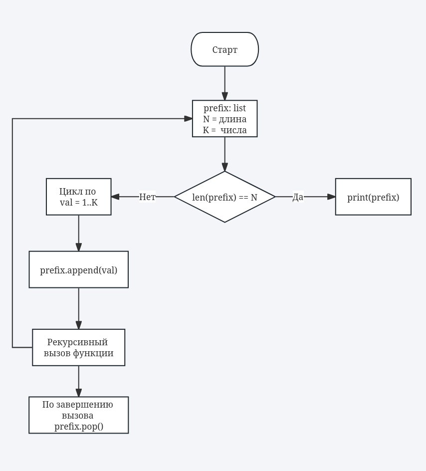

# Итеративные и рекурсивные алгоритмы
Фомин И.Н.
ИУ10-37
## Задания
### Задание 1 Реализуйте рекурсивный алгоритм, распечатывающий по одному разу в лексикографическом порядке все последовательности длины N, составленные из натуральных чисел 1,2,…,K.


```python
def generate_sequences_recursive(N, K, prefix=[]):
    if len(prefix) == N:
        print(prefix)
        return

    for val in range(1, K + 1):
        prefix.append(val)
        generate_sequences_recursive(N, K, prefix)
        prefix.pop()
        

N = 3  # длина последовательностей
K = 2  # числа 1..K
generate_sequences_recursive(N, K)

```

    [1, 1, 1]
    [1, 1, 2]
    [1, 2, 1]
    [1, 2, 2]
    [2, 1, 1]
    [2, 1, 2]
    [2, 2, 1]
    [2, 2, 2]


### Задание 2 Реализуйте алгоритмы из задания 1 не используя рекурсию.


```python
def generate_sequences_iterative(N, K):
    stack = [(0, [])]

    while stack:
        pos, seq = stack.pop()
        if pos == N:
            print(seq)
            continue

        for val in range(K, 0, -1):
            stack.append((pos + 1, seq + [val]))


N = 3  # длина последовательностей
K = 2  # числа 1..K
generate_sequences_iterative(N, K)
```

    [1, 1, 1]
    [1, 1, 2]
    [1, 2, 1]
    [1, 2, 2]
    [2, 1, 1]
    [2, 1, 2]
    [2, 2, 1]
    [2, 2, 2]


### Задание 3


| Параметр                       | Значение    |
| ------------------------------ | ----------- |
| Глубина рекурсии               | N           |
| Стандартное ограничение Python | ~1000       |
| Безопасный предел              | **N ≤ 900** |


```python
cache = {}

def generate_with_cache(N, K, prefix=[]):
    key = tuple(prefix)

    if key in cache:
        return cache[key]

    if len(prefix) == N:
        print(prefix)
        cache[key] = None
        return

    for val in range(1, K + 1):
        prefix.append(val)
        generate_with_cache(N, K, prefix)
        prefix.pop()

    cache[key] = None
    return

```


```python
from functools import lru_cache

@lru_cache(None)
def generate_decorated(prefix_tuple, N, K):
    prefix = list(prefix_tuple)

    if len(prefix) == N:
        print(prefix)
        return

    for val in range(1, K + 1):
        generate_decorated(tuple(prefix + [val]), N, K)
```


```python
import time

def measure(func, N, K):
    start = time.time()
    func(N, K)
    return time.time() - start

t1 = measure(generate_sequences_recursive, 15, 3)
t2 = measure(lambda N,K: generate_with_cache(N,K), 15, 3)
t3 = measure(lambda N,K: generate_decorated(tuple(), N, K), 15, 3)
print(t1, t2, t3)
```

    2.5187137126922607 2.86102294921875e-06 31.854609727859497

