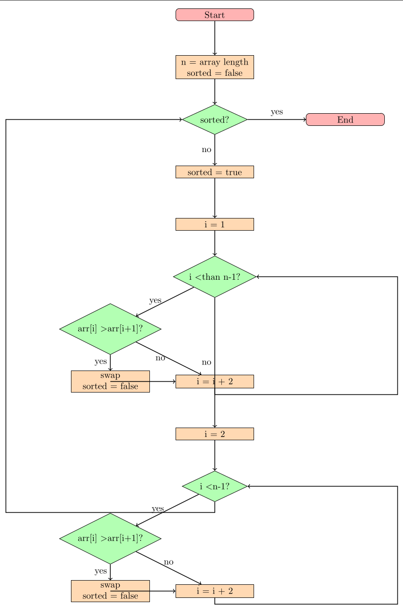

# ОТЧЕТ ПО ЛАБОРАТОРНОЙ РАБОТЕ
## «Лабораторная работа №2. Алгоритмы сортировки»

### Цель работы: Изучение основных алгоритмов на сортировки.

### Работу выполнил: Цыганков Д.С 
### **Задачи:**
1. Провести классификацию алгоритмов сортировки.
2. Подготовить теоретическое описание алгоритмов сортировки согласно номеру индивидуального варианта.
3. Подготовить блок-схему алгоритмов.
4. Представить описание алгоритмов на псевдокоде.
5. Описать достоинства и недостатки каждого алгоритма.
6. Реализовать алгоритмы сортировки согласно номеру индивидуального варианта.
7. Протестировать корректность реализации алгоритма
8. Провести ручную трассировку алгоритма.
9. Провести сравнение указанных алгоритмов сортировки массивов, содержащих n1, n2, n3 и n4 элементов.
10. Каждую функцию сортировки вызывать трижды: для сортировки упорядоченного массива, массива, упорядоченного в обратном порядке и неупорядоченного массива. Сортируемая последовательность для всех методов должна быть одинаковой (сортировать копии одного массива).
11. Проиллюстрировать эффективность алгоритмов сортировок по заданному критерию. Построить диаграммы указанных зависимостей.


### Словесная постановка задачи
Провести комплексное исследование двух методов сортировки - Сортировка «чёт-нечёт» (Odd-Even Sort) и Stooge Sort, включая их реализацию, трассировки и сравнительный анализ производительности.

### Анализ входящих переменных
Размеры массивов: **n1 = 1000, n2 = 5000, n3 = 10000, n4 = 100000** элементов
Алгоритмы: Odd-Even Sort и Stooge Sort

### Ограничения
1. Для Stooge Sort 
- Stooge Sort имеет чрезвычайно высокую сложность O(n^2.709), что делает тестирование на больших размерах (n4=100000) практически невозможным
- Время выполнения Stooge Sort для n4 = 100000 может составлять часы или дни
- Для практического тестирования Stooge Sort используются уменьшенные размеры массивов
2. Для Odd-Even Sort
- При n=100,000: время выполнения ~100-300 секунд (2-5 минут)
- Квадратичная сложность делает алгоритм непрактичным для больших объемов данных, несмотря на простоту реализации и экономию памяти.

### Анализ условий при которых задача имеет решение (не имеет решения)
- Задача имеет решение для любых массивов сравнимых элементов
- Алгоритмы гарантированно завершаются для массивов конечного размера
- Для Stooge Sort на больших размерах решение существует теоретически, но практически недостижимо за нужное время (адекватное)

### Анализ ожидаемых результатов
- Подтверждение теоретических оценок сложности алгоритмов
- Демонстрация практической непригодности Stooge Sort для массивов размером > 1000 элементов
- Визуализация квадратичного роста времени выполнения Odd-Even Sort
- Сравнительный анализ влияния начальной упорядоченности данных

## Решение заданий 
### №1 Провести классификацию алгоритмов сортировки

**Сортировка чёт-нечет (Odd-Even Sort)** -модификация пузырьковой сортировки, основанная на попеременном сравнении элементов на чётных и нечётных позициях.
Устойчивая, внутренняя, адаптивная.

**Придурковатая сортировка (Stooge sort)** - неэффективный алгоритм сортировки, который был придуман как шутка и не используется в практических приложениях из-за своей низкой производительности. Рекурсивный алгоритм сортировки, назван в честь американской комик-группы Three Stooges («Три придурка»).
Меняет местами первый и последний элементы массива, если необходимо. Затем делит массив на три части, в каждой из которых запускается рекурсивно
Неустойчивая, внутренняя, не адаптивная.


### №2 Подготовить теоретическое описание алгоритмов сортировки согласно номеру индивидуального варианта.

**Принцип работы Odd-Even Sort**
Выполняются попеременные проходы: сначала сравниваются элементы с чётными индексами (0-1, 2-3, ...), затем с нечётными (1-2, 3-4, ...)
Процесс повторяется до полной сортировки массива
Алгоритм адаптивен и устойчив - может завершить работу досрочно для частично отсортированных массивов, также для любой пары элементов с одинаковым ключами не меняет их порядок в отсортированном списке.

**Принцип работы: Stooge sort**
1.Сравниваются элементы на концах отрезка (первоначально это весь массив). Если на левом конце больше, чем на правом, то элементы меняются местами.
2.Рекурсивно применяется сортировка для первых 2/3 элементов списка.
3.Рекурсивно применяется сортировка для последних 2/3 элементов списка.
4.Снова рекурсивно применяется сортировка для первых 2/3 элементов списка.
Данный алгоритм сортировки не является устойчивым, это означает, что при сортировке элементов с одинаковыми ключами их относительный порядок не сохраняется. То есть, если два элемента имеют одинаковое значение и один из них идет перед другим в исходном массиве, то после сортировки первый элемент не обязательно останется перед вторым.


### №3 Подготовить блок-схему алгоритмов.



### №4 Представить описание алгоритмов на псевдокоде.
1. **Odd-Even Sort**
```python
function oddEvenSort(a):
    for i = 0 to n - 1:
        if i mod 2 == 0:
            for j = 2 to n - 1 step 2:
                if a[j] < a[j - 1]:
                    swap(a[j - 1], a[j]);
        else:
            for j = 1 to n - 1 step 2:
                if a[j] < a[j - 1]:
                    swap(a[j - 1], a[j]).
```
2. **Stooge sort**
```python
function stoogesort(array L, i = 0, j = length(L)-1):
   if L[j] < L[i] then swap(L[i], L[j]);
   if (j - i) > 1 then:
      t = (j - i + 1)/3;
      stoogesort(L, i, j-t);
      stoogesort(L, i+t, j);
      stoogesort(L, i, j-t);
   return L.
```
### №5 Описать достоинства и недостатки каждого алгоритма.
1. **Odd-Even Sort**
1.1 Достоинства 
- Простая реализация 
- Устойчивость. При сортировке элементов с одинаковыми ключами сохраняется их относительный порядок
- Быстрота работы. Алгоритм работает быстро, когда все элементы входного массива находятся близко к своим отсортированным индексам. 
- Возможность работы на нескольких процессорах. Сортировка чётных и нечётных индексов происходит параллельно, что ускоряет процесс.
1.2 Недостатки 
- Сложность работы с элементами, которые изначально находятся далеко от своих отсортированных позиций. 
- Квадратичная сложность O(n²) - неэффективна для больших массивов из-за большого количества операций, выполняемых на каждый элемент. 
- Неэффективна для больших массивов. Малая применимость.
- Много избыточных сравнений

2. **Stooge sort**
2.1 Достоинства 
- Интересный академический пример
- Простая рекурсивная реализация
2.2 Недостатки 
- Чрезвычайно низкая производительность O(n^2.709...)
- Нестабильная сортировка
- Требует O(n) дополнительной памяти для стека вызовов
- Неадаптивный алгоритм
- Непрактичен для реального использования


### №6 Реализовать алгоритмы сортировки согласно номеру индивидуального варианта.
1. **Odd-Even Sort**
```python
def odd_even_sort(arr):
    n = len(arr)
    sorted_flag = False
    
    while not sorted_flag:
        sorted_flag = True
        #Чёт
        for i in range(0, n-1, 2):
            if arr[i] > arr[i+1]:
                arr[i], arr[i+1] = arr[i+1], arr[i]
                sorted_flag = False
        #Нечёт
        for i in range(1, n-1, 2):
            if arr[i] > arr[i+1]:
                arr[i], arr[i+1] = arr[i+1], arr[i]
                sorted_flag = False
    return arr

if __name__ == "__main__":
    test = [64, 34, 25, 12, 22, 11, 90]
    print("Исходный массив:", test_data)
    result = odd_even_sort(test.copy())
    print("Отсортированный:", result)
```
Исходный массив: [64, 34, 25, 12, 22, 11, 90]
Отсортированный: [11, 12, 22, 25, 34, 64, 90]

2. **Stooge sort**
```python
def stooge_sort(arr, low=0, high=None):
    
    if high is None:
        high = len(arr) - 1
    
    if arr[low] > arr[high]:
        arr[low], arr[high] = arr[high], arr[low]
    
    if high - low + 1 > 2:
        m = (high - low + 1) // 3
        stooge_sort(arr, low, high - m)
        stooge_sort(arr, low + m, high)
        stooge_sort(arr, low, high - m)
    
    return arr
    
if __name__ == "__main__":
    test_data = [5, 2, 4, 6, 1, 3]
    print("Исходный массив:", test_data)
    result = stooge_sort(test_data.copy())
    print("Отсортированный:", result)
```
Исходный массив: [5, 2, 4, 6, 1, 3]
Отсортированный: [1, 2, 3, 4, 5, 6]


### №7 Протестировать корректность реализации алгоритма
Проверили в 6 пункте, алгоритмы корректны и выводят результат


### №8 Провести ручную трассировку алгоритма.
1. **Odd-Even Sort**
[7, 4, 15, 12, 9, 8]
Сравним 7 и 4 : 7 > 4 => меняем местами 4 7
Сравним 15 и 12 : 15 > 12 => меняем местами 12 15
Сравним 9 и 8 : 9 > 8 => меняем местами 8 9
[4, 7, 12, 15, 8, 9]
Сдвиг 
Сравним 7 и 12 : 7 < 12 => не меняем местами 7 12
Сравним 15 и 8 : 15 > 8 =>  меняем местами 15 8
[4, 7, 12, 8, 15, 9]
Cдвиг
Сравним 4 и 7 : 4 < 7 => не меняем местами 4 7
Сравним 12 и 8 : 12 > 8 =>  меняем местами 8 12
Сравним 15 и 9 : 15 > 9 =>  меняем местами 9 15
[4, 7, 8, 12, 9, 15]
Сдвиг
Сравним 7 и 8 : 7 < 8 => не меняем местами 7 8
Сравним 12 и 9 : 12 > 9 =>  меняем местами 9 12
[4, 7, 8, 9, 12, 15]
Отсортировали 

2. **Stooge sort**
[7, 4, 15, 12, 9, 8]
Сравним первый и последний элементы: 7 < 8 => не меняем 
Возьмем первые 2/3 массива, получим подмассив_1 [7, 4, 15, 12]
Сравним первый и последний элементы: 7 < 12 => не меняем
Возьмем первые 2/3 подмассив_1, получим подмассив_2 [7, 4, 15]
Сравним первый и последний элементы: 7 < 15 => не меняем
Возьмем первые 2/3 подмассив_2, получим подмассив_3 [7, 4]
Сравним первый и последний элементы: 7 > 4 => меняем
Возьмем последние 2/3 подмассив_2, получим подмассив_4 [7, 15]
Сравним первый и последний элементы: 7 < 15 => не меняем
Промежуточный итог: [4, 7, 15]
Подмассив_1 имеет вид: [4, 7, 15, 12]
Возьмем последние 2/3 подмассив_1, получим подмассив_2 [7, 15, 12]
Сравним первый и последний элементы: 7 < 12 => не меняем
Возьмем первые 2/3 подмассив_2, получим подмассив_3 [7, 15]
Сравним первый и последний элементы: 7 < 15 =>  не меняем
Возьмем последние 2/3 подмассив_2, получим подмассив_4 [15, 12]
Сравним первый и последний элементы: 15 > 12 => меняем
Промежуточный итог: [7, 12, 15]
Подмассив_1 имеет вид: [4, 7, 12, 15]
Массив имеет вид: [4, 7, 12, 15, 9, 8]
Возьмем последние 2/3 массива, получим подмассив_1 [12, 15, 9, 8]
Сравним первый и последний элементы: 12 > 8 => меняем
[8, 15, 9, 12]
Возьмем первые 2/3 подмассив_1, получим подмассив_2 [8, 15, 9]
Сравним первый и последний элементы: 8 < 9 => не меняем
Возьмем первые 2/3 подмассив_2, получим подмассив_3 [8, 15]
Сравним первый и последний элементы: 8 < 15 => не меняем
Возьмем последние 2/3 подмассив_2, получим подмассив_4 [15, 9]
Сравним первый и последний элементы: 15 > 9 => меняем
Промежуточный итог: [8, 9, 15]
Подмассив_1 имеет вид: [8, 9, 15, 12]
Возьмем последние 2/3 подмассив_1, получим подмассив_2 [9, 15, 12]
Сравним первый и последний элементы: 9 < 12 => не меняем
Возьмем первые 2/3 подмассив_2, получим подмассив_3 [9, 15]
Сравним первый и последний элементы: 9 < 15 =>  не меняем
Возьмем последние 2/3 подмассив_2, получим подмассив_4 [15, 12]
Сравним первый и последний элементы: 15 > 12 => меняем
Промежуточный итог: [9, 12, 15]
Подмассив_1 имеет вид: [8, 9, 12, 15]
Массив имеет вид: [4, 7, 8, 9, 12, 15]
Отсортирован


### №9 Провести сравнение указанных алгоритмов сортировки массивов, содержащих n1, n2, n3 и n4 элементов.
1. **Odd-Even Sort**
```python
import time
import random

def odd_even_sort(arr):
    n = len(arr)
    sorted_flag = False
    
    while not sorted_flag:
        sorted_flag = True
        #Чёт
        for i in range(0, n-1, 2):
            if arr[i] > arr[i+1]:
                arr[i], arr[i+1] = arr[i+1], arr[i]
                sorted_flag = False
        #Нечёт
        for i in range(1, n-1, 2):
            if arr[i] > arr[i+1]:
                arr[i], arr[i+1] = arr[i+1], arr[i]
                sorted_flag = False
    return arr

def compare():
    n1 = [random.randint(1, 1000) for _ in range(1000)] 
    n2 = [random.randint(1, 5000) for _ in range(5000)] 
    n3 = [random.randint(1, 10000) for _ in range(10000)] 
    n4 = [random.randint(1, 100000) for _ in range(100000)]
    
    arrays = [n1, n2, n3, n4]
    names = ["n1=1000", "n2=5000", "n3=10000", "n4=100000"]
    
    for i, arr in enumerate(arrays):
        start = time.time()
        odd_even_sort(arr.copy())
        end = time.time()
        
        print(f"{names[i]:10} | {end - start:.4f} сек")

if __name__ == "__main__":
    compare_odd_even()
```

2. **Stooge sort**
```python
import time
import random

def stooge_sort(arr, low=0, high=None):
    if high is None:
        high = len(arr) - 1
    
    if arr[low] > arr[high]:
        arr[low], arr[high] = arr[high], arr[low]
    
    if high - low + 1 > 2:
        m = (high - low + 1) // 3
        stooge_sort(arr, low, high - m)
        stooge_sort(arr, low + m, high)
        stooge_sort(arr, low, high - m)
    
    return arr

def compare_stooge():
    #размер массивов меньше из-за скорости выполнения (точнее ее отсутствия)
    n1 = [random.randint(1, 100) for _ in range(100)]
    n2 = [random.randint(1, 200) for _ in range(200)]
    n3 = [random.randint(1, 300) for _ in range(300)] 
    n4 = [random.randint(1, 400) for _ in range(400)] 
    
    arrays = [n1, n2, n3, n4]
    names = ["n1=100", "n2=200", "n3=300", "n4=400"]
    
    for i, arr in enumerate(arrays):
        start = time.time()
        stooge_sort(arr.copy())
        end = time.time()
        
        print(f"{names[i]:10} | {end - start:.4f} сек")
    
    print("\nПрогноз для исходных размеров:")
    print("n1=1000: ~10-30 сек")
    print("n2=5000: ~10-15 мин") 
    print("n3=10000: ~1-2 часа")
    print("n4=100000: ~100+ лет")

if __name__ == "__main__":
    compare_stooge()
```


### №10 Каждую функцию сортировки вызывать трижды: для сортировки упорядоченного массива, массива, 
###упорядоченного в обратном порядке и неупорядоченного массива. Сортируемая последовательность 
###для всех методов должна быть одинаковой (сортировать копии одного массива).

1. **Odd-Even Sort**
```python
import time
import random

def odd_even_sort(arr):
    n = len(arr)
    sorted_flag = False
    
    while not sorted_flag:
        sorted_flag = True
        for i in range(0, n-1, 2):
            if arr[i] > arr[i+1]:
                arr[i], arr[i+1] = arr[i+1], arr[i]
                sorted_flag = False
        for i in range(1, n-1, 2):
            if arr[i] > arr[i+1]:
                arr[i], arr[i+1] = arr[i+1], arr[i]
                sorted_flag = False
    return arr

def test_odd_even_3types():
    sizes = [1000, 5000, 10000, 100000] 
    
    print("Размер | Отсорт. | Обратный | Случайный")
    
    for size in sizes:
        #Создание одинаковой последовательности
        random.seed(42) 
        base_array = [random.randint(1, size) for _ in range(size)]
        
        #3 типа массивов из одинаковых данных
        sorted_arr = sorted(base_array)  #Упорядоченный
        reverse_arr = sorted(base_array, reverse=True)  #Обратный порядок
        random_arr = base_array.copy()  #Неупорядоченный
        
        times = []
        for arr in [sorted_arr, reverse_arr, random_arr]:
            start = time.time()
            odd_even_sort(arr.copy()) 
            end = time.time()
            times.append(end - start)
        
        print(f"{size:6} | {times[0]:7.4f} | {times[1]:8.4f} | {times[2]:8.4f}")

if __name__ == "__main__":
    test_odd_even_3types()
```

2. **Stooge sort**
```python
import time
import random

def stooge_sort(arr, low=0, high=None):
    if high is None:
        high = len(arr) - 1
    
    if arr[low] > arr[high]:
        arr[low], arr[high] = arr[high], arr[low]
    
    if high - low + 1 > 2:
        m = (high - low + 1) // 3
        stooge_sort(arr, low, high - m)
        stooge_sort(arr, low + m, high)
        stooge_sort(arr, low, high - m)
    
    return arr

def test_stooge_3types():
    #размер массивов меньше из-за скорости выполнения (точнее ее отсутствия)
    sizes = [100, 200, 300, 400] 
    
    print("Размер | Отсорт. | Обратный | Случайный")
    
    for size in sizes:
        random.seed(42)
        base_array = [random.randint(1, size) for _ in range(size)]
        
        sorted_arr = sorted(base_array)  #Упорядоченный
        reverse_arr = sorted(base_array, reverse=True)  #Обратный порядок
        random_arr = base_array.copy()  #Неупорядоченный
        
        times = []
        for arr in [sorted_arr, reverse_arr, random_arr]:
            start = time.time()
            stooge_sort(arr.copy()) 
            end = time.time()
            times.append(end - start)
        
        print(f"{size:6} | {times[0]:7.4f} | {times[1]:8.4f} | {times[2]:8.4f}")
    
    print("\nПрогноз для исходных размеров:")
    print("n1=1000: ~10-30 сек")
    print("n2=5000: ~10-15 мин")
    print("n3=10000: ~1-2 часа") 
    print("n4=100000: ~100+ лет")

if __name__ == "__main__":
    test_stooge_3types()
```

### №11 Проиллюстрировать эффективность алгоритмов сортировок по заданному критерию. Построить диаграммы указанных зависимостей.

1. **Odd-Even Sort**
```python
import matplotlib.pyplot as plt
from time import perf_counter
import typing

def odd_even_sort(arr):
    n = len(arr)
    is_sorted = False
    
    while not is_sorted:
        is_sorted = True
        
        #Чет
        for i in range(0, n-1, 2):
            if arr[i] > arr[i+1]:
                arr[i], arr[i+1] = arr[i+1], arr[i]
                is_sorted = False
        
        #Нечет
        for i in range(1, n-1, 2):
            if arr[i] > arr[i+1]:
                arr[i], arr[i+1] = arr[i+1], arr[i]
                is_sorted = False
    
    return arr

def measure_time(func: typing.Callable, n: int) -> float:

    test_array = np.random.randint(0, 10000, size=n)
    
    start_time = perf_counter()
    func(test_array.copy()) 
    end_time = perf_counter()
    return end_time - start_time

sizes = [1000, 5000, 10000, 100000]
times = []

for n in sizes:
    execution_time = measure_time(odd_even_sort, n)
    times.append(execution_time)
    print(f"n = {n}: {execution_time:.4f} сек")

plt.figure(figsize=(10, 6))
plt.plot(sizes, times, 'bo-', linewidth=2, markersize=8)
plt.title('Время выполнения алгоритма Odd-Even Sort')
plt.xlabel('Размер массива n')
plt.ylabel('Время, сек')
plt.grid(True, alpha=0.3)
plt.show()
```


2. **Stooge sort**
```python
import numpy as np 
import matplotlib.pyplot as plt
from time import perf_counter
import typing

def stooge_sort(arr, low=0, high=None):
    if high is None:
        high = len(arr) - 1
    
    if arr[low] > arr[high]:
        arr[low], arr[high] = arr[high], arr[low]
    
    if high - low + 1 > 2:
        m = (high - low + 1) // 3
        stooge_sort(arr, low, high - m)
        stooge_sort(arr, low + m, high)
        stooge_sort(arr, low, high - m)
    
    return arr

def measure_time(func: typing.Callable, n: int) -> float:
    test_array = np.random.randint(0, 10000, size=n)
    
    start_time = perf_counter()
    func(test_array.copy()) 
    end_time = perf_counter()
    return end_time - start_time

sizes = [200, 300, 1000, 10000]
times = []

for n in sizes:
    execution_time = measure_time(stooge_sort, n)
    times.append(execution_time)
    print(f"n = {n}: {execution_time:.4f} сек")

plt.figure(figsize=(10, 6))
plt.plot(sizes, times, 'ro-', linewidth=2, markersize=8)
plt.title('Время выполнения алгоритма Stooge Sort')
plt.xlabel('Размер массива n')
plt.ylabel('Время, сек')
plt.grid(True, alpha=0.3)
plt.show()
```


