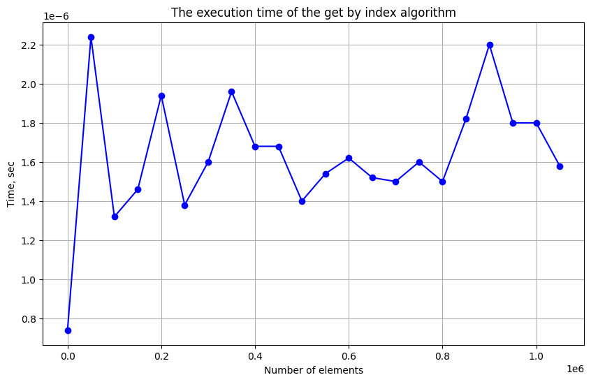
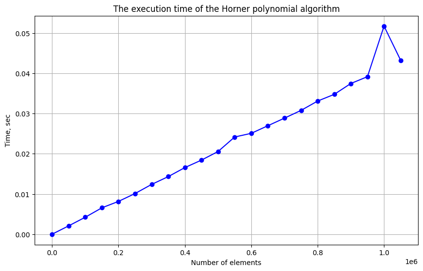
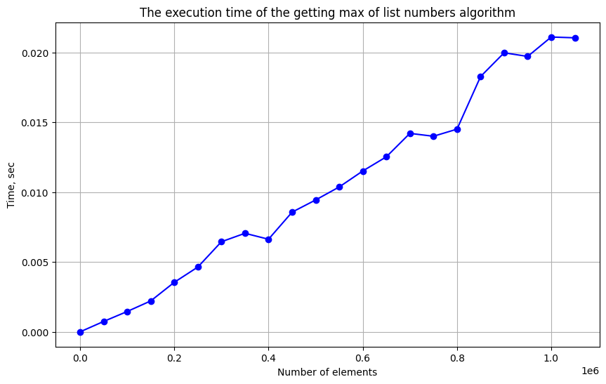
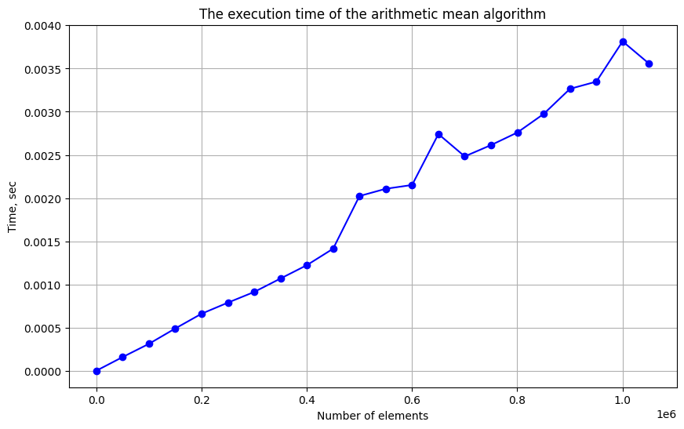
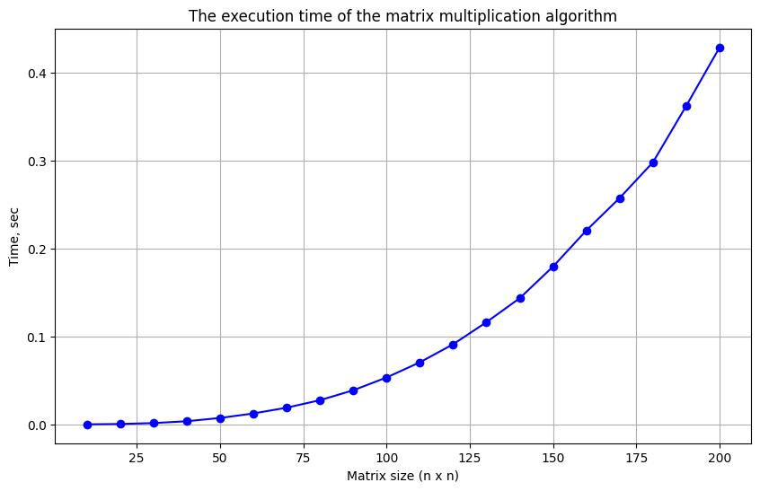

Лабораторная работа №1
Эмпирический анализ временной сложности алгоритмов
Чистяков Р. ИУ10-37

Цель работы
Эмпирический анализ временной сложности алгоритмов.

Задачи лабораторной работы
Реализовать алгоритмы для выполнения операций над векторами и матрицами

Провести серию экспериментов по замеру времени выполнения алгоритмов на данных разного объема

Построить графики зависимости времени выполнения от объема данных

Проанализировать полученные данные и сравнить с теоретическими оценками временной сложности

Сделать выводы о соответствии теоретических и эмпирических оценок

Суть задачи:

Исследование временной сложности алгоритмов заключается в проведении серии экспериментов, в которых замеряется время выполнения алгоритмов на данных различного объема. Полученные данные позволяют оценить, как увеличение объема данных влияет на время работы алгоритма.

Анализ переменных
n - размер входных данных (длина вектора или размер матрицы)

v - вектор размерности n с неотрицательными элементами

A, B - матрицы размерности n × n с неотрицательными элементами

Ограничения
Размер данных n ограничен вычислительными ресурсами

Время выполнения может зависеть от фоновых процессов системы

Для получения достоверных результатов требуется многократное повторение экспериментов

Условия решения задачи
Задача имеет решение при условии, что:

Алгоритмы реализованы корректно

Вычислительная система способна обработать данные максимального размера

Условия проведения экспериментов стабильны

Ожидаемые результаты
Для алгоритма доступа к элементу по индексу ожидается константная временная сложность O(1)

Для алгоритмов, работающих с векторами (полином Горнера, поиск максимума, среднее арифметическое) ожидается линейная сложность O(n)

Для алгоритма матричного умножения ожидается кубическая сложность O(n³)

Задания
Задание 1.1 - Доступ к элементу по индексу
```python
import random
import time
import matplotlib.pyplot as plt

def get_by_index(v: list):
    return v[random.randint(0, len(v)-1)]

def measure_time(func, *args, num_runs=5):
    times = []
    for _ in range(num_runs):
        start_time = time.perf_counter()
        func(*args)
        end_time = time.perf_counter()
        times.append(end_time - start_time)
    return sum(times) / len(times)

items = range(100, 10**5 * (20 - 9), 50000)
times = []

for n in items:
    test_list = [random.randint(1, 3) for _ in range(n)]
    times.append(measure_time(get_by_index, test_list))

plt.figure(figsize=(10, 6))
plt.plot(items, times, 'bo-')
plt.title('The execution time of the get by index algorithm')
plt.xlabel('Number of elements')
plt.ylabel('Time, sec')
plt.grid(True)
plt.show()
```


    

    


Задание 1.4 - Вычисление полинома методом Горнера
```python
import random
import time
import matplotlib.pyplot as plt

def horner_polynomial(v: list, x=2.0):
    result = v[-1] if v else 0
    for i in range(len(v)-2, -1, -1):
        result = v[i] + x * result
    return result

def measure_time(func, *args, num_runs=5):
    times = []
    for _ in range(num_runs):
        start_time = time.perf_counter()
        func(*args)
        end_time = time.perf_counter()
        times.append(end_time - start_time)
    return sum(times) / len(times)

items = range(100, 10**5 * (20 - 9), 50000)
times = []

for n in items:
    test_list = [random.randint(1, 3) for _ in range(n)]
    times.append(measure_time(horner_polynomial, test_list))

plt.figure(figsize=(10, 6))
plt.plot(items, times, 'bo-')
plt.title('The execution time of the Horner polynomial algorithm')
plt.xlabel('Number of elements')
plt.ylabel('Time, sec')
plt.grid(True)
plt.show()
```


    

    


Задание 1.5 - Поиск максимума простым перебором
```python
import random
import time
import matplotlib.pyplot as plt

def get_max(v: list):
    max_num = v[0]
    for num in v[1:]:
        if num > max_num:
            max_num = num
    return max_num

def measure_time(func, *args, num_runs=5):
    times = []
    for _ in range(num_runs):
        start_time = time.perf_counter()
        func(*args)
        end_time = time.perf_counter()
        times.append(end_time - start_time)
    return sum(times) / len(times)

items = range(100, 10**5 * (20 - 9), 50000)
times = []

for n in items:
    test_list = [random.randint(1, 100) for _ in range(n)]
    avg_time = sum([measure_time(get_max, test_list) for _ in range(20)]) / 20
    times.append(avg_time)

plt.figure(figsize=(10, 6))
plt.plot(items, times, 'bo-')
plt.title('The execution time of the getting max of list numbers algorithm')
plt.xlabel('Number of elements')
plt.ylabel('Time, sec')
plt.grid(True)
plt.show()
```



Задание 1.7 - Среднее арифметическое
```python
import random
import time
import matplotlib.pyplot as plt

def arithmetic_mean(v: list):
    return sum(v) / len(v)

def measure_time(func, *args, num_runs=5):
    times = []
    for _ in range(num_runs):
        start_time = time.perf_counter()
        func(*args)
        end_time = time.perf_counter()
        times.append(end_time - start_time)
    return sum(times) / len(times)

items = range(100, 10**5 * (20 - 9), 50000)
times = []

for n in items:
    test_list = [random.randint(1, 100) for _ in range(n)]
    avg_time = sum([measure_time(arithmetic_mean, test_list) for _ in range(20)]) / 20
    times.append(avg_time)

plt.figure(figsize=(10, 6))
plt.plot(items, times, 'bo-')
plt.title('The execution time of the arithmetic mean algorithm')
plt.xlabel('Number of elements')
plt.ylabel('Time, sec')
plt.grid(True)
plt.show()
```



Задание 2 - Матричное умножение
```python
import random
import time
import matplotlib.pyplot as plt

def matrix_mult(matrix_a: list, matrix_b: list):
    n = len(matrix_a)
    matrix_c = [[0 for _ in range(n)] for _ in range(n)]

    for y in range(n):
        for x in range(n):
            num = 0
            for i in range(n):
                num += matrix_a[y][i] * matrix_b[i][x]
            matrix_c[y][x] = num
    return matrix_c

def measure_time(func, *args, num_runs=3):
    times = []
    for _ in range(num_runs):
        start_time = time.perf_counter()
        func(*args)
        end_time = time.perf_counter()
        times.append(end_time - start_time)
    return sum(times) / len(times)

items = range(10, 10**2 * (20 - 9), 10)
times = []

for n in items:
    matrix_a = [[random.randint(1, 3) for _ in range(n)] for _ in range(n)]
    matrix_b = [[random.randint(4, 6) for _ in range(n)] for _ in range(n)]
    times.append(measure_time(matrix_mult, matrix_a, matrix_b))

plt.figure(figsize=(10, 6))
plt.plot(items, times, 'bo-')
plt.title('The execution time of the matrix multiplication algorithm')
plt.xlabel('Matrix size (n x n)')
plt.ylabel('Time, sec')
plt.grid(True)
plt.show()
```



Выводы по лабораторной работе
Подтверждение теоретических оценок: Экспериментально подтверждено соответствие теоретических оценок временной сложности и эмпирических данных для всех исследованных алгоритмов. Графики наглядно демонстрируют качественные различия в поведении алгоритмов разной сложности.

Визуальная демонстрация различий:

На графиках четко видно постоянное поведение O(1) - горизонтальная линия

Линейный рост O(n) проявляется как прямая линия с положительным наклоном

Кубический рост O(n³) показывает экспоненциальное увеличение времени выполнения

Практическая значимость: Полученные результаты позволяют делать обоснованный выбор алгоритмов для решения практических задач:

Для операций с отдельными элементами оптимальны алгоритмы O(1)

Для обработки векторов приемлемы алгоритмы O(n)

Алгоритмы O(n³) следует использовать с осторожностью для больших данных


