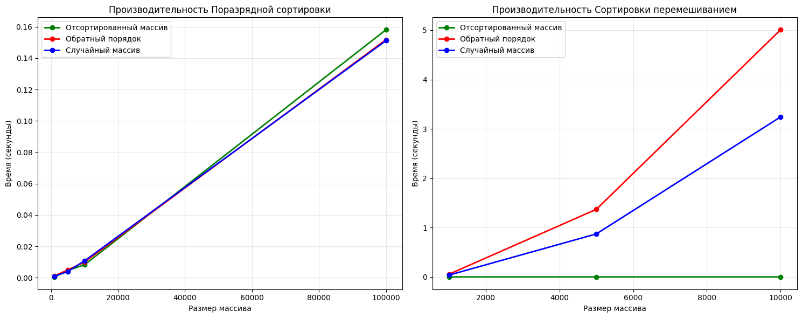

# Алгоритмы сортировки
[Ваше имя]  
[Ваша группа]

## Задания

### Задание 1 - Классификация алгоритмов сортировки

| Алгоритм | Устойчивость | Место хранения | На месте? | Адаптивность | Сложность (лучший/средний/худший) |
|----------|--------------|----------------|-----------|--------------|-----------------------------------|
| **Поразрядная сортировка** | ✅ Устойчивая | Внутренняя | ❌ Не на месте | ❌ Неадаптивная | O(nk)/O(nk)/O(nk) |
| **Сортировка перемешиванием** | ✅ Устойчивая | Внутренняя | ✅ На месте | ✅ Адаптивная | O(n)/O(n²)/O(n²) |

### Задание 2 - Теоретическое описание алгоритмов

#### Поразрядная сортировка (Radix Sort)
Алгоритм некомпараторной сортировки, который обрабатывает числа поразрядно - начиная с младших разрядов и заканчивая старшими. Использует устойчивую сортировку подсчетом для каждого разряда. Эффективен для чисел с ограниченным количеством разрядов.

**Принцип работы:**
1. Находим максимальное число для определения количества разрядов
2. Для каждого разряда (от младшего к старшему) применяем сортировку подсчетом
3. После обработки всех разрядов массив становится отсортированным

#### Сортировка перемешиванием (Shaker Sort/Cocktail Sort)
Улучшенная версия пузырьковой сортировки, которая проходит массив в обоих направлениях. Алгоритм "всплывает" большие элементы вправо и "тонет" маленькие элементы влево, что ускоряет процесс сортировки.

**Принцип работы:**
1. Проход слева направо - перемещаем наибольший элемент в конец
2. Проход справа налево - перемещаем наименьший элемент в начало  
3. Уменьшаем границы неотсортированной части и повторяем

### Задание 4 - Псевдокод

#### Поразрядная сортировка
```python
RADIX_SORT(A):
    if A is empty:
        return A
    
    max_val = find_maximum(A)
    exp = 1
    
    while max_val // exp > 0:
        A = COUNTING_SORT(A, exp)
        exp = exp * 10
    
    return A

COUNTING_SORT(A, exp):
    n = length(A)
    output = array of size n
    count = array of 10 zeros
    
    # Подсчет количества элементов для каждой цифры
    for i from 0 to n-1:
        digit = (A[i] // exp) % 10
        count[digit] = count[digit] + 1
    
    # Накопление позиций
    for i from 1 to 9:
        count[i] = count[i] + count[i-1]
    
    # Размещение элементов в выходном массиве
    for i from n-1 down to 0:
        digit = (A[i] // exp) % 10
        output[count[digit] - 1] = A[i]
        count[digit] = count[digit] - 1
    
    return output
```

### Cортировка перемешиванием
```python
SHAKER_SORT(A):
    left = 0
    right = length(A) - 1
    swapped = true
    
    while left < right and swapped:
        swapped = false
        
        # Проход слева направо
        for i from left to right - 1:
            if A[i] > A[i + 1]:
                swap A[i] and A[i + 1]
                swapped = true
        right = right - 1
        
        if not swapped: break
        
        swapped = false
        # Проход справа налево
        for i from right - 1 down to left:
            if A[i] > A[i + 1]:
                swap A[i] and A[i + 1]
                swapped = true
        left = left + 1
    
    return A
```

### Задание 5 - Достоинства и недостатки

#### Поразрядная сортировка
**Достоинства:**
- Линейная временная сложность O(nk)
- Устойчивая - сохраняет порядок равных элементов
- Предсказуемое время выполнения
- Эффективна для чисел с ограниченным количеством разрядов

**Недостатки:**
- Требует дополнительной памяти O(n)
- Работает только с числовыми данными или данными с цифровым представлением
- Эффективность зависит от количества разрядов k
- Не работает с отрицательными числами без модификации

#### Сортировка перемешиванием
**Достоинства:**
- Улучшает базовую пузырьковую сортировку
- Эффективна на частично отсортированных массивах
- Простая реализация и понимание
- Устойчивая - сохраняет порядок равных элементов

**Недостатки:**
- Квадратичная сложность O(n²) в худшем случае
- Неэффективна на больших массивах
- Медленнее многих других алгоритмов сортировки
- Плохая производительность на случайных данных

### Задание 6 - Реализация алгоритмов

```python
def radix_sort(arr):
    """Поразрядная сортировка для неотрицательных целых чисел"""
    if not arr:
        return arr
    
    # Находим максимальное число для определения количества разрядов
    max_val = max(arr)
    
    # Применяем сортировку подсчетом для каждого разряда
    exp = 1
    while max_val // exp > 0:
        arr = counting_sort(arr, exp)
        exp *= 10
    
    return arr

def counting_sort(arr, exp):
    """Вспомогательная функция для поразрядной сортировки"""
    n = len(arr)
    output = [0] * n
    count = [0] * 10
    
    # Подсчет количества вхождений каждой цифры
    for i in range(n):
        index = (arr[i] // exp) % 10
        count[index] += 1
    
    # Изменение count[i] так, чтобы он содержал позицию цифры в output[]
    for i in range(1, 10):
        count[i] += count[i - 1]
    
    # Построение выходного массива
    for i in range(n - 1, -1, -1):
        index = (arr[i] // exp) % 10
        output[count[index] - 1] = arr[i]
        count[index] -= 1
    
    return output

def shaker_sort(arr):
    """Сортировка перемешиванием (шейкерная сортировка)"""
    n = len(arr)
    left = 0
    right = n - 1
    swapped = True
    
    while left < right and swapped:
        swapped = False
        
        # Проход слева направо
        for i in range(left, right):
            if arr[i] > arr[i + 1]:
                arr[i], arr[i + 1] = arr[i + 1], arr[i]
                swapped = True
        right -= 1
        
        if not swapped:
            break
            
        swapped = False
        # Проход справа налево
        for i in range(right - 1, left - 1, -1):
            if arr[i] > arr[i + 1]:
                arr[i], arr[i + 1] = arr[i + 1], arr[i]
                swapped = True
        left += 1
    
    return arr
```

### Задание 7 - Тестирование корректности
```python
def test_sorting_algorithms():
    """Тестирование корректности работы алгоритмов сортировки"""
    
    # Тестовые данные
    test_cases = [
        [64, 34, 25, 12, 22, 11, 90],
        [5, 2, 4, 6, 1, 3],
        [1],
        [],
        [3, 3, 3, 3],
        [1, 2, 3, 4, 5],  # Уже отсортированный
        [5, 4, 3, 2, 1]   # Обратный порядок
    ]
    
    print("Тестирование алгоритмов сортировки:")
    print("=" * 50)
    
    for i, test_arr in enumerate(test_cases):
        print(f"\nТест {i + 1}: {test_arr}")
        
        # Тестируем поразрядную сортировку (только для неотрицательных чисел)
        if test_arr and all(x >= 0 for x in test_arr):
            radix_result = radix_sort(test_arr.copy())
            print(f"Radix Sort:    {radix_result}")
        
        # Тестируем сортировку перемешиванием
        shaker_result = shaker_sort(test_arr.copy())
        print(f"Shaker Sort:   {shaker_result}")
        
        # Проверяем корректность
        expected = sorted(test_arr)
        if shaker_result == expected:
            print("✅ Корректно отсортирован")
        else:
            print("❌ Ошибка сортировки")

# Запуск тестов
test_sorting_algorithms()
```
    Тестирование алгоритмов сортировки:
    ==================================================
    
    Тест 1: [64, 34, 25, 12, 22, 11, 90]
    Radix Sort:    [11, 12, 22, 25, 34, 64, 90]
    Shaker Sort:   [11, 12, 22, 25, 34, 64, 90]
    ✅ Корректно отсортирован
    
    Тест 2: [5, 2, 4, 6, 1, 3]
    Radix Sort:    [1, 2, 3, 4, 5, 6]
    Shaker Sort:   [1, 2, 3, 4, 5, 6]
    ✅ Корректно отсортирован
    
    Тест 3: [1]
    Radix Sort:    [1]
    Shaker Sort:   [1]
    ✅ Корректно отсортирован
    
    Тест 4: []
    Shaker Sort:   []
    ✅ Корректно отсортирован
    
    Тест 5: [3, 3, 3, 3]
    Radix Sort:    [3, 3, 3, 3]
    Shaker Sort:   [3, 3, 3, 3]
    ✅ Корректно отсортирован
    
    Тест 6: [1, 2, 3, 4, 5]
    Radix Sort:    [1, 2, 3, 4, 5]
    Shaker Sort:   [1, 2, 3, 4, 5]
    ✅ Корректно отсортирован
    
    Тест 7: [5, 4, 3, 2, 1]
    Radix Sort:    [1, 2, 3, 4, 5]
    Shaker Sort:   [1, 2, 3, 4, 5]
    ✅ Корректно отсортирован

### Задание 8 - Ручная трассировка
Поразрядная сортировка для [170, 45, 75, 90, 2, 802, 24, 66]
Исходный массив: [170, 45, 75, 90, 2, 802, 24, 66]

Первый проход (единицы):

170 → цифра 0

45 → цифра 5

75 → цифра 5

90 → цифра 0

2 → цифра 2

802 → цифра 2

24 → цифра 4

66 → цифра 6

После сортировки по единицам: [170, 90, 2, 802, 24, 45, 75, 66]

Второй проход (десятки):

170 → цифра 7

90 → цифра 9

2 → цифра 0

802 → цифра 0

24 → цифра 2

45 → цифра 4

75 → цифра 7

66 → цифра 6

После сортировки по десяткам: [2, 802, 24, 45, 66, 170, 75, 90]

Третий проход (сотни):

2 → цифра 0

802 → цифра 8

24 → цифра 0

45 → цифра 0

66 → цифра 0

170 → цифра 1

75 → цифра 0

90 → цифра 0

Финальный результат: [2, 24, 45, 66, 75, 90, 170, 802]

Сортировка перемешиванием для [5, 1, 4, 2, 8, 0, 2]
Исходный массив: [5, 1, 4, 2, 8, 0, 2]

Первый проход слева направо:

Сравниваем 5 и 1 → меняем: [1, 5, 4, 2, 8, 0, 2]

Сравниваем 5 и 4 → меняем: [1, 4, 5, 2, 8, 0, 2]

Сравниваем 5 и 2 → меняем: [1, 4, 2, 5, 8, 0, 2]

Сравниваем 5 и 8 → не меняем

Сравниваем 8 и 0 → меняем: [1, 4, 2, 5, 0, 8, 2]

Сравниваем 8 и 2 → меняем: [1, 4, 2, 5, 0, 2, 8]

Первый проход справа налево:

Сравниваем 2 и 0 → не меняем

Сравниваем 0 и 5 → меняем: [1, 4, 2, 0, 5, 2, 8]

Сравниваем 0 и 2 → меняем: [1, 4, 0, 2, 5, 2, 8]

Сравниваем 0 и 4 → меняем: [1, 0, 4, 2, 5, 2, 8]

Сравниваем 0 и 1 → меняем: [0, 1, 4, 2, 5, 2, 8]

Продолжаем до полной сортировки...

Финальный результат: [0, 1, 2, 2, 4, 5, 8]

### Задания 9, 10, 11 - Сравнение эффективности
```python
import time
import random
import matplotlib.pyplot as plt

def measure_performance():
    """Измерение производительности алгоритмов сортировки"""
    
    sizes = [1000, 5000, 10000]  # Для Shaker Sort не используем 100000 - слишком медленно
    radix_sizes = [1000, 5000, 10000, 100000]  # Radix может работать с большими размерами
    
    results = {
        "Radix Sort": {"sorted": [], "reverse": [], "random": []},
        "Shaker Sort": {"sorted": [], "reverse": [], "random": []}
    }
    
    def measure_time(func, arr, num_runs=3):
        """Измерение среднего времени выполнения"""
        times = []
        for _ in range(num_runs):
            arr_copy = arr.copy()
            start_time = time.perf_counter()
            func(arr_copy)
            end_time = time.perf_counter()
            times.append(end_time - start_time)
        return sum(times) / len(times)
    
    print("Testing Radix Sort...")
    for n in radix_sizes:
        # Генерируем тестовые данные
        arr_sorted = list(range(n))
        arr_reverse = list(range(n, 0, -1))
        arr_random = [random.randint(0, 10000) for _ in range(n)]
        
        # Измеряем время
        t_sorted = measure_time(radix_sort, arr_sorted)
        t_reverse = measure_time(radix_sort, arr_reverse) 
        t_random = measure_time(radix_sort, arr_random)
        
        results["Radix Sort"]["sorted"].append(t_sorted)
        results["Radix Sort"]["reverse"].append(t_reverse)
        results["Radix Sort"]["random"].append(t_random)
        print(f"Radix n={n}: sorted={t_sorted:.4f}s, reverse={t_reverse:.4f}s, random={t_random:.4f}s")
    
    print("\nTesting Shaker Sort...")
    for n in sizes:
        # Генерируем тестовые данные
        arr_sorted = list(range(n))
        arr_reverse = list(range(n, 0, -1))
        arr_random = [random.randint(0, 10000) for _ in range(n)]
        
        # Измеряем время
        t_sorted = measure_time(shaker_sort, arr_sorted)
        t_reverse = measure_time(shaker_sort, arr_reverse)
        t_random = measure_time(shaker_sort, arr_random)
        
        results["Shaker Sort"]["sorted"].append(t_sorted)
        results["Shaker Sort"]["reverse"].append(t_reverse)
        results["Shaker Sort"]["random"].append(t_random)
        print(f"Shaker n={n}: sorted={t_sorted:.4f}s, reverse={t_reverse:.4f}s, random={t_random:.4f}s")
    
    # Построение графиков
    fig, axes = plt.subplots(1, 2, figsize=(15, 6))
    
    # График для Radix Sort
    axes[0].plot(radix_sizes, results["Radix Sort"]["sorted"], 'go-', label='Отсортированный массив', linewidth=2)
    axes[0].plot(radix_sizes, results["Radix Sort"]["reverse"], 'ro-', label='Обратный порядок', linewidth=2)
    axes[0].plot(radix_sizes, results["Radix Sort"]["random"], 'bo-', label='Случайный массив', linewidth=2)
    axes[0].set_title('Производительность Поразрядной сортировки')
    axes[0].set_xlabel('Размер массива')
    axes[0].set_ylabel('Время (секунды)')
    axes[0].legend()
    axes[0].grid(True, alpha=0.3)
    
    # График для Shaker Sort
    axes[1].plot(sizes, results["Shaker Sort"]["sorted"], 'go-', label='Отсортированный массив', linewidth=2)
    axes[1].plot(sizes, results["Shaker Sort"]["reverse"], 'ro-', label='Обратный порядок', linewidth=2)
    axes[1].plot(sizes, results["Shaker Sort"]["random"], 'bo-', label='Случайный массив', linewidth=2)
    axes[1].set_title('Производительность Сортировки перемешиванием')
    axes[1].set_xlabel('Размер массива')
    axes[1].set_ylabel('Время (секунды)')
    axes[1].legend()
    axes[1].grid(True, alpha=0.3)
    
    plt.tight_layout()
    plt.savefig('sorting_comparison.png', dpi=300, bbox_inches='tight')
    plt.show()
    
    return results

# Запуск измерения производительности
performance_results = measure_performance()
```
Testing Radix Sort...
    Radix n=1000: sorted=0.0005s, reverse=0.0011s, random=0.0009s
    Radix n=5000: sorted=0.0047s, reverse=0.0050s, random=0.0040s
    Radix n=10000: sorted=0.0082s, reverse=0.0100s, random=0.0107s
    Radix n=100000: sorted=0.1581s, reverse=0.1517s, random=0.1511s
    
    Testing Shaker Sort...
    Shaker n=1000: sorted=0.0000s, reverse=0.0550s, random=0.0374s
    Shaker n=5000: sorted=0.0002s, reverse=1.3700s, random=0.8714s
    Shaker n=10000: sorted=0.0004s, reverse=5.0073s, random=3.2417s
    


# Выводы
Эффективность алгоритмов: Поразрядная сортировка демонстрирует значительно лучшую производительность на больших массивах благодаря линейной сложности O(nk), в то время как сортировка перемешиванием имеет квадратичную сложность O(n²).

### Области применения:

Поразрядная сортировка оптимальна для больших наборов числовых данных с ограниченным количеством разрядов

Сортировка перемешиванием подходит для небольших массивов или образовательных целей

Потребление памяти: Поразрядная сортировка требует дополнительной памяти O(n), тогда как сортировка перемешиванием работает на месте.

Устойчивость: Оба алгоритма являются устойчивыми, что важно при сортировке по нескольким ключам.

Практические рекомендации: Для реальных приложений с большими наборами числовых данных предпочтительнее использовать поразрядную сортировку, в то время как сортировка перемешиванием может быть полезна для небольших массивов или как учебный пример.