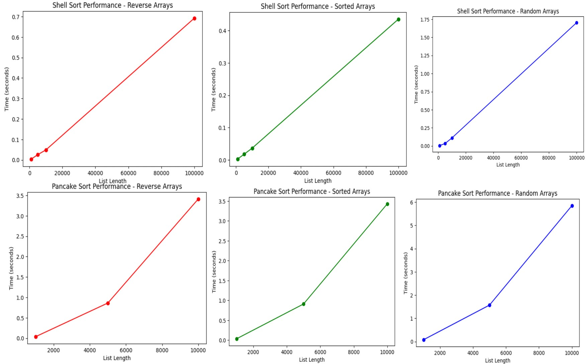

# Алгоритмы сортировки
Баскаков Д. С.
ИУ10-38
## Задания
### Задание 1
| Алгоритм                                         | Устойчивость                                           | Место хранения       | На месте?   | Адаптивность        | Сложность (лучший / средний / худший)               |
| ------------------------------------------------ | ------------------------------------------------------ | -------------------- | ----------- | ------------------- | --------------------------------------------------- |
| **Bitonic sort (Битонная)**                      | Неустойчивая                                           | Внутренняя           | Частично    | Неадаптивная        | O(n log² n) / O(n log² n) / O(n log² n)             |
| **Bogosort**                                     | Устойчивая                                             | Внутренняя           | На месте    | Неадаптивная        | O(n) / O(n·n!) / O(∞)                               |
| **Stooge sort**                                  | Устойчивая                                             | Внутренняя           | На месте    | Неадаптивная        | O(n².709) / O(n².709) / O(n².709)                   |
| **Timsort**                                      | Устойчивая                                             | Внутренняя           | Не на месте | Адаптивная          | O(n) / O(n log n) / O(n log n)                      |
| **Introsort**                                    | Неустойчивая                                           | Внутренняя           | На месте    | Неадаптивная        | O(n log n) / O(n log n) / O(n log n)                |
| **Блинная сортировка (Pancake sort)**            | Неустойчивая                                           | Внутренняя           | На месте    | Неадаптивная        | O(n) / O(n²) / O(n²)                                |
| **Блочная сортировка (Block sort)**              | Устойчивая                                             | Внутренняя           | Не на месте | Частично            | O(n log n) / O(n log n) / O(n log n)                |
| **Быстрая (Хоара) сортировка (Quicksort)**       | Неустойчивая                                           | Внутренняя           | На месте    | Неадаптивная        | O(n log n) / O(n log n) / O(n²)                     |
| **Гномья сортировка (Gnome sort)**               | Устойчивая                                             | Внутренняя           | На месте    | Адаптивная          | O(n) / O(n²) / O(n²)                                |
| **Медленная сортировка (Slow sort)**             | Устойчивая                                             | Внутренняя           | На месте    | Неадаптивная        | O(n log n) / O(n log n) / O(2^n)                    |
| **Метод Шелла (Shell sort)**                     | Неустойчивая                                           | Внутренняя           | На месте    | Частично адаптивная | O(n) / O(n^(3/2)) / O(n²) (зависит от инкрементов)  |
| **Пирамидальная сортировка (Heap sort)**         | Неустойчивая                                           | Внутренняя           | На месте    | Неадаптивная        | O(n log n) / O(n log n) / O(n log n)                |
| **Плавная сортировка (Smoothsort)**              | Неустойчивая                                           | Внутренняя           | На месте    | Адаптивная          | O(n) / O(n log n) / O(n log n)                      |
| **Поразрядная сортировка (Radix sort)**          | Устойчивая                                             | Внутренняя           | Не на месте | Неадаптивная        | O(n·k) / O(n·k) / O(n·k), k — длина ключа           |
| **Пузырьковая сортировка (Bubble sort)**         | Устойчивая                                             | Внутренняя           | На месте    | Адаптивная          | O(n) / O(n²) / O(n²)                                |
| **Сортировка выбором (Selection sort)**          | Неустойчивая                                           | Внутренняя           | На месте    | Неадаптивная        | O(n²) / O(n²) / O(n²)                               |
| **Сортировка деревом (Tree sort)**               | Устойчивая (если использовать сбалансированное дерево) | Внутренняя           | Не на месте | Неадаптивная        | O(n log n) / O(n log n) / O(n²)                     |
| **Сортировка подсчетом (Counting sort)**         | Устойчивая                                             | Внутренняя           | Не на месте | Неадаптивная        | O(n + k) / O(n + k) / O(n + k), k — диапазон ключей |
| **Сортировка перемешиванием (Shuffle sort)**     | Устойчивая                                             | Внутренняя           | На месте    | Неадаптивная        | O(n log n) / O(n log n) / O(n log n)                |
| **Сортировка расческой (Comb sort)**             | Неустойчивая                                           | Внутренняя           | На месте    | Частично            | O(n) / O(n²/2^p) / O(n²)                            |
| **Сортировка слиянием (Merge sort)**             | Устойчивая                                             | Внутренняя / Внешняя | Не на месте | Неадаптивная        | O(n log n) / O(n log n) / O(n log n)                |
| **Сортировка чёт-нечет (Odd-even sort)**         | Устойчивая                                             | Внутренняя           | На месте    | Частично            | O(n) / O(n²) / O(n²)                                |
| **Топологическая сортировка (Topological sort)** | Неустойчивая                                           | Внутренняя           | На месте    | Неадаптивная        | O(V + E), V — вершины, E — ребра                    |
| **Шейкерная сортировка (Cocktail sort)**         | Устойчивая                                             | Внутренняя           | На месте    | Адаптивная          | O(n) / O(n²) / O(n²)                                |

### Задание 2
#### Метод Шелла
Сортировка Шелла - это усовершенствованный вариант сортировки вставками, разработанный Дональдом Шеллом в 1959 году. Алгоритм работает путем сравнения элементов, находящихся на определенном расстоянии друг от друга (шаге), и постепенно уменьшает этот шаг до 1.

Принцип работы:
1. Разбить массив на подмассивы с определенным шагом
2. Отсортировать каждый подмассив методом вставок
3. Постепенно уменьшать шаг до 1
4. Когда шаг становится равным 1, массив почти отсортирован

#### Блинная сортировка
Блинная сортировка - это алгоритм сортировки, в котором разрешена только одна операция: переворот префикса массива. Алгоритм получил свое название по аналогии с переворачиванием стопки блинов с помощью лопатки.

Принцип работы:
1. Найти максимальный элемент в неотсортированной части массива
2. Перевернуть часть массива от начала до позиции максимального элемента, чтобы он оказался в начале
3. Перевернуть всю неотсортированную часть массива, чтобы максимальный элемент оказался на своем месте

### Задание 3
Псевдокод метода Шелла:
```pseudo
функция shellSort(arr):
    n = длина(arr)
    gap = 1
    пока gap < n / 3:
        gap = gap * 3 + 1
    пока gap > 0:
        для i от gap до n-1:
            temp = arr[i]
            j = i
            пока j >= gap и arr[j - gap] > temp:
                arr[j] = arr[j - gap]
                j = j - gap
            arr[j] = temp
        gap = (gap - 1) // 3
    вернуть arr
```
Псевдокод блинной сортировки:
```pseudo
функция pancakeSort(arr):
    n = длина(arr)
    для curr_size от n вниз до 2:
        max_idx = найтиМаксимум(arr, curr_size)
        если max_idx != curr_size - 1:
            если max_idx != 0:
                перевернуть(arr, max_idx + 1)
            перевернуть(arr, curr_size)
    вернуть arr

функция перевернуть(arr, k):
    левый = 0
    правый = k - 1
    пока левый < правый:
        поменятьМестами(arr[левый], arr[правый])
        левый = левый + 1
        правый = правый - 1
функция найтиМаксимум(arr, n):
    max_idx = 0
    для i от 1 до n-1:
        если arr[i] > arr[max_idx]:
            max_idx = i
    вернуть max_idx
```
### Задание 4
#### Метод Шелла:
**Достоинства:**
- Эффективнее простых алгоритмов (O(n²))
- Не требует дополнительной памяти (in-place)
- Прост в реализации

**Недостатки:**
- Сложность зависит от выбора последовательности шагов
- Не такой быстрый как QuickSort или MergeSort в общем случае
- Нестабильная сортировка
#### Блинная сортировка
**Достоинства:**
- Интересный концептуально алгоритм
- Минимальное количество операций сравнения
- Оптимальное количество переворотов (не более 2n-3)
- In-place сортировка (не требует дополнительной памяти)

**Недостатки:**
- Неэффективен на практике из-за большого количества перестановок
- Временная сложность O(n²) в худшем случае
- Нестабильная сортировка
- Сложность реализации по сравнению с другими алгоритмами
### Задание 5


```python
def shell_sort(arr):
    '''Сортировка Шелла'''
    n = len(arr)
    arr = arr[:]
    step = len(arr) // 2
    while step > 0:
        for i in range(step, n, 1):
            j = i
            delta = j - step
            while delta >= 0 and arr[delta] > arr[j]:
                #arr[delta], arr[j] = arr[j], arr[delta]
                swap(arr, delta, j)
                j = delta
                delta = j - step
        step //= 2
    return arr


def pancake_sort(arr):
    '''Блинная сортировка'''
    n = len(arr)
    for i in range(n, 1, -1):
        max_idx = 0
        for j in range(1, i):
            if arr[j] > arr[max_idx]:
                max_idx = j
        if max_idx != i - 1:
            if max_idx != 0:
                left = 0
                right = max_idx
                while left < right:
                    arr[left], arr[right] = arr[right], arr[left]
                    left += 1
                    right -= 1
            left = 0
            right = i - 1
            while left < right:
                arr[left], arr[right] = arr[right], arr[left]
                left += 1
                right -= 1
    return arr
```

### Задание 6


```python
v1 = [10, -5, 0, 3, -2]
print("Shell Sort:", shell_sort(v1))

v2 = [10, -5, 0, 3, -2]
print("Pancake Sort:", heap_sort(v2))
```

    Shell Sort: [-5, -2, 0, 3, 10]
    Heap Sort: [-5, -2, 0, 3, 10]


### Задание 7
Ручная трассировка сортировки Шелла:  
v = [1, 2, 4, 3]  

| Шаг | step | i | j | delta |Массив        | Действие                                             |
| --- | ---- | - | - | ----- | ------------ | ---------------------------------------------------- |
| 1   | 2    | 2 | 2 | 0     | [1, 2, 4, 3] | i=2, j=2, delta=0                                    |
| 2   | 2    | 2 | 2 | 0     | [1, 2, 4, 3] | delta>=0 (0>=0) и arr[0]=1 ≤ arr[2]=4                |
| 3   | 2    | 3 | 3 | 1     | [1, 2, 4, 3] | i=3, j=3, delta=1                                    |
| 4   | 2    | 3 | 3 | 1     | [1, 2, 4, 3] | delta>=0 (1>=0) и arr[1]=2 ≤ arr[3]=3                |
| 5   | 1    | 1 | 1 | 0     | [1, 2, 4, 3] | i=1, j=1, delta=0                                    |
| 6   | 1    | 1 | 1 | 0     | [1, 2, 4, 3] | delta>=0 (0>=0) и arr[0]=1 ≤ arr[1]=2                |
| 7   | 1    | 2 | 2 | 1     | [1, 2, 4, 3] | i=2, j=2, delta=1                                    |
| 8   | 1    | 2 | 2 | 1     | [1, 2, 4, 3] | delta>=0 (1>=0) и arr[1]=2 ≤ arr[2]=4                |
| 9   | 1    | 3 | 3 | 2     | [1, 2, 4, 3] | i=3, j=3, delta=2                                    |
| 10  | 1    | 3 | 3 | 2     | [1, 2, 4, 3] |delta>=0 (2>=0) и arr[2]=4 > arr[3]=3 → swap(arr,2,3) |
| 11  | 1    | 3 | 2 | 1     | [1, 2, 3, 4] | j=2, delta=1                                         |
| 12  | 1    | 3 | 2 | 1     | [1, 2, 3, 4] | delta>=0 (1>=0) и arr[1]=2 ≤ arr[2]=3                |


Ручная трассировка блинной сортировки:  
v = [5, 3, 4, 1]

| Шаг | Массив       | Действие                                                                 |
| --- | ------------ | ------------------------------------------------------------------------ |
| 1   | [5, 3, 4, 1] | Начальный массив                                                         |
| 2   | [5, 3, 4, 1] | curr_size = 4, max_idx = 0 (элемент 5)                                   |
| 3   | [5, 3, 4, 1] | max_idx = 0, curr_size-1 = 3 → нужны перевороты                          |
| 4   | [5, 3, 4, 1] | max_idx = 0, поэтому первый переворот пропускаем                         |
| 5   | [1, 4, 3, 5] | Переворачиваем первые 4 элемента                                         |
| 6   | [1, 4, 3, 5] | curr_size = 3, max_idx = 1 (элемент 4)                                   |
| 7   | [1, 4, 3, 5] | max_idx = 1, curr_size-1 = 2 → нужны перевороты                          |
| 8   | [4, 1, 3, 5] | Переворачиваем первые 2 элемента (max_idx+1 = 2)                         |
| 9   | [3, 1, 4, 5] | Переворачиваем первые 3 элемента                                         |
| 10  | [3, 1, 4, 5] | curr_size = 2, max_idx = 0 (элемент 3)                                   |
| 11  | [3, 1, 4, 5] | max_idx = 0, curr_size-1 = 1 → нужны перевороты                          |
| 12  | [3, 1, 4, 5] | max_idx = 0, поэтому первый переворот пропускаем                         |
| 13  | [1, 3, 4, 5] | Переворачиваем первые 2 элемента                                         |
| 14  | [1, 3, 4, 5] | Конец сортировки                                                         |


### Задание 8, 9, 10


```python
import random, usage_time
import matplotlib.pyplot as plt

def test_shell_sort_random(n):
    arr = [random.randint(1, n) for i in range(n)]
    return shell_sort(arr)

def test_shell_sort_sorted(n):
    arr = list(range(n))
    return shell_sort(arr)

def test_shell_sort_reverse(n):
    arr = list(range(n, 0, -1))
    return shell_sort(arr)

def test_pancake_sort_random(n):
    arr = [random.randint(1, n) for i in range(n)]
    return pancake_sort(arr)

def test_pancake_sort_sorted(n):
    arr = list(range(n))
    return pancake_sort(arr)

def test_pancake_sort_reverse(n):
    arr = list(range(n, 0, -1))
    return pancake_sort(arr)

list_lengths = [1000, 5000, 10000, 100000]

times_shell_random = []
for i in list_lengths:
    timed_function = get_usage_time(ndigits=5)(test_shell_sort_random)
    execution_time = timed_function(i)
    times_shell_random.append(execution_time)
    print(i, execution_time)
plt.plot(list_lengths, times_shell_random, 'bo-')
plt.title('Shell Sort Performance - Random Arrays')
plt.xlabel('List Length')
plt.ylabel('Time (seconds)')
plt.show()

times_shell_sorted = []
for i in list_lengths:
    timed_function = get_usage_time(ndigits=5)(test_shell_sort_sorted)
    execution_time = timed_function(i)
    times_shell_sorted.append(execution_time)
    print(i, execution_time)
plt.plot(list_lengths, times_shell_sorted, 'go-')
plt.title('Shell Sort Performance - Sorted Arrays')
plt.xlabel('List Length')
plt.ylabel('Time (seconds)')
plt.show()

times_shell_reverse = []
for i in list_lengths:
    timed_function = get_usage_time(ndigits=5)(test_shell_sort_reverse)
    execution_time = timed_function(i)
    times_shell_reverse.append(execution_time)
    print(i, execution_time)
plt.plot(list_lengths, times_shell_reverse, 'ro-')
plt.title('Shell Sort Performance - Reverse Arrays')
plt.xlabel('List Length')
plt.ylabel('Time (seconds)')
plt.show()

list_lengths_pancake = [1000, 5000, 10000]
times_pancake_random = []
for i in list_lengths_pancake:
    timed_function = get_usage_time(ndigits=5)(test_pancake_sort_random)
    execution_time = timed_function(i)
    times_pancake_random.append(execution_time)
    print(i, execution_time)
plt.plot(list_lengths_pancake, times_pancake_random, 'bo-')
plt.title('Pancake Sort Performance - Random Arrays')
plt.xlabel('List Length')
plt.ylabel('Time (seconds)')
plt.show()

times_pancake_sorted = []
for i in list_lengths_pancake:
    timed_function = get_usage_time(ndigits=5)(test_pancake_sort_sorted)
    execution_time = timed_function(i)
    times_pancake_sorted.append(execution_time)
    print(i, execution_time)
plt.plot(list_lengths_pancake, times_pancake_sorted, 'go-')
plt.title('Pancake Sort Performance - Sorted Arrays')
plt.xlabel('List Length')
plt.ylabel('Time (seconds)')
plt.show()

times_pancake_reverse = []
for i in list_lengths_pancake:
    timed_function = get_usage_time(ndigits=5)(test_pancake_sort_reverse)
    execution_time = timed_function(i)
    times_pancake_reverse.append(execution_time)
    print(i, execution_time)
plt.plot(list_lengths_pancake, times_pancake_reverse, 'ro-')
plt.title('Pancake Sort Performance - Reverse Arrays')
plt.xlabel('List Length')
plt.ylabel('Time (seconds)')
plt.show()
```


    
