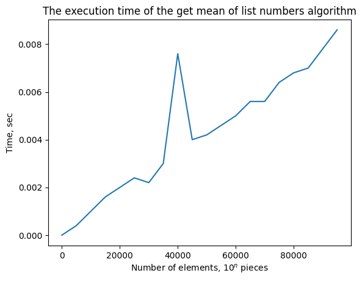

# Лабораторная работа № 1
## Эмпирический анализ временной сложности алгоритмов
## Выполнил студент Акбаев Ахмат Султанович ИУ10-38

## Цель работы

Провести эмпирический анализ временной сложности алгоритмов.

## Задания

Для $n$ от 1 до $10^5 \cdot N$ c шагом $100 \cdot N$, где $N = (20 - \text{номер студента в списке группе})$, произведите для пяти запусков замер среднего машинного времени исполнения программ, реализующих нижеуказанные алгоритмы и функции. 

Изобразите на графике полученные данные, отражающие зависимость среднего времени исполнения от $n$. 
Проведите теоретический анализ временной сложности рассматриваемых алгоритмов и сравните эмпирическую и теоретическую временные сложности.

### Задание 1

Сгенерируйте $n$-мерный случайный вектор $v = [v_1, v_2, ..., v_n]$ с
неотрицательными элементами. 

Для полученного вектора $v$ осуществите подсчет функций и реализацию алгоритмов:

| №  | Оценивание | Функция | Вариант | Примечание |
|:--|:----------:|:-------|:-------|:----------:|
| 1.2. сумма элементов                         | 2 балла | $f_2(v) = \sum\limits_{k=1}^{n} {v_k}$     | 1, 3, 6, 8, 10, 12, 14, 17? 19||
| 1.3  произведение элементов                  | 2 балла | $f_3(v) = \prod\limits_{k=1}^{n} {v_k}$    | 1, 2, 5, 6, 7, 10, 11, 14, 15, 16? 19 ||
| 1.5. поиск максимума простым перебором       | 2 балла | $f_5(v) = \max(v)$                         | 1, 3, 4, 7, 8, 9, 12, 14, 16, 18 ||
| 1.7. среднее арифметическое                  | 2 балла | $f_7(v) = \cfrac{1}{n} \cdot \sum\limits_{k=1}^{n} {v_k}$   | 1, 2, 4, 9, 11, 12, 13, 14, 15, 16, 18 ||

Обьявляем общие импортирования библиотек и декоратор
```Python
import random
import functools
import timeit
import typing
import matplotlib.pyplot as plt

def get_usage_time(*, number: int = 1, setup: str = 'pass', ndigits: int = 3) -> typing.Callable:
    def decorator(func: typing.Callable) -> typing.Callable:
        @functools.wraps(func)
        def wrapper(*args, **kwargs) -> float:
            usage_time = timeit.timeit(
                lambda: func(*args, **kwargs),
                setup=setup,
                number=number,
            )
            return round(usage_time / number, ndigits)
        return wrapper
    return decorator

n_values = range(1, (10**5), 5000)
```
Требуемые реализации алгоритмов

```Python
def vector_element_sum(vector: list):
    summa = 0
    for number in vector:
        summa += number
    return summa

def vector_element_product(vector: list):
    product = 1
    for number in vector:
        product *= number
    return product

def vector_element_max(vector: list):
    max_number = 0
    for number in vector:
        if max_number < number:
            max_number = number
    return number

def vector_element_mean(vector: list):
    summa = 0
    counter = 0
    for number in vector:
        summa += number
        counter += 1
    return summa / counter
```

Хранение времен исполнения алгоритмов

```Python
times_summ = []
times_product = []
times_max = []
times_mean = []
```

Декорируем функции и вычисляем время исполнения

```Python
func_sum = get_usage_time()(vector_element_sum)
func_product = get_usage_time()(vector_element_product)
func_mean = get_usage_time()(vector_element_mean)
func_max = get_usage_time()(vector_element_max)

for n in n_values:

    avg_summ = []
    avg_product = []
    avg_max = []
    avg_mean = []
    vector = [random.randint(1, 3) for _ in range(n)]
    
    for i in range(5):
        avg_summ.append(func_sum(vector))
    times_summ.append(sum(avg_summ) / 5)

    for i in range(5):
        avg_product.append(func_product(vector))
    times_product.append(sum(avg_product) / 5)

    for i in range(5):
        avg_mean.append(func_mean(vector))
    times_mean.append(sum(avg_mean) / 5)

    for i in range(5):
        avg_max.append(func_max(vector))
    times_max.append(sum(avg_max) / 5)
```


Графики




### Задание 2

Сгенерируйте случайные матрицы $A$ и $B$ размером $n × n$ с неотрицательными элементами. 

Найдите обычное матричное произведение матриц $A$ и $B$.

```Python
import numpy as np
n_values2 = range(100, 10**4, 500)

def generate_matrixes(n):
    A = np.random.rand(n, n)
    B = np.random.rand(n, n)
    return [A, B]

def matrix_multiplication(mp):
    A = mp[0]
    B = mp[1]
    return np.dot(A, B)
```

```Python
func_mult = get_usage_time()(matrix_multiplication)
times_mult = []
for n in n_values2:

    avg_mult = []
    
    for i in range(5):
        avg_mult.append(func_mult(generate_matrixes(n)))
    times_mult.append(sum(avg_mult) / 5)
```


