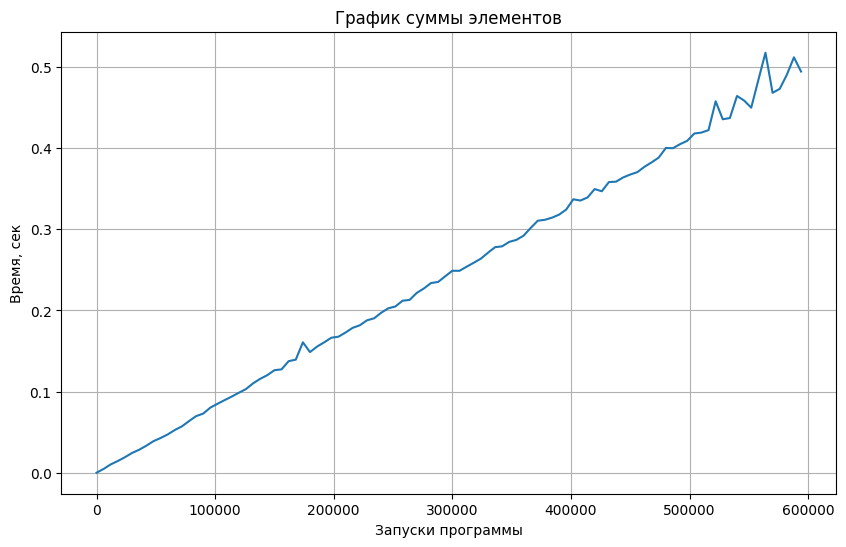
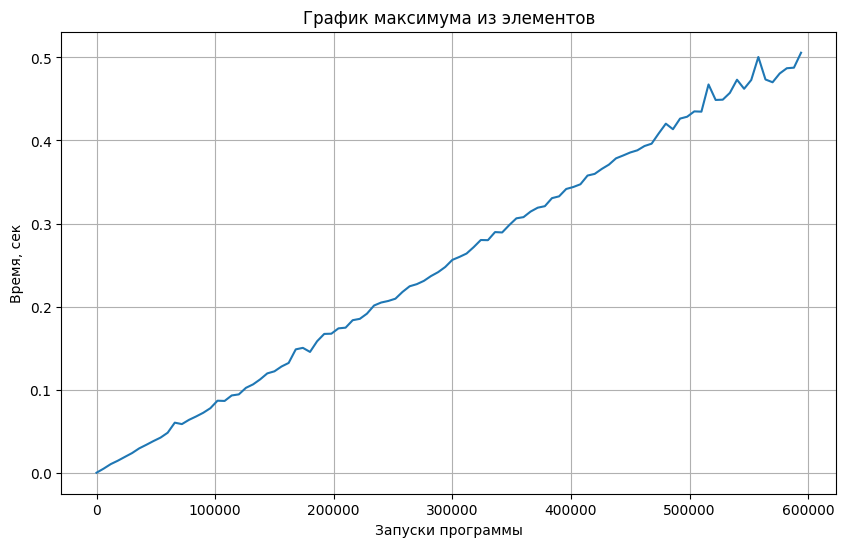
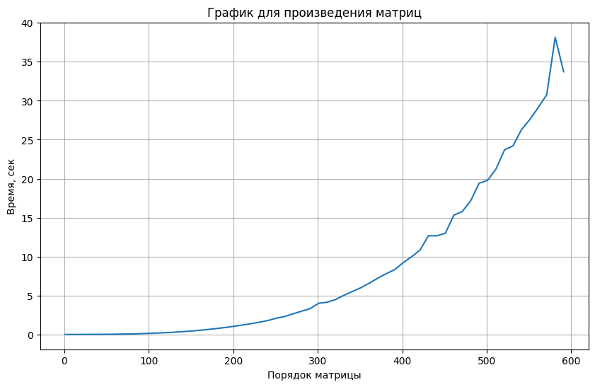

# Лабораторная работа №1
# Эмпирический анализ временной сложности алгоритмов
## Цель лабораторной работы
Эмпирический анализ временной сложности алгоритмов.
## Задачи лабораторной работы
- Изучить понятие временной сложности алгоритма на примере различных алгоритмов;
- Изучить зависимость времени выполнения различных алгоритмов от количества элементов.
## Словесная постановка задачи
Требуется написать 2 программы:
- В 1 будет вычисляться время работы различных функций(сложение, умножение, максимум, среднее гармоническое) для вектора размера $n$;
- Во 2 будет вычисляться время работы функции, перемножающей 2 матрицы порядка $n$.
Для $n$ от 1 до $10^5 \cdot N$ c шагом $100 \cdot N$, где $N = 20 - 14 = 6$, произведем для пяти запусков замер среднего машинного времени исполнения программ, реализующих вышеуказанные алгоритмы и функции. 

Изобразим на графике полученные данные, отражающие зависимость среднего времени исполнения от $n$. 
## Программа к заданию 1
Первая часть программы реализует функцию get_usage_time, позволяющую вычислять время выполнения любой функции:
```Python
# 1
import functools
import timeit
import typing

def get_usage_time(
    *, number: int = 1, setup: str = 'pass', ndigits: int = 3
) -> typing.Callable:
    def decorator(func: typing.Callable) -> typing.Callable:
        @functools.wraps(func)
        def wrapper(*args, **kwargs) -> float:
            usage_time = timeit.timeit(
                lambda: func(*args, **kwargs),
                setup=setup,
                number=number,
            )
            return round(usage_time / number, ndigits)

        return wrapper

    return decorator
```
Вторая часть реализует функцию vector_generator для создания вектора из случайных значений, а также 4 различные операции с этим вектором(сумма элементов - 1.2, произведение элементов - 1.3, максимум из элементов - 1.5, среднее гармоническое элементов - 1.8):
```Python
# 2
import random

N = 6

def vector_generator(n):
    vec = [random.randint(1, 100*N) for i in range(n)]
    return vec
#1.2
def summa_func(n):
    vec = vector_generator(n)
    summ = 0
    for num in vec:
        summ += num
    return summ
#1.3
def proizvedenie_func(n):
    vec = vector_generator(n)
    proizv = 1
    for num in vec:
        proizv *= num
    return proizv
#1.5
def maximum_func(n):
    vec = vector_generator(n)
    maxi = 0
    for num in vec:
        if num >= maxi:
            maxi = num
    return maxi
#1.7
# def srednee_arifm_func(vec):
#     vec = vector_generator(n)
#     summ = 0
#     lenn = 0
#     for num in vec:
#         summ += num
#         lenn += 1
#     return summ/lenn
#1.8
def srednee_garm_func(n):
    vec = vector_generator(n)
    summ = 0
    lenn = 0
    for num in vec:
        summ += num
        lenn += 1
    return lenn/summ
```
В третьей части происходит измерение времени работы каждой функции из второй части(происходит 5 измерений и берется среднее время для каждого $n$), после этого на 4 графиках изображается зависимость среднего времени работы для различных значений $n$:
```Python
import matplotlib.pyplot as plt

N = 6
    
def five_iteration_summa(n):
    time_of_summa = []
    summa_time = get_usage_time(ndigits=5)(summa_func)
    for i in range(5):
        time_of_summa.append(summa_time(n))
    average_time_summa = sum(time_of_summa)/5
    return average_time_summa

def five_iteration_proizvedenie(n):
    time_of_proizvedenie = []
    proizvedenie_time = get_usage_time(ndigits=5)(proizvedenie_func)
    for i in range(5):
        time_of_proizvedenie.append(proizvedenie_time(n))
    average_time_proizvedenie = sum(time_of_proizvedenie)/5
    return average_time_proizvedenie

def five_iteration_maximum(n):
    time_of_maximum = []
    maximum_time = get_usage_time(ndigits=5)(maximum_func)
    for i in range(5):
        time_of_maximum.append(maximum_time(n))
    average_time_maximum = sum(time_of_maximum)/5
    return average_time_maximum

def five_iteration_srednee(n):
    time_of_srednee = []
    srednee_time = get_usage_time(ndigits=5)(srednee_garm_func)
    for i in range(5):
        time_of_srednee.append(srednee_time(n))
    average_time_srednee = sum(time_of_srednee)/5
    return average_time_srednee
    
# %matplotlib inline

items = range(1, 10**5*N+1, 1000*N)

times_summa = []
times_proizvedenie = []
times_maximum = []
times_srednee = []

j = 0

for i in items:
    times_summa.append(five_iteration_summa(i))
    times_proizvedenie.append(five_iteration_proizvedenie(i))
    times_maximum.append(five_iteration_maximum(i))
    times_srednee.append(five_iteration_srednee(i))
    if i > 1000:
        print('Среднее время произведения для', i, 'элементов:', times_proizvedenie[j])
    j += 1

#Summa
plt.figure(figsize=(10, 6))
plt.plot(items, times_summa)
plt.title('График суммы элементов')
plt.xlabel('Запуски программы')
plt.ylabel('Время, сек')
plt.grid(True)

#Proizvedenie
plt.figure(figsize=(10, 6))
plt.plot(items, times_proizvedenie)
plt.title('График произведения элементов')
plt.xlabel('Запуски программы')
plt.ylabel('Время, сек')
plt.grid(True)

#Maximum
plt.figure(figsize=(10, 6))
plt.plot(items, times_maximum)
plt.title('График максимума из элементов')
plt.xlabel('Запуски программы')
plt.ylabel('Время, сек')
plt.grid(True)

#Srednee
plt.figure(figsize=(10, 6))
plt.plot(items, times_srednee)
plt.title('График среднего гармонического элементов')
plt.xlabel('Запуски программы')
plt.ylabel('Время, сек')
plt.grid(True)
```
Данная программа выполнялась ~ 12 700 секунд и по ее результатам было получено 4 графика, проанализировав которые, можно сделать вывод, что эмпирическая временная сложность выполнения алгоритма может отличаться от теоретической, но общий характер поведения функции $T(n)$ совпадает с тем, который можно получить теоретическими рассчетами(сумма, максимум и среднее гармоническое возрастают линейно, а произведение возрастает по параболе, в связи с чем время работы функции для суммы, максимума и среднего гармонического для самых больших исследуемых значений - 0.5 с, а для произведения - 80 с), кроме того на графиках можно заметить резкое увеличение времени выполнения в моменты повышенной нагрузки, при открытии различных сторонних программ:





## Программа к заданию 2
Первая часть программы реализует функцию get_usage_time, позволяющую вычислять время выполнения любой функции:
```Python
# 1
import functools
import timeit
import typing

def get_usage_time(
    *, number: int = 1, setup: str = 'pass', ndigits: int = 3
) -> typing.Callable:
    def decorator(func: typing.Callable) -> typing.Callable:
        @functools.wraps(func)
        def wrapper(*args, **kwargs) -> float:
            usage_time = timeit.timeit(
                lambda: func(*args, **kwargs),
                setup=setup,
                number=number,
            )
            return round(usage_time / number, ndigits)

        return wrapper

    return decorator
```
Вторая часть реализует функции matrix_generator и matrix_proizv для создания матрицы и вычисления произведения матриц:
```Python
# 2
import random

N = 6

def matrix_generator(n):
    matrix = []
    for i in range(n):
        line = [random.randint(1, 100*N) for j in range(n)]
        matrix.append(line)
    return matrix

def matrix_proizv(n):
    a = matrix_generator(n)
    b = matrix_generator(n)
    c = [[] for i in range(n)]
    for i in range(n):
        for j in range(n):
            element = 0
            for k in range(n): 
                element += a[i][k] * b[k][j]
            c[i].append(element)
    return c
```
В третьей части происходит измерение времени работы функции matrix_proizv из второй части, после чего среднее время работы для каждого значения записывается и составляется график зависимости времени выполнения от $n$:
```Python
# 3
import matplotlib.pyplot as plt

N = 6

def five_iteration_matrix(n):
    time_of_matrix = []
    matrix_time = get_usage_time(ndigits=5)(matrix_proizv)
    for i in range(5):
        time_of_matrix.append(matrix_time(n))
    average_time_matrix = sum(time_of_matrix)/5
    return average_time_matrix
    
%matplotlib inline

items = range(1, 10**2*N+1, 10)
times_matrix = []
j = 0
for i in items:
    times_matrix.append(five_iteration_matrix(i))
    print('Среднее время произведения матриц для', i, 'порядка матрицы', times_matrix[j])
    j += 1

plt.figure(figsize=(10, 6))
plt.plot(items, times_matrix)
plt.title('График для произведения матриц')
plt.xlabel('Порядок матрицы')
plt.ylabel('Время, сек')
plt.grid(True)
```
После выполнения данной программы мы получаем график, проанализировав который можно заметить, что время выполнения данного алгоритма увеличивается по параболе:


## Вывод
На осонвании результатов работы данных программ можно сделать вывод, что анализ времени выполнения функции для большого числа значений $n$ позволяет достаточно верно оценить временную сложность выполнения алгоритма, а также что ддополнительная нагрузка на память компьютера может значительно повлиять на точность исследований.