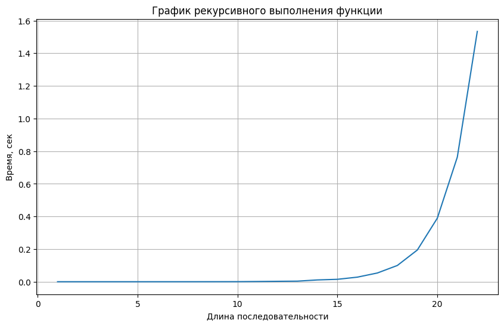
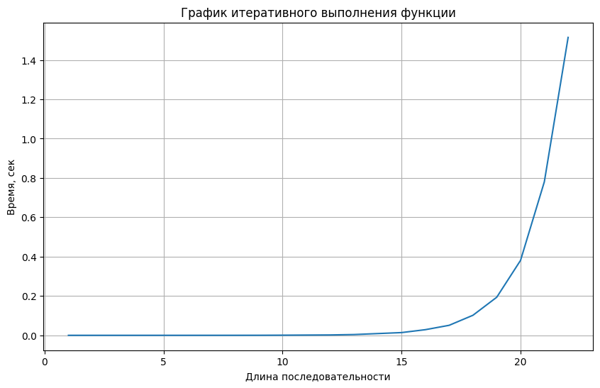
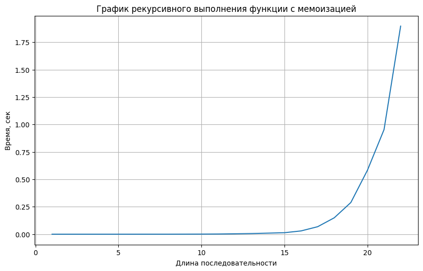

# Лабораторная работа 6
# Итеративные и рекурсивные алгоритмы
## Цель работы
Изучение рекурсивных алгоритмов и применение их для написания своего рекурсивного алгоритма.
## Задачи лабораторной работы
1. Изучение понятий рекурсивных алгоритмов
2. Реализация индивидуального алгоритма с помощью рекурсии
3. Реализация индивидуального алгоритма с помощью итераций
## Словесная постановка задачи
1. Изучить определения рекурсивных алгоритмов
2. Написать 2 реализации индивидуального задания
3. Построить графики зависимости выполнения рекурсивной функции от длины получающегося массива
## Реализация рекурсивной функции
Первая часть реализует выполнения функции posl_founder1 с помощью рекурсии (мы постепенно строим увеличивающиеся числовые последовательности длины n)
``` Python
#1
def posl_founder1(n, k):
    if n > k:
        raise Exception("n > k")
    posledovatelnosti = []

    def recursion(posl, bol):
        if len(posl) == n:
            result = []
            for i in posl:
                result.append(i)
            posledovatelnosti.append(result)
            return 
        for i in range(bol, k+1):
            posl.append(i)
            recursion(posl, i+1)
            posl.pop()

    recursion([], 1)
        
    return posledovatelnosti

print(posl_founder2(4, 3))
```
Вторая часть реализует аналогичную функцию posl_founder2 без использования рекурсии (через while)
``` Python
#2
def posl_founder2(n, k):
    if n > k:
        raise Exception("n > k")
    posledovatelnosti = []
    stack = [([], 1)]

    while stack:
        posl, bol = stack.pop()

        if len(posl) == n:
            posledovatelnosti.append(posl)
        for i in range(bol, k+1):
            new_posl = posl + [i]
            stack.append((new_posl, i+1))

    return posledovatelnosti

print(posl_founder2(2, 3))
```
Третья часть реализует рекурсивную функцию с мемоизацией
``` Python
#3
def posl_founder3(n, k):
    if n > k:
        raise Exception("n > k")
    posledovatelnosti = []
    cache = {}

    def recursion(posl, bol):
        current_len = len(posl)
        if current_len == n:
            posledovatelnosti.append(posl[:])
            return
        
        key = (current_len, bol)
        if key in cache:
            for continuee in cache[key]:
                full_posl = posl + continuee
                posledovatelnosti.append(full_posl)
            return
        
        continuations = []
        original_len = len(posledovatelnosti)
        
        for i in range(bol, k+1):
            posl.append(i)
            recursion(posl, i+1)
            posl.pop()
        
        new_sequences = posledovatelnosti[original_len:]
        for seq in new_sequences:
            continuee = seq[current_len:] 
            if continuee not in continuations:
                continuations.append(continuee)
        
        cache[key] = continuations

    recursion([], 1)
    return posledovatelnosti

print(posl_founder3(2, 3))
```
Четвертая часть программы реализует функцию get_usage_time, позволяющую вычислять время выполнения любой функции
``` Python
#4
import functools
import timeit
import typing

def get_usage_time(
    *, number: int = 1, setup: str = 'pass', ndigits: int = 3
) -> typing.Callable:
    def decorator(func: typing.Callable) -> typing.Callable:
        @functools.wraps(func)
        def wrapper(*args, **kwargs) -> float:
            usage_time = timeit.timeit(
                lambda: func(*args, **kwargs),
                setup=setup,
                number=number,
            )
            return round(usage_time / number, ndigits)

        return wrapper

    return decorator
```
Пятая часть реализует отображение графиков зависимости времени выполнения всех функций от различных вводных
``` Python
#5
import matplotlib.pyplot as plt

def f1(i):
    n, k = i, i+1
    return posl_founder1(n, k)
def f2(i):
    n, k = i, i+1
    return posl_founder2(n, k)
def f3(i):
    n, k = i, i+1
    return posl_founder3(n, k)

times_f1, times_f2, times_f3 = [], [], []
n = [i for i in range(1, 23)]

for i in n:
    time_f1 = get_usage_time(ndigits=5)(f1)
    times_f1.append(time_f1(i))

    time_f2 = get_usage_time(ndigits=5)(f2)
    times_f2.append(time_f2(i))

    time_f3 = get_usage_time(ndigits=5)(f3)
    times_f3.append(time_f3(i))
    
plt.figure(figsize=(10, 6))
plt.plot(n, times_f1)
plt.title('График рекурсивного выполнения функции')
plt.xlabel('Длина последовательности')
plt.ylabel('Время, сек')
plt.grid(True)   

plt.figure(figsize=(10, 6))
plt.plot(n, times_f2)
plt.title('График итеративного выполнения функции')
plt.xlabel('Длина последовательности')
plt.ylabel('Время, сек')
plt.grid(True)  

plt.figure(figsize=(10, 6))
plt.plot(n, times_f1)
plt.title('График рекурсивного выполнения функции с мемоизацией')
plt.xlabel('Длина последовательности')
plt.ylabel('Время, сек')
plt.grid(True)
```
Проанализируем графики





