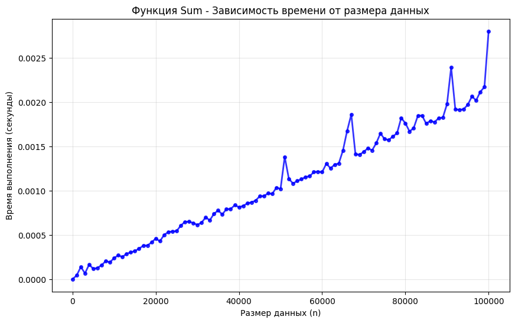
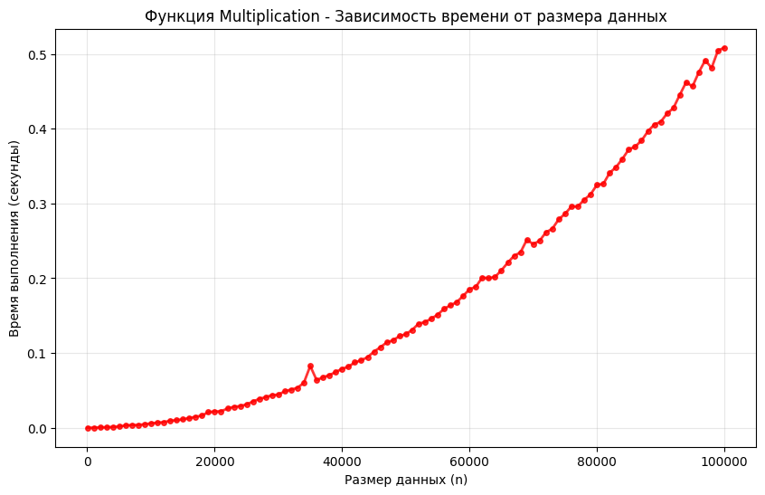
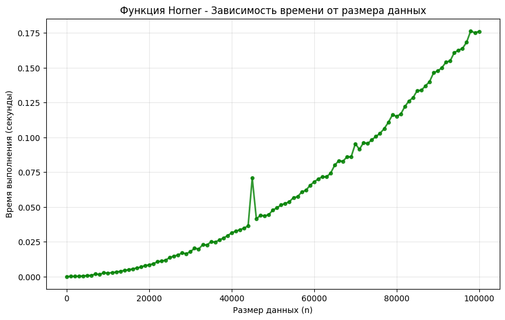
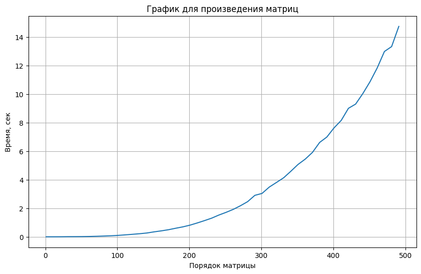

# **ЛР №1: Эмпирический анализ временной сложности алгоритмов**
---


## **Цель работы**
---
    
Проанализировать временную сложность алгоритмов для заданных функций


### Задание №1


```python
import random
import matplotlib.pyplot as plt
from usage_time import get_usage_time

def sum_func(v):
    s = 0
    for i in range(len(v)):
        s += v[i]
    return s

def mult_func(v):
    m = 1
    for i in range(len(v)):
        m = m * v[i]
    return m

def horner_func(v, x=2):
    p = 0
    for i in range(len(v)-1, -1, -1):
        p = p * x + v[i]
    return p

def min_func(v):
    m = v[0]
    for i in range(len(v)):
        if v[i] < m:
            m = v[i]
    return m

time_sum = get_usage_time(number=5, ndigits=6)(sum_func)
time_mult = get_usage_time(number=5, ndigits=6)(mult_func)
time_horner = get_usage_time(number=5, ndigits=6)(horner_func)
time_min = get_usage_time(number=5, ndigits=6)(min_func)

sizes = list(range(1, 101000, 1000))

sum_times = []
mult_times = []
horner_times = []
min_times = []

for n in sizes:
    vector = [random.randint(1, 100) for _ in range(n)]

    sum_time = time_sum(vector)
    mult_time = time_mult(vector)
    horner_time = time_horner(vector, 2)
    min_time = time_min(vector)
    
    sum_times.append(sum_time)
    mult_times.append(mult_time)
    horner_times.append(horner_time)
    min_times.append(min_time)

plt.figure(figsize=(10, 6))
plt.plot(sizes, sum_times, 'bo-', linewidth=2, markersize=4, alpha=0.8)
plt.title('Функция Sum - Зависимость времени от размера данных')
plt.xlabel('Размер данных (n)')
plt.ylabel('Время выполнения (секунды)')
plt.grid(True, alpha=0.3)
plt.show()

plt.figure(figsize=(10, 6))
plt.plot(sizes, mult_times, 'ro-', linewidth=2, markersize=4, alpha=0.8)
plt.title('Функция Multiplication - Зависимость времени от размера данных')
plt.xlabel('Размер данных (n)')
plt.ylabel('Время выполнения (секунды)')
plt.grid(True, alpha=0.3)
plt.show()

plt.figure(figsize=(10, 6))
plt.plot(sizes, horner_times, 'go-', linewidth=2, markersize=4, alpha=0.8)
plt.title('Функция Horner - Зависимость времени от размера данных')
plt.xlabel('Размер данных (n)')
plt.ylabel('Время выполнения (секунды)')
plt.grid(True, alpha=0.3)
plt.show()

plt.figure(figsize=(10, 6))
plt.plot(sizes, min_times, 'mo-', linewidth=2, markersize=4, alpha=0.8)
plt.title('Функция Min - Зависимость времени от размера данных')
plt.xlabel('Размер данных (n)')
plt.ylabel('Время выполнения (секунды)')
plt.grid(True, alpha=0.3)
plt.show()
```


    

    


    

    


    

    


    

    


### Задание №2


```python
import functools
import timeit
from usage_time import get_usage_time
import typing

import random

N = 10

def matrix_generator(n):
    matrix = []
    for i in range(n):
        line = [random.randint(1, 100*N) for j in range(n)]
        matrix.append(line)
    return matrix

def matrix_proizv(n):
    a = matrix_generator(n)
    b = matrix_generator(n)
    c = [[] for i in range(n)]
    for i in range(n):
        for j in range(n):
            element = 0
            for k in range(n): 
                element += a[i][k] * b[k][j]
            c[i].append(element)
    return c

import matplotlib.pyplot as plt

def five_iteration_matrix(n):
    time_of_matrix = []
    matrix_time = get_usage_time(ndigits=5)(matrix_proizv)
    for i in range(5):
        time_of_matrix.append(matrix_time(n))
    average_time_matrix = sum(time_of_matrix)/5
    return average_time_matrix

items = list(range(1, (10**2*N)//2+1, 10))
times_matrix = []
for i in items:
    times_matrix.append(five_iteration_matrix(i))

plt.figure(figsize=(10, 6))
plt.plot(items, times_matrix)
plt.title('График для произведения матриц')
plt.xlabel('Порядок матрицы')
plt.ylabel('Время, сек')
plt.grid(True)
```

    Среднее время произведения матриц для 1 порядка матрицы 1.8e-05
    Среднее время произведения матриц для 11 порядка матрицы 0.000428
    Среднее время произведения матриц для 21 порядка матрицы 0.0023699999999999997
    Среднее время произведения матриц для 31 порядка матрицы 0.00941
    Среднее время произведения матриц для 41 порядка матрицы 0.011092000000000001
    Среднее время произведения матриц для 51 порядка матрицы 0.014722000000000002
    Среднее время произведения матриц для 61 порядка матрицы 0.02288
    Среднее время произведения матриц для 71 порядка матрицы 0.035886
    Среднее время произведения матриц для 81 порядка матрицы 0.052849999999999994
    Среднее время произведения матриц для 91 порядка матрицы 0.071474
    Среднее время произведения матриц для 101 порядка матрицы 0.09878400000000001
    Среднее время произведения матриц для 111 порядка матрицы 0.134838
    Среднее время произведения матриц для 121 порядка матрицы 0.17457799999999998
    Среднее время произведения матриц для 131 порядка матрицы 0.21608
    Среднее время произведения матриц для 141 порядка матрицы 0.26579600000000003
    Среднее время произведения матриц для 151 порядка матрицы 0.346264
    Среднее время произведения матриц для 161 порядка матрицы 0.415456
    Среднее время произведения матриц для 171 порядка матрицы 0.495712
    Среднее время произведения матриц для 181 порядка матрицы 0.59851
    Среднее время произведения матриц для 191 порядка матрицы 0.6958219999999999
    Среднее время произведения матриц для 201 порядка матрицы 0.8171860000000001
    Среднее время произведения матриц для 211 порядка матрицы 0.969352
    Среднее время произведения матриц для 221 порядка матрицы 1.13263
    Среднее время произведения матриц для 231 порядка матрицы 1.3053640000000002
    Среднее время произведения матриц для 241 порядка матрицы 1.52251
    Среднее время произведения матриц для 251 порядка матрицы 1.7115040000000001
    Среднее время произведения матриц для 261 порядка матрицы 1.919838
    Среднее время произведения матриц для 271 порядка матрицы 2.175318
    Среднее время произведения матриц для 281 порядка матрицы 2.462008
    Среднее время произведения матриц для 291 порядка матрицы 2.902732
    Среднее время произведения матриц для 301 порядка матрицы 3.038194
    Среднее время произведения матриц для 311 порядка матрицы 3.480686
    Среднее время произведения матриц для 321 порядка матрицы 3.804818
    Среднее время произведения матриц для 331 порядка матрицы 4.132728
    Среднее время произведения матриц для 341 порядка матрицы 4.589262
    Среднее время произведения матриц для 351 порядка матрицы 5.067338
    Среднее время произведения матриц для 361 порядка матрицы 5.43936
    Среднее время произведения матриц для 371 порядка матрицы 5.908113999999999
    Среднее время произведения матриц для 381 порядка матрицы 6.607448
    Среднее время произведения матриц для 391 порядка матрицы 6.984728
    Среднее время произведения матриц для 401 порядка матрицы 7.6263499999999995
    Среднее время произведения матриц для 411 порядка матрицы 8.150282
    Среднее время произведения матриц для 421 порядка матрицы 8.99688
    Среднее время произведения матриц для 431 порядка матрицы 9.293038
    Среднее время произведения матриц для 441 порядка матрицы 10.028424
    Среднее время произведения матриц для 451 порядка матрицы 10.85958
    Среднее время произведения матриц для 461 порядка матрицы 11.827012
    Среднее время произведения матриц для 471 порядка матрицы 12.976718
    Среднее время произведения матриц для 481 порядка матрицы 13.319571999999999
    Среднее время произведения матриц для 491 порядка матрицы 14.732852


    

