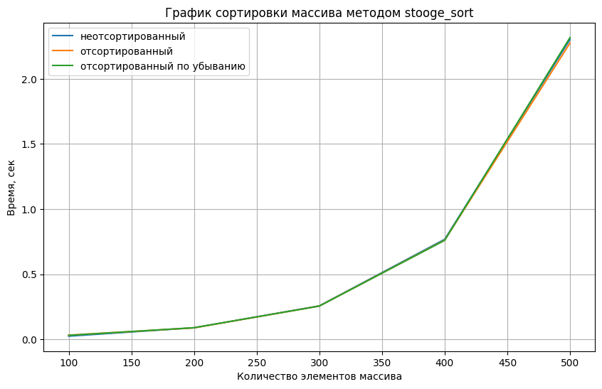
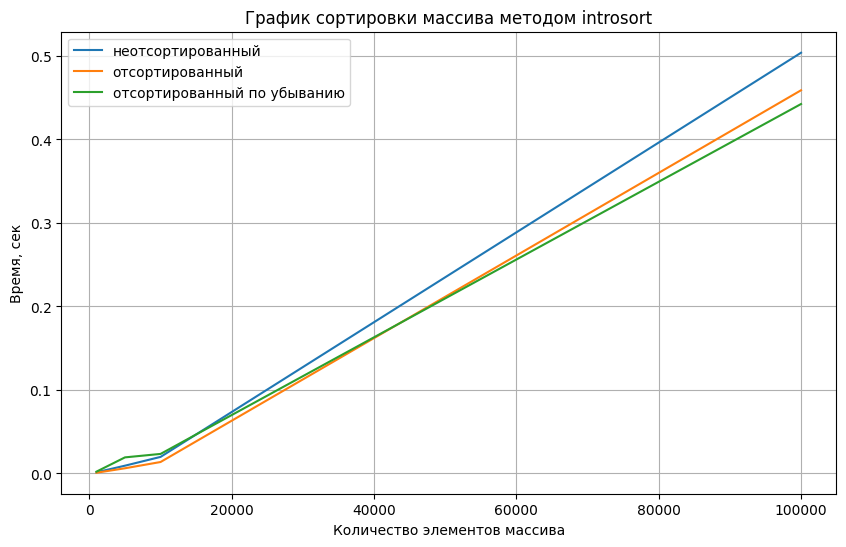

# Лабораторная работа 2
# Алгоритмы сортировки
## Цель лабораторной работы
Изучение основных алгоритмов на сортировки.
## Задачи лабораторной работы
1. Общее изучение различных видов алгоритмов сортировки.
2. Подробное изучение алгоритмов сортировки Introsort и Stooge sort.
## Словесная постановка задачи
1. Провести сравнение указанных алгоритмов сортировки массивов, содержащих n1, n2, n3 и n4 элементов. 
2. Каждую функцию сортировки вызывать трижды: для сортировки упорядоченного массива, массива, упорядоченного в обратном порядке и неупорядоченного массива. Сортируемая последовательность для всех методов должна быть одинаковой (сортировать копии одного массива). 
3. Проиллюстрировать эффективность алгоритмов сортировок по заданному критерию. Построить диаграммы указанных зависимостей.
## реализация алгоритмов stooge sort и introsort
Первая часть программы реализует функцию get_usage_time, позволяющую вычислять время выполнения любой функции:
``` Python
# 1
import functools
import timeit
import typing

def get_usage_time(
    *, number: int = 1, setup: str = 'pass', ndigits: int = 3
) -> typing.Callable:
    def decorator(func: typing.Callable) -> typing.Callable:
        @functools.wraps(func)
        def wrapper(*args, **kwargs) -> float:
            usage_time = timeit.timeit(
                lambda: func(*args, **kwargs),
                setup=setup,
                number=number,
            )
            return round(usage_time / number, ndigits)

        return wrapper

    return decorator
```
Вторая часть реализует функцию massiv_generator, которая создает массив случайных чисел длины n
``` Python
#2
import random

def massiv_generator(n):
    massiv = [random.randint(1, 1000) for i in range(n)]
    return massiv
```
В третьей части происходит сама реализация функций stooge_sort и introsort
``` Python
#3
import math

def stooge_sort(n):
    return stooge_sort_rec(n, 0, len(n)-1)
    
def stooge_sort_rec(n, left, right):
    if n[left] > n[right]:
        temp = n[left]
        n[left] = n[right]
        n[right] = temp

    if (right - left + 1) > 2:
        part_len = (right - left + 1) // 3
        stooge_sort_rec(n, left, right - part_len)
        stooge_sort_rec(n, left + part_len, right)
        stooge_sort_rec(n, left, right - part_len)

    return n

def introsort(n):
    length = len(n)
    depth = 2 * math.floor(math.log2(length))

    return introsort_rec(n, 0, length-1, depth)

def introsort_rec(n, left, right, depth):
    size = right - left + 1

    if size <= 16:
        insertion_sort(n, left, right)
        return n

    if depth <= 0:
        heap_sort(n, left, right)
        return n

    pivot_index = median_of_three(n, left, right)
    partition_index = partition(n, left, right, pivot_index)
    introsort_rec(n, left, partition_index - 1, depth - 1)
    introsort_rec(n, partition_index + 1, right, depth - 1)
    
    return n

def median_of_three(n, left, right):
    mid = left + (right - left) // 2
    
    if n[left] > n[mid]:
        temp = n[left]
        n[left] = n[mid]
        n[mid] = temp
    if n[left] > n[right]:
        temp = n[left]
        n[left] = n[right]
        n[right] = temp
    if n[mid] > n[right]:
        temp = n[mid]
        n[mid] = n[right]
        n[right] = temp
    return mid

def partition(n, left, right, pivot_index):
    pivot_value = n[pivot_index]
    temp = n[pivot_index]
    n[pivot_index] = n[right]
    n[right] = temp
    
    i = left - 1
    
    for j in range(left, right):
        if n[j] <= pivot_value:
            i = i + 1
            temp = n[i]
            n[i] = n[j]
            n[j] = temp
    
    temp = n[i+1]
    n[i+1] = n[right]
    n[right] = temp
    
    return i + 1

def insertion_sort(n, left, right):
    for i in range(left + 1, right + 1):
        key = n[i]        
        j = i - 1        
        
        while j >= left and n[j] > key:
            n[j + 1] = n[j]
            j = j - 1
        
        n[j + 1] = key

def heap_sort(n, left, right):
    index = right - left + 1
    
    for i in range(index // 2 - 1, -1, -1):
        heapify(n, index, i, left)
    
    for i in range(index - 1, 0, -1):
        temp = n[left]
        n[left] = n[left+i]
        n[left+i] = temp
        
        heapify(n, i, 0, left)

def heapify(n, index, i, left):
    largest = i        
    left_element = 2 * i + 1 
    right_element = 2 * i + 2  
    
    if left_element < index and n[left + left_element] > n[left + largest]:
        largest = left
    
    if right_element < index and n[left + right_element] > n[left + largest]:
        largest = right
    
    if largest != i:
        temp = n[left+i]
        n[left+i] = n[largest]
        n[largest] = temp
        
        heapify(n, index, largest, left)
```
Четвертая часть вызывает функции сортировок для различных массивов и рисует графики
``` Python
#4
import matplotlib.pyplot as plt

n = [100, 200, 300, 400, 500]#[1000, 5000, 10_000, 100_000]

times_s = []
times_sort_s = []
times_reverse_sort_s = []

times_i = []
times_sort_i = []
times_reverse_sort_i = []

for i in n:
    massiv = massiv_generator(i)
    time_s = get_usage_time(ndigits=5)(stooge_sort)
    times_s.append(time_s(massiv))
    time_i = get_usage_time(ndigits=5)(introsort)
    times_i.append(time_i(massiv))
    
    massiv_sort = list(sorted(massiv))
    time_sort_s = get_usage_time(ndigits=5)(stooge_sort)
    times_sort_s.append(time_sort_s(massiv_sort))
    time_sort_i = get_usage_time(ndigits=5)(introsort)
    times_sort_i.append(time_sort_i(massiv_sort))
    
    massiv_reverse_sort = list(reversed(massiv_sort))
    time_reverse_sort_s = get_usage_time(ndigits=5)(stooge_sort)
    times_reverse_sort_s.append(time_reverse_sort_s(massiv_reverse_sort))
    time_reverse_sort_i = get_usage_time(ndigits=5)(introsort)
    times_reverse_sort_i.append(time_reverse_sort_i(massiv_reverse_sort))

plt.figure(figsize=(10, 6))
plt.plot(n, times_s, label='неотсортированный')
plt.plot(n, times_sort_s, label='отсортированный')
plt.plot(n, times_reverse_sort_s, label='отсортированный по убыванию')
plt.title('График сортировки массива методом stooge_sort')
plt.xlabel('Количество элементов массива')
plt.ylabel('Время, сек')
plt.legend()
plt.grid(True)

plt.figure(figsize=(10, 6))
plt.plot(n, times_i, label='неотсортированный')
plt.plot(n, times_sort_i, label='отсортированный')
plt.plot(n, times_reverse_sort_i, label='отсортированный по убыванию')
plt.title('График сортировки массива методом introsort')
plt.xlabel('Количество элементов массива')
plt.ylabel('Время, сек')
plt.legend()
plt.grid(True)
```
## Анализ графиков
График для stooge sort

График для introsort
